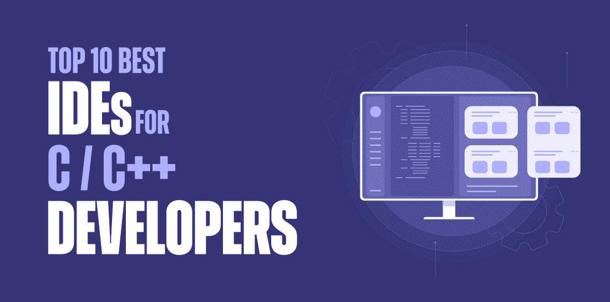

# 2021 年 C 或 C++ 开发者 10 大最佳 IDEs】

> 原文:[https://www . geesforgeks . org/10-best-ides-for-c-or-CPP-developers-in-2021/](https://www.geeksforgeeks.org/10-best-ides-for-c-or-cpp-developers-in-2021/)

没有人能否认，C 和 C++ 一直是全世界大量开发者的第一编程语言。即使在今天，这两种语言也是最推荐给想要开始编程的初学者的。这个建议在某种程度上也是合理的，因为当你选择学习用 C/C++ 编程时，它可以帮助你理解各种底层机制和核心编程概念，从而使你成为一名熟练的程序员，也使你更容易学习其他高级编程语言。

虽然我们已经讨论了很多对[**【C】**](https://www.geeksforgeeks.org/c-programming-language/)/[**C++**](https://www.geeksforgeeks.org/c-plus-plus/)语言的重要性和需求——在本文中，我们将详细了解用 C 或 c++ 语言进行编程所需的一个关键先决条件，即 C/C++ IDE(集成开发环境)。如果我们通常谈论 IDEs，它们通常是为了让开发人员更容易地工作，并通过提供几个有用的功能来提高他们的工作效率，如代码编辑器、调试支持、编译器、自动代码完成等。

C/C++ 集成开发环境为您提供了一套使用 C 或 C++ 语言进行软件开发的全面工具。有许多 C 和 c++ ide 可供有经验的开发人员以及新手程序员使用，让他们可以毫无困难地进行编程，您可以根据自己的需求选择其中的任何一种。

同时，为了减少你的工作量，我们整理了一份 2021 年你可以考虑的 10 个最好的面向 C 或 C++ 开发者的 ide 列表。那么，让我们开始吧:

### 1.可视化工作室

首先，这是一个由科技巨头微软开发的丰富的集成开发环境。微软的 Visual Studio 为您提供了几项出色的功能，例如智能代码完成、代码重构、语法突出显示、对多种语言的支持以及许多其他功能。除了 C/C++ 和 [C#](https://www.geeksforgeeks.org/csharp-programming-language/) 之外，Visual Studio 还支持各种其他语言，如 JavaScript、TypeScript、XML 等。以及 Python、Ruby 等。通过插件。同时，Visual Studio 推出了三个版本——社区版、专业版和企业版；其中社区版免费提供，其余两个是付费版。因此，如果你期待一个标准的 C/C++ 集成开发环境，你当然可以根据你的需求尝试任何一个版本的 Visual Studio。

*   *兼容:Windows、macOS、Linux*
*   *使用智能感知完成代码*
*   *内置 Git 集成*
*   *易天青开发*
*   *集成调试器和 VCS 支持*

### 2.克莱伦

CLion 是另一个最受程序员推荐的跨平台 C/C++ 集成开发环境(IDE)，它支持与 CMake 构建系统集成的 macOS、Linux 和 Windows。它由 JetBrains 开发，为您提供了各种突出的功能，例如智能 C/C++ 代码编辑器，以获得更好的代码帮助、安全的重构和快速文档，允许您测试单个单元的源代码、有效的代码和项目管理等。此外，除了 C/C++，CLion 还支持其他几种语言，如 Kotlin、Python、Swift 等。通过插件。尽管在选择 CLion 之前，您需要知道它是一个付费的集成开发环境，并且您需要购买相应的订阅才能继续使用它。但是，您可以探索他们的教育和开源订阅计划，免费使用 CLion。

*   *集成调试器*
*   *即时代码分析*
*   *支持嵌入式开发*
*   *支持 CVS(并发版本系统)& TFS(团队基础服务器)*
*   *兼容:Windows、macOS、Linux*

### 3.黯然失色

Eclipse 在集成开发环境(IDE)领域是一个相当有名的名字。然而，它最出名的是对 JAVA 的卓越支持——Eclipse 已经证明了自己是一个值得为 C 和 C++ 开发的集成开发环境。它为 C/C++ 开发提供了几个有用的特性，例如自动完成代码、代码重构、可视化调试工具、远程系统资源管理器以及许多其他功能。此外，您可以根据自己的需求，通过集成各种外部插件来扩展 Eclipse IDE 的功能。如果您已经有了任何 Eclipse 环境，您可以选择在其中添加一个 CDT (C/C++ 开发工具)，或者在没有 Eclipse 环境的情况下，您可以通过下载 Eclipse CDT 包直接安装 Eclipse CDT。由于更好的图形用户界面和易于使用的功能，集成开发环境特别推荐给初级到中级的 C/C++ 程序员。

*   *开源&富裕社区*
*   *兼容:Windows、macOS、Linux*
*   *更容易的项目创建*
*   *支持静态代码分析*
*   *轻松调试*

### 4.代码::块

下面是代码::块，这是一个开源的 C/C++ 集成开发环境，使用图形用户界面工具包 wxWidgets 在 C++ 中开发。Code::Blocks 为您提供了 C 和 C++ 开发所需的所有突出功能，例如语法突出显示、选项卡式界面、代码完成、代码覆盖、轻松导航、调试支持等。此外，它允许您登记完整的断点条件，即如果条件为真，您可以终止代码执行。另外，您需要知道您可以访问 Code::Blocks IDE 的源代码，并且可以根据您对 C/C++ 集成开发环境的偏好进行相关的更改。您也可以选择调试源代码，或者提出任何新的特性来回馈代码::块社区。

*   *兼容:Windows、macOS、Linux*
*   *支持多个编译器——GCC、Clang 和 Visual C++*
*   *可通过插件扩展*
*   *完全断点支持*
*   *开源&富裕社区*

### 5.代码简化版

CodeLite 是另一个开源的 C 和 C++ 集成开发环境，被许多开发人员所喜欢。它为编译器提供了更好的支持，内置了对 GCC、Clang 和 Visual C++ 的支持，并且与 C/C++ 兼容，如 [PHP](https://www.geeksforgeeks.org/php/) 、 [JavaScript](https://www.geeksforgeeks.org/javascript-tutorial/) (Node.js)等。CodeLite 利用大量丰富的功能来利用您，例如代码重构、项目管理、源代码浏览、语法突出显示、单元测试和许多其他功能。此外，CodeLite 还提供了几个额外的特性，例如可点击的错误、C++ 项目基于 clang 的代码完成等。CodeLite 还有其快速应用程序开发工具，允许您创建基于 wxWidgets 的应用程序。由于您可以免费使用 CodeLite 的所有这些功能，您肯定可以在 2021 年尝试探索这种丰富的 C/C++ IDE。

*   *兼容:Windows、macOS、Linux*
*   *项目管理*
*   *交互式调试器*
*   valgrind 支持
*   *支持静态代码分析*

### 6.NetBeans

由 Apache 软件基金会-甲骨文公司开发的 NetBeans 也是 C/C++ 开发人员使用最广泛的集成开发环境之一。这个免费的开源集成开发环境允许您使用动态和静态库创建 C 和 C++ 应用程序。NetBeans 为 C/C++ 开发提供了许多丰富的功能，例如代码重构、括号匹配、自动缩进、单元测试以及许多其他功能。此外，它还为多个编译器提供了强大的支持，如 Oracle Solaris Studio、GNU、CLang/LLVM、Cygwin、MinGW 等。除此之外，还有更简单的文件导航、源代码检查、打包等功能。也由 NetBeans 提供。像 Eclipse 一样，NetBeans 也提供了更好的拖放功能，这就是强烈推荐给学生或初级 C/C++ 开发人员的原因。

*   *免费开源*
*   *兼容:Windows、macOS、Linux、Solaris*
*   *Qt 工具包支持*
*   *支持远程开发*
*   *高效项目管理*

### 7.Qt 创建者

现在，让我们转向另一个有价值的面向 C 和 C++ 开发人员的集成开发环境——Qt Creator。这种跨平台 IDE 允许您为移动、桌面、嵌入式平台等开发基于图形用户界面的应用程序。Qt Creator 提供了许多丰富的功能，例如代码完成、语法突出显示、重构、内置文档等等。它的高级代码编辑器不仅允许你用 C++ 编码，还支持 JavaScript、Python 和其他语言。除此之外，它很容易与各种流行的版本控制系统集成，如 Git、Subversion、Mercurial 等。而且，借助 Qt 对编译器和构建系统的广泛支持，您可以跨不同平台部署您的应用程序。虽然 Qt Creator 不是免费的，你需要购买所需的计划，但你可以获得他们一个月的免费试用版。

*   *兼容:Windows、macOS、Linux*
*   *静态代码分析*
*   *集成 UI 设计*
*   *项目&建设管理*
*   *可视化调试器*

### 8.Dev C++

Dev C++ 是用于 C 和 C++ 开发的流行开源 ide 之一。这个集成开发环境是专门为 C/C++ 编程而设计的，具有许多突出的特性，例如代码完成、分析支持、函数列表、类浏览器、创建自己的项目类型的模板以及许多其他特性。此外，Dev C++ 为您提供了可定制的代码编辑器，并支持各种基于 GCC 的编译器，如 Mingw、Cygwin 等。Dev C++ 提供的其他几个引人入胜的特性是——编辑和编译资源文件、查找和替换工具、工具管理器、打印支持、Makefile 生成等等。尽管使用 Dev C++ 的一个主要缺点是它只能在 Windows 操作系统上使用，因为它不支持其他操作系统，如 macOS 或 Linux。

*   *开源轻量级 IDE*
*   *与视窗系统兼容*
*   *集成调试器*
*   *CVS 支架*
*   *可定制代码编辑器*

### 9.x mode(x mode)-x mode(x mode)-x mode(x mode)(x mode)(x mode)(x mode)(x mode)(x mode)(x mode)(x mode)

如果你是使用 macOS 的 C/C++ 开发人员之一，那么你可以尝试探索这个丰富的 IDE，Xcode。像针对 Windows 的 Dev C++ 一样，Xcode 只支持带有 C++、Objective-C、Swift 和其他编程语言的 macOS 平台。Xcode 提供的一些值得注意的特性有–交互式 UI、智能代码完成、代码折叠、语法高亮、快速应用测试、多平台应用模板等等。此外，它为您提供了使用 Git 版本控制系统进行源代码管理的内置支持。除此之外，它内置的界面构建器允许您高效地设计和测试您的用户界面，而无需编写一行代码，并在 Xcode 编辑器中以图形方式将您的界面连接到源代码。简单来说，如果你使用 macOS 进行 C/C++ 编程，或者想为苹果的 App Store 开发一款应用，那么 Xcode 将是你的正确选择！

*   *兼容 macOS*
*   *图形调试器*
*   *静态代码分析*
*   *完成文件*
*   *持续整合*

### 10.kdevelop(kdevelop)

最后但同样重要的是，KDevelop 来了。这个跨平台的集成开发环境是基于现代开源技术开发的，为 C/C++ 程序员提供了一个无缝的开发环境。除了 C/C++，集成开发环境还支持各种其他语言，如 PHP、Python、Ruby 等。通过插件。KDevelop 提供了各种显著的功能，如语法高亮、自动缩进、自动代码完成、快速代码导航、完整文档等。而且还集成了 Git、Subversion、CVS、Mercurial 等几种流行的版本控制系统。KDevelop 的一些额外功能是——彩虹高亮显示，用特定的颜色突出显示同一变量的每一次出现，强大的查找和替换功能，为 IDE 中的任何操作分配快捷方式，外部脚本支持，等等。

*   *兼容:Windows、macOS、Linux 等。*
*   *项目管理*
*   *单元测试集成*
*   *图形调试器支持*
*   *内置强力支架*

因此，这些是上面提到的最推荐的 ide，以及它们各自的特性和优势，供 2021 年的 C 和 C++ 开发人员使用。然而，在选择任何集成开发环境之前，您首先需要确定您的需求，因为它非常重要！例如，如果你需要一个用于 macOS 的 C++ IDE，那么你可以选择 Xcode，或者如果你是一个初级程序员，想要一些更好的拖放功能，你可以选择 NetBeans 或者 Eclipse，等等。