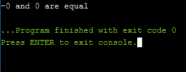
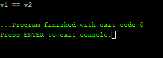

# c++ 20 中的三向比较运算符(航天飞船运算符)

> 原文:[https://www . geesforgeks . org/3 路-比较-操作员-空间-船舶-操作员-in-c-20/](https://www.geeksforgeeks.org/3-way-comparison-operator-space-ship-operator-in-c-20/)

三方比较运算符**“<=>”**称为飞船运算符。宇宙飞船操作员确定两个物体 **A** 和 **B** 是 **A < B，A = B，还是 A > B** 。宇宙飞船操作员或编译器可以自动为我们生成它。此外，三向比较是在一个查询中给出整个关系的函数。传统上， [strcmp()](https://www.geeksforgeeks.org/strcmp-in-c-cpp/) 就是这样的功能。给定两个字符串，它将返回一个整数，

*   < 0 表示第一个字符串较少
*   == 0 如果两者相等
*   如果第一个字符串更大，则> 0。

它可以给出三个结果中的一个，因此这是一个三方比较。

<figure class="table">

|  | **Equality** | **sort** |
| **Primary** | = | <=> |
| **Secondary** | ！= | 、< =、> = |

</figure>

从上表可以看出，宇宙飞船操作符是一个初级的[操作符](https://www.geeksforgeeks.org/operators-c-c/)，即可以反过来用它写相应的次级操作符。

> (A <=> B) < 0 is true if A < B
> (A < = > B) > 0 为真如果 A > B
> (A < = > B) == 0 为真如果 A 和 B 相等/等价。

**<u>节目 1</u> :**

下面是两个浮点变量的三向比较运算符的实现:

## C++

```
// C++ 20 program to illustrate the
// 3 way comparison operator
#include <bits/stdc++.h>
using namespace std;

// Driver Code
int main()
{
    float A = -0.0;
    float B = 0.0;

    // Find the value of 3 way comparison
    auto ans = A <= > B;

    // If ans is less than zero
    if (ans < 0)
        cout << "-0 is less than 0";

    // If ans is equal to zero
    else if (ans == 0)
        cout << "-0 and 0 are equal";

    // If ans is greater than zero
    else if (ans > 0)
        cout << "-0 is greater than 0";

    return 0;
}
```

**输出:**
[](https://media.geeksforgeeks.org/wp-content/cdn-uploads/20201123151437/Screenshot-787.png)

**<u>节目 2</u> :**

下面是两个向量的三向比较运算符的实现:

## C++

```
// C++ 20 program for the illustration of the
// 3-way comparison operator for 2 vectors
#include <bits/stdc++.h>
using namespace std;

// Driver Code
int main()
{
    // Given vectors
    vector<int> v1{ 3, 6, 9 };
    vector<int> v2{ 3, 6, 9 };

    auto ans2 = v1 <= > v2;

    // If ans is less than zero
    if (ans2 < 0) {

        cout << "v1 < v2" << endl;
    }

    // If ans is equal to zero
    else if (ans2 == 0) {

        cout << "v1 == v2" << endl;
    }

    // If ans is greater than zero
    else if (ans2 > 0) {

        cout << "v1 > v2" << endl;
    }

    return 0;
}
```

**输出:**
[](https://media.geeksforgeeks.org/wp-content/cdn-uploads/20201123151440/Screenshot-786.png)

**注意:**你应该下载足够的最新编译器来运行 C++ 20。

**<u>飞船操作员的需求</u> :**

*   这是所有其他比较运算符(对于全序域)的通用概括: **>、> =、==、< =、<。**使用 **< = >** ，在[用户定义数据类型](https://www.geeksforgeeks.org/user-defined-data-types-in-c/)的情况下，每个操作都可以以完全通用的方式实现，就像[结构](https://www.geeksforgeeks.org/structures-c/)一样，需要逐个定义其他 6 个比较运算符。
*   对于字符串，相当于 C 标准库的老的 [strcmp()](https://www.geeksforgeeks.org/strcmp-in-c-cpp/) 函数。因此它对于字典顺序检查很有用，例如[向量](https://www.geeksforgeeks.org/vector-in-cpp-stl/)或[列表](https://www.geeksforgeeks.org/python-list/)中的数据，或其他有序的[容器](https://www.geeksforgeeks.org/containers-cpp-stl/)中的数据。