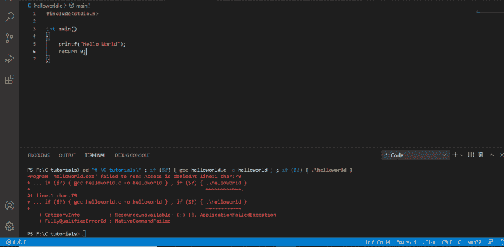
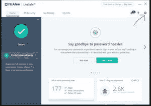
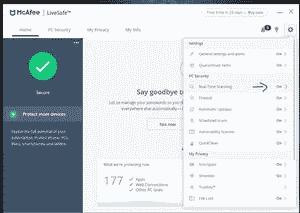
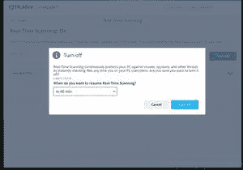

# c++ Visual Studio 中的“访问被拒绝错误”及如何解决

> 原文:[https://www . geesforgeks . org/access-is-reject-in-c-visual studio-以及如何解决它/](https://www.geeksforgeeks.org/access-is-denied-error-in-c-visual-studio-and-how-to-resolve-it/)

**先决条件:** [如何在 Windows 上安装 Visual c++ ](https://www.geeksforgeeks.org/how-to-install-visual-cpp-on-windows/)

在本文中，我们将讨论 C++ 中 Visual Studio 中的拒绝访问错误。

**<u>什么是 C++ 中 Visual Studio 拒绝访问错误？</u>T3】**

在 Visual Studio c++ 中，当试图访问某个安装文件时，由于某种原因，对所请求文件的访问被拒绝，就会出现拒绝访问错误。可能有几个原因。本文主要讨论在 Visual Studio 中运行 C++ 程序时遇到的拒绝访问错误。

**<u>为什么会出现拒绝访问错误？</u>T3】**

当 Visual Studio 无法访问一个或多个安装文件时，会出现拒绝访问错误。出现此错误可能是由于以下原因之一:

1.  安装时，当 Visual Studio 正在安装文件时，防病毒或防恶意软件应用程序等外部进程锁定了一个 Visual Studio 安装文件。
2.  安装 Visual Studio 的用户没有成功安装所有文件的管理权限。要安装 Visual Studio，用户必须是管理员，并且必须通过右键单击并选择“以管理员身份运行”选项来启动安装程序。
3.  对某些注册表或配置单元的权限可能会阻止 Visual Studio 安装所有文件。

**<u>如何解决此错误</u>**

解决该错误的解决方案之一是在防病毒软件中进行更改，以解锁 Visual Studio 安装文件。下面是在 Visual Studio 中运行 C++ 程序时遇到的错误的截图。

出错信息

安装 VS code 和 [MinGW(C 编译器)](https://www.geeksforgeeks.org/complete-guide-to-install-c17-in-windows/)的方法有很多种，但是当这些方法被用来运行一个代码时，它可能会在输出或 VS Code 终端显示一些错误。但安装过程不正确的情况可能不会出现。这是因为系统的反病毒阻止了 VS 代码访问 MinGW 的 bin 文件夹。

**解决错误的步骤:**
以下是迈克菲杀毒软件中解决错误的步骤。

**第一步:**打开迈克菲杀毒应用。

**第二步:**找到**设置**选项，然后点击。
**第三步:**点击**实时扫描**选项。在这里你可以找到更多的选择。

**第三步:**最后一步是点击**关闭**按钮，想关多久就关多久。此选项将关闭实时扫描。

通过这些简单的步骤，人们可以轻松地打开和关闭防病毒软件，不再面临问题。此外，还可以选择将某些单独的文件添加到“排除文件”部分，将其从扫描中排除，反病毒扫描将在执行计算机扫描时跳过该特定文件夹。