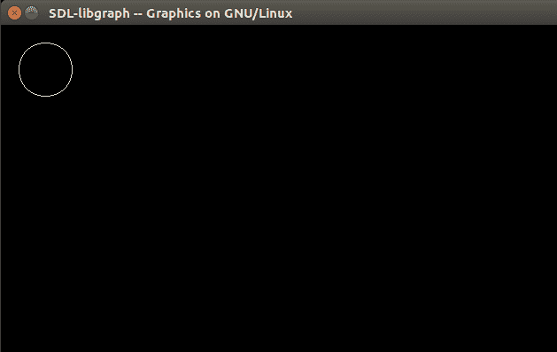

# 如何在 Linux 中给 gcc 编译器添加“graphics . h”C/c++库

> 原文:[https://www . geesforgeks . org/add-graphics-h-c-library-gcc-compiler-Linux/](https://www.geeksforgeeks.org/add-graphics-h-c-library-gcc-compiler-linux/)

在 Ubuntu 上尝试 C 图形编程时，我发现 graphic.h 不是标准的 C 库，也不受 gcc 编译器的支持。所以我写这篇文章来解释这个过程。
如果想在 Ubuntu 平台上使用 graphics.h，需要编译安装 libgraph。它是使用 SDL 在 Linux 上实现 turbo c 图形应用编程接口。
可以从这里下载[libgraph](http://download.savannah.gnu.org/releases/libgraph/libgraph-1.0.2.tar.gz)
T5】分步说明:

*   **步骤 1:** 首先通过键入
    安装构建必备组件

```cpp
sudo apt-get install build-essential
```

*   **步骤 2:** 通过键入
    安装一些附加包

```cpp
sudo apt-get install libsdl-image1.2 libsdl-image1.2-dev guile-2.0 \
guile-2.0-dev libsdl1.2debian libart-2.0-dev libaudiofile-dev \
libesd0-dev libdirectfb-dev libdirectfb-extra libfreetype6-dev \
libxext-dev x11proto-xext-dev libfreetype6 libaa1 libaa1-dev \
libslang2-dev libasound2 libasound2-dev
```

*   **步骤 3:** 现在提取下载的 libgraph-1.0.2.tar.gz 文件。
*   **步骤 4:** 转到提取的文件夹并运行以下命令

```cpp
./configure
make
sudo make install
sudo cp /usr/local/lib/libgraph.* /usr/lib
```

*   现在您可以使用 graphics.h lib，使用以下几行:

```cpp
int gd = DETECT,gm; 
initgraph (& gd,& gm,NULL);
```

示例代码:

## C

```cpp
// C code to illustrate using
// graphics in linux environment
#include<stdio.h>
#include<stdlib.h>
#include<graphics.h>
int main()
{
    int gd = DETECT, gm;
    initgraph(&gd, &gm, NULL);

    circle(50, 50, 30);

    delay(500000);
    closegraph();
    return 0;
}
```

**输出:**



**参考:** [问乌班图](https://askubuntu.com/questions/525051/how-do-i-use-graphics-h-in-ubuntu)
本文由 **Aakash Tiwari** 供稿。如果你喜欢 GeeksforGeeks 并想投稿，你也可以使用[write.geeksforgeeks.org](https://write.geeksforgeeks.org)写一篇文章或者把你的文章邮寄到 review-team@geeksforgeeks.org。看到你的文章出现在极客博客主页上，帮助其他极客。
重要注意事项(用户添加) :上述链接中的文件对我无效。我从 https://github.com/SagarGaniga/Graphics-Library 下载的文件
有问题，如果你发现任何不正确的地方，或者你想分享更多关于上面讨论的话题的信息，请写评论。