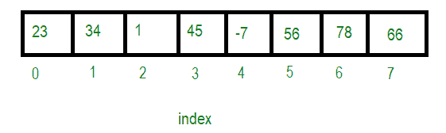

# C 中数组的优缺点

> 原文:[https://www . geeksforgeeks . org/c 中阵列的优缺点/](https://www.geeksforgeeks.org/advantages-and-disadvantages-of-array-in-c/)

一个[数组](https://www.geeksforgeeks.org/array-data-structure/)是相似类型元素的集合。例如，整数数组保存 [int 类型](https://www.geeksforgeeks.org/c-data-types/)的元素，而字符数组保存 char 类型的元素。下面是数组的表示:

[](https://media.geeksforgeeks.org/wp-content/uploads/20201018234745/11.png)

不过，array 也有自己的一套优缺点。

### **<u>阵列优势</u>**

以下是该阵列的一些优势:

*   在数组中，使用索引号访问元素非常容易。
*   搜索过程可以很容易地应用于数组。
*   2D 阵列用于表示矩阵。
*   由于任何原因，用户希望存储多个相似类型的值，那么可以有效地使用和利用数组。

### **<u>阵列的缺点</u>**

现在让我们看看该阵列的一些缺点以及如何克服这些缺点:

**<u>阵的大小是固定的</u> :** 阵是静止的，也就是说它的大小总是固定的。分配给它的内存不能增加或减少。下面是同样的程序:

## C

```
// C program to illustrate that the
// array size is fixed
#include <stdio.h>

// Driver Code
int main()
{
    int arr[10];

    // Assign values to array
    arr[0] = 5;
    arr[5] = 6;
    arr[7] = -9;

    // Print array element at index 0
    printf("Element at index 0"
           " is %d\n",
           arr[0]);

    // Print array element at index 11
    printf("Element at index 11"
           " is %d",
           arr[11]);

    return 0;
}
```

**Output:**

```
Element at index 0 is 5
Element at index 11 is -1176897384

```

**<u>解释</u> :** 在上面的程序中，声明了大小为 10 的数组，并在特定的索引处赋值。但是当索引 11 处的值被打印时，它会打印出[垃圾值](https://www.geeksforgeeks.org/accessing-array-bounds-ccpp/)，因为[数组是从绑定索引](https://www.geeksforgeeks.org/accessing-array-bounds-ccpp/)中访问的。在某些编译器中，它给出错误为**“数组索引越界”**。

**<u>如何克服</u> :** 使用[动态内存分配](https://www.geeksforgeeks.org/what-is-dynamic-memory-allocation/)像 [**malloc()** 、 **calloc()**](https://www.geeksforgeeks.org/dynamic-memory-allocation-in-c-using-malloc-calloc-free-and-realloc/) 来克服这个问题。它还帮助我们使用[**free()**](https://www.geeksforgeeks.org/dynamic-memory-allocation-in-c-using-malloc-calloc-free-and-realloc/)**方法来解除分配内存，这有助于通过释放内存来减少内存浪费。下面是同样的程序:**

## **C**

```
// C program to illustrate the use of
// array using Dynamic Memory Allocation
#include <stdio.h>
#include <stdlib.h>

// Driver Code
int main()
{
    // Pointer will hold the base address
    int* ptr;
    int n = 10;

    // Dynamically allocates memory
    // using malloc() function
    ptr = (int*)malloc(n * sizeof(int));

    // Assign values to the array
    for (int i = 0; i < n; i++) {
        ptr[i] = i + 1;
    }

    // Print the array
    printf("The elements are: ");

    for (int i = 0; i < n; i++) {
        printf("%d ", ptr[i]);
    }

    // Free the dynamically
    // allocated memory
    free(ptr);

    return 0;
}
```

****Output:**

```
The elements are: 1 2 3 4 5 6 7 8 9 10

```** 

****<u>数组是同构的</u> :** 数组是同构的，即数组中只能存储一种类型的值。例如，如果数组类型“ **int** ”，只能存储整数元素，不能允许其他类型的元素，如 double、float、char 等。下面是同样的程序:**

## **C**

```
// C++ program to illustrate that
// the array is homogeneous
#include <stdio.h>

// Driver Code
int main()
{
    // Below declaration will give
    // Compilation Error
    int a[5] = { 0, 1, 2, "string", 9, 4.85 };

    return 0;
}
```