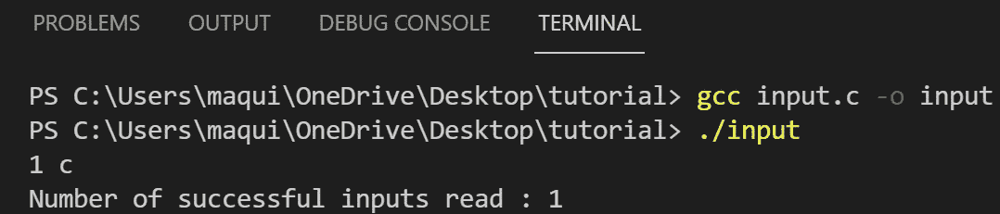
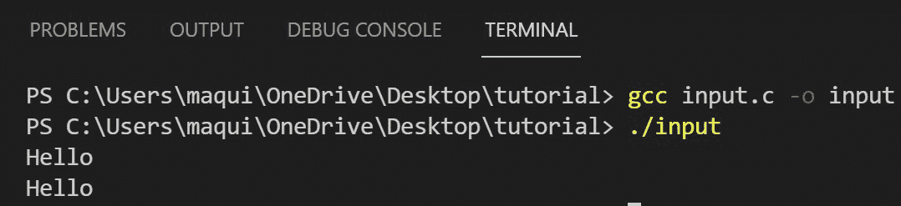
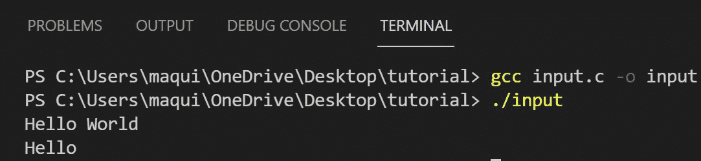
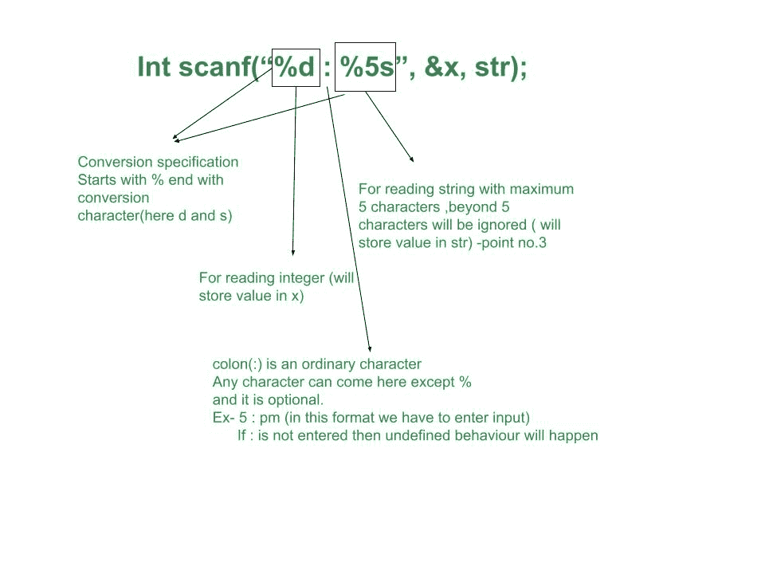
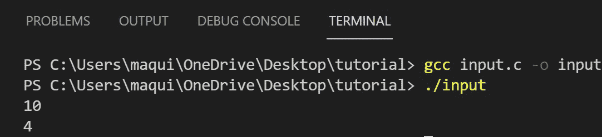
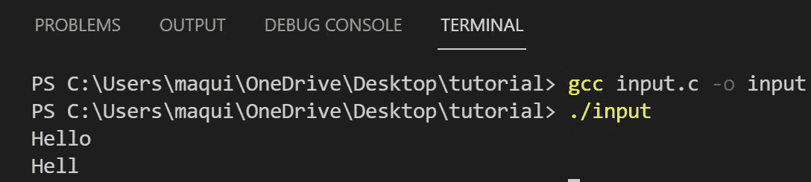
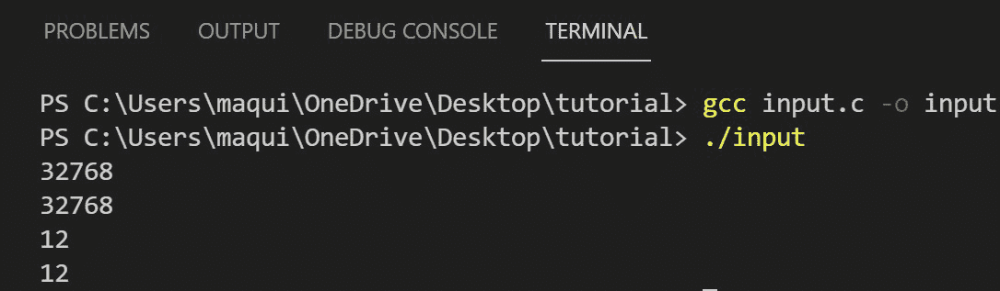

# C

中所有格式的 scanf()

> 原文:[https://www . geesforgeks . org/all-forms-of-format-scanf-in-c/](https://www.geeksforgeeks.org/all-forms-of-formatted-scanf-in-c/)

[C 语言](https://www.geeksforgeeks.org/c-language-set-1-introduction/)有标准库，允许在程序中输入和输出。C 中的[](https://www.geeksforgeeks.org/whats-difference-between-and/)**或**标准输入输出库**有[输入输出](https://www.geeksforgeeks.org/basic-input-output-c/)的方法。**

****scanf():**C 语言中的 [scanf()](https://www.geeksforgeeks.org/scanf-and-fscanf-in-c-simple-yet-poweful/) 方法按照指定的类型从控制台读取值。它返回一个整数类型，即成功匹配和分配的输入项的数量。**

****语法:****

```
int scanf(const char*format, arg1, agr2, arg3, ...);
```

**scanf()函数[从标准输入](https://www.geeksforgeeks.org/fgets-gets-c-language/)(键盘)中读取字符，按照格式(const char *格式)中的转换规范进行解释，并通过匹配的参数列表( **arg1、arg2、arg3、…** )存储结果。参数列表，每个参数必须是一个指针，指示相应的转换输入应该存储在哪里。当-**

*   **它用尽其[格式字符串](https://www.geeksforgeeks.org/format-specifiers-in-c/)(所有输入)**
*   **当某些输入不符合控制规范时。**

****程序 1:** 使用格式化的输入 scanf()读取两个整数值:**

## **C**

```
// C program to implement the above idea
#include <stdio.h>

// Driver Code
int main()
{
    int a, b, c;
    c = scanf("%d %d", &a, &b);
    printf("Number of successful "
           "inputs read : %d",
           c);

    return 0;
}
```

****输出:****

****<u>读取成功输入</u> :****

****

****说明:**由于输入值都是整数，并且 scanf()函数中的格式说明符是“%d”，因此输入值被读取，scanf()函数返回读取的值的数量。**

****<u>读取不成功输入</u> :****

****

****解释:**这里输入的第二个参数是一个字符串，与格式说明符“%d”不匹配，格式说明符“% d”是一个整数，因此 scanf 不会将值存储到第二个参数中并返回 1，因为只有 1 个输入被成功读取，scanf()将在这里终止。**

****注意:**因为 scanf()中的参数列表必须是指针，所以才会写成& a、& b ( & variablename 给出变量的地址)。如果 scanf()函数遗漏了“&”，那么程序将显示未定义的行为，编译器也不会显示错误。**

****程序 2:** **使用 scanf 读取字符串:****

**下面是使用格式化输入 scanf()读取字符串的 C 程序:**

## **C**

```
// C program to implement the above idea
#include <stdio.h>

// Driver Code
int main()
{
    // Declaring character array
    char str[10];

    // & is not used
    scanf("%s", str);
    printf("%s", str);
    return 0;
}
```

****输出:****

****

****注意:****&**不用于[字符串](https://www.geeksforgeeks.org/strings-in-c-2/)读取的情况，因为数组名称是指向第一个元素(str[0])的[指针](https://www.geeksforgeeks.org/pointers-in-c-and-c-set-1-introduction-arithmetic-and-array/)。这里还有一点需要注意的是*“% s”*不读取空白字符(空格、换行符等)。下面是相同的输出示例:**

****

****解释:**当 **scanf()** 遇到空格或换行符时，它会开始读取下一个参数(如果有)。这就是为什么这里只看《你好》，不看《世界》。**

****格式字符串:**如果仔细观察 **scanf()** 的语法，那么它有两个部分:**

1.  **格式化字符串。**
2.  **参数的数量。**

**双引号中的所有内容都称为格式字符串，逗号(，)后的所有内容都是匹配的参数。格式字符串可能包含-**

*   **空白或制表符被忽略。**
*   **普通字符(不是%)，它应该匹配输入流的下一个非空白字符。**
*   **转换规范，包括以下内容:

    1.  字符%。
    2.  可选的赋值抑制字符*。
    3.  指定最大字段宽度的可选数字。
    4.  可选的 h、L 或 L，表示目标的宽度。
    5.  转换字符。** 

**转换规范以强制的%字符开始，以强制的转换字符结束。例如- d、s、f、I 等。如果需要添加任何点 2–4(可选)，应按照%和转换字符之间的顺序添加。**

**让我们用一个例子来理解所有这些观点:**

****示例 1:** 读取时间格式为 11: PM(一个整数值，后跟冒号(:)和字符串)。**

****

****注意:**在上例中(:)没有存储在任何变量中它只是为了匹配给定的输入格式。**

****程序 3:** 下面是读取值但不存储在变量中的程序:**

## **C**

```
// C program to implement the above idea
#include <stdio.h>

// Driver Code
int main()
{
    int x = 4;

    // Read but do not store
    // in x
    scanf("%*d", &x);

    // Print initialized value
    printf("%d", x);

    return 0;
}
```

****输出****

****

****说明:**输出为 4，而不是 10，因为使用了赋值抑制字符“*”，使用该字符时，输入字段将被跳过，并且不会进行赋值。**

****程序 4:** 下面是读取字符串的程序，但最多允许 4 个字符:**

## **C**

```
// C program to implement the above idea
#include <stdio.h>

// Driver Code
int main()
{
    // Array of 10 character elements
    char str[10];

    // Can read maximum four characters
    scanf("%4s", str);
    printf("%s", str);
    return 0;
}
```

****输出****

****

****说明:**最多只能读四个字符，但在输入中给出了第五个字符 **o** ，跳过。**

****程序 5:** 读取一个整数，但是它的大小应该是长还是短:**

## **C**

```
// C program to implement the above idea
#include <stdio.h>

// Driver code
int main()
{
    // For reading long int
    long int x;
    scanf("%ld", &x);
    printf("%ld", x);

    // For reading short int
    short int y;
    scanf("%hd", &y);
    printf("%hd", y);
    return 0;
}
```

****输出:****

****

****转换字符:****

**我们来看看转换字符的完整列表:**

<figure class="table"> **| **Conversion character** | **Input data** |
| **d** | Decimal integer (int*). Such as 10, 20\.
**Note:** 10,010 both refer to 10. |
| **I** | 整数(int*)。整数可以是八进制(前导 0(零))或十六进制前导 0x 或 0X
**注:**

*   00 means 8, because it starts with 0, so it is an octal number, and 10 (octal) = 8 (decimal).
*   10 means 10 (because there is no leading 0 (zero) or leading 0X or 0x.
*   0x10 means 16\. Because it starts with 0x, it is a hexadecimal number and 10 (hexadecimal) =16 (decimal).

 |
| **o** | 八进制整数(带 0 或不带前导零)(int *)
**注意:**任何输入的数字都将被视为八进制数。

*   10 means 8.
*   00 also means 8.

 |
| **u** | An unsigned decimal integer (unsigned int*).
**Note:** Enter any negative MSB (most significant bit is not treated as sign bit, and its value is taken for calculation) |
| **x** | 十六进制整数(带或不带前导 0x 或 0X) (int *)。
**注:**任何输入的数字都将被视为十六进制数

*   10 means 16.
*   0x10 also means 16.

 |
| **c** | Character (char*). The next input character (1 by default) is placed at the specified position. Normal skip whitespace suppression means that it can read whitespace characters. To read the next non-blank character, use 1. |
| **s** | 字符串(未引用)(char*)，用于读取字符串。
**注意:**

*   The space character cannot be read.
*   The size of the variable should be 1 extra character, because a null value ("\0") is added at the end.

 |
| **e、f、g** | Floating-point number with optional symbol, optional decimal point & optional exponent (float*). |
| **%** | Literally%, no assignment. |** </figure>

****从其他字符串读取输入:sscanf()****

**在前面的例子中，输入是从键盘读取的。让我们看一下如何从其他字符串读取输入的例子。下面是实现上述概念的 C 程序:**

## **C**

```
// C program to implement the above concept
#include <stdio.h>

// Driver code
int main()
{
    // String from which input
    // to be read
    char str[] = "11:pm";
    int x;
    char time[3];
    sscanf(str, "%d:%s", &x, time);
    printf("%d:%s", x, time);

    return 0;
}
```

****Output**

```
11:pm
```**