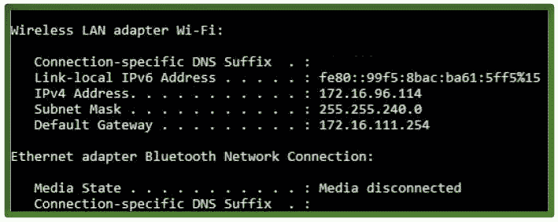

# C/c++

中系统()的惊人之处

> 原文:[https://www . geeksforgeeks . org/c-CPP/](https://www.geeksforgeeks.org/amazing-stuff-with-system-in-c-cpp/)神奇的系统填充

**system()** 在执行操作系统命令时起着非常特殊的作用。
通过使用这个库函数，我们可以运行操作系统允许我们执行的所有终端命令，只需使用我们的 C 程序。

现在，我们将学习一个非常简单的**代码来获取 IP 地址**-识别每台使用该互联网协议进行通信的计算机。
[](https://media.geeksforgeeks.org/wp-content/uploads/Untitled-drawing3.jpg) 
我们来看看如何。

## Windows 操作系统

```cpp
// C program to get the IP Address of your 
// Windows system.

//<stdlib.h> library has system() library function.
#include<stdlib.h> 

int main()
{
   system("C:\\Windows\\System32\\ipconfig");
}
```

## Linux 操作系统

```cpp
// C program to get the IP Address of your
// Linux system.

//<stdlib.h> library has system() library function.
#include<stdlib.h>

int main()
{
   system("/sbin/ifconfig");
}
```

**Output :**

```cpp
Same output as you get on writing ipconfig in Windows or ifconfig in Linux on your terminal.
You are just using ipconfig/ifconfig on terminal but using C code isn't it cool.
```

现在我们来看一个关闭系统的**代码。**

## Windows 操作系统

```cpp
// C code to Shut Down your Windows system
#include<stdlib.h>
using namespace std; 

int main()
{
   // Using the system() library.
   system("C:\\WINDOWS\\System32\\shutdown /s");

   // For Windows XP
   // system("C:\\WINDOWS\\System32\\shutdown -s");
}
```

## Linux 操作系统

```cpp
// C program to get the IP Address of your
// Linux system.

//<stdlib.h> library has system() library function.
#include<stdlib.h>

int main()
{
   system("sudo shutdown now");
}
```

**Output :**

```cpp
An alert box appears telling you that your System will Shut Down.
```

在你的系统上运行这些代码，玩得开心。🙂

本文由 <font color="green">**Mohit Gupta_OMG 供稿🙂**</font> 。如果你喜欢 GeeksforGeeks 并想投稿，你也可以使用[contribute.geeksforgeeks.org](http://www.contribute.geeksforgeeks.org)写一篇文章或者把你的文章邮寄到 contribute@geeksforgeeks.org。看到你的文章出现在极客博客主页上，帮助其他极客。

如果你发现任何不正确的地方，或者你想分享更多关于上面讨论的话题的信息，请写评论。