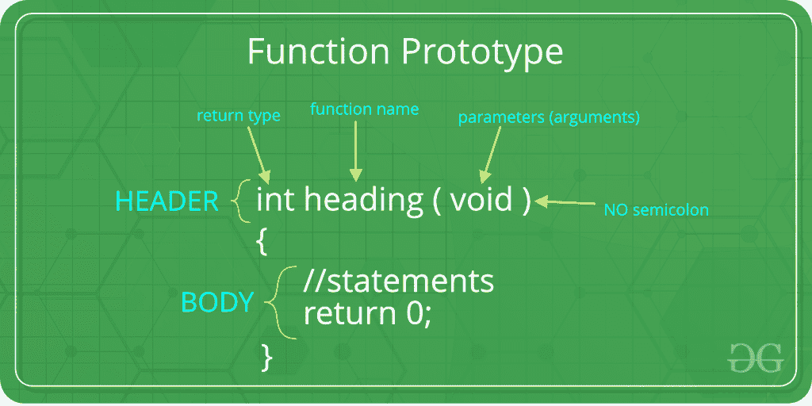
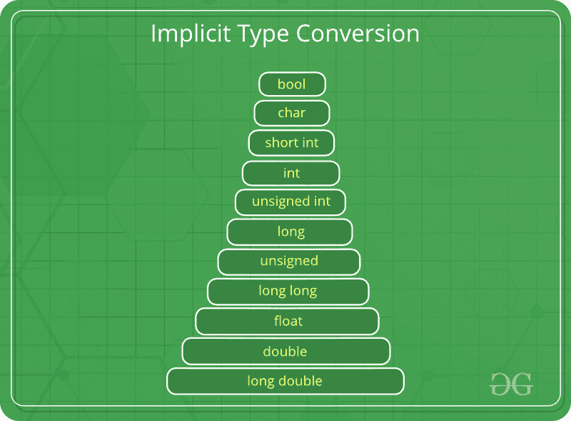

# C/c++ 中的参数强制

> 原文:[https://www.geeksforgeeks.org/argument-coercion-in-c-c/](https://www.geeksforgeeks.org/argument-coercion-in-c-c/)

**参数强制**是函数原型的一个特性，编译器通过它隐式转换函数调用期间传递的参数的数据类型，以匹配函数定义中的数据类型。



它遵循参数提升规则。因此，较低的数据类型可能会转换为较高的数据类型，但反之亦然。这是因为当较高的数据类型转换为较低的数据类型时，会导致数据丢失或截断。

**c++ 中基本数据类型的提升层次是:**



**示例:**以下面给出的代码为例，它由一个需要双参数的 add 函数组成。但即使传递了整数参数，它也能正常工作。如果传递长的双参数，代码会给出一个错误。

```cpp
#include <iostream>
using namespace std;

double add(double a, double b)
{
    return a + b;
}

int main()
{
    // Passing double arguments, as expected
    cout << "Sum = " << add(2.4, 8.5) << endl;

    // Passing int arguments, when double is expected
    // This will lead to Argument Coercion
    cout << "Sum = " << add(16, 18) << endl;

    return 0;
}
```