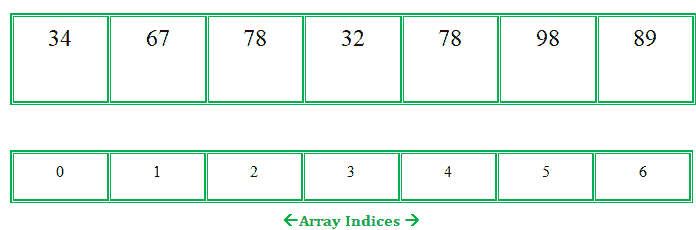
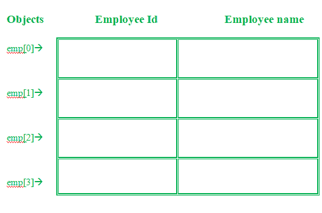
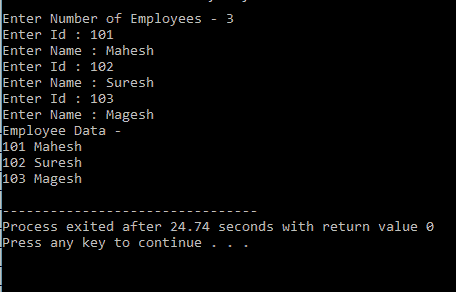
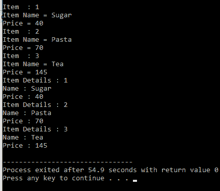

# c++中的对象数组，示例

> 原文:[https://www . geeksforgeeks . org/带示例的 c 中对象数组/](https://www.geeksforgeeks.org/array-of-objects-in-c-with-examples/)

一个 [数组](https://www.geeksforgeeks.org/introduction-to-arrays/) 中的 [C/C++](https://www.geeksforgeeks.org/difference-between-c-and-c/) 或者是它在任何编程语言中都是存储在连续内存位置的相似数据项的集合，并且可以使用数组的索引随机访问元素。它们可以用来存储原始数据类型的集合，例如任何特定类型的 int、float、double、char 等。补充一下，C/C++中的数组可以存储结构、指针、等派生数据类型。下面给出了一个数组的图片表示。

**示例:**
我们来考虑一个从用户处获取随机整数的示例。



排列

**<u>物体阵列</u>**

定义类时，只定义对象的规范；没有分配内存或存储空间。要使用类中定义的数据和访问函数，需要创建对象。

**语法:**

```
ClassName ObjectName[number of objects];
```

对象数组存储*个对象*。类类型的数组也称为对象数组。

**示例#1:**
存储多个员工数据。让我们假设有一个对象数组用于存储员工数据 emp[50]。



以下是用于存储一名员工数据的 C++程序:

## C++

```
// C++ program to implement
// the above approach
#include<iostream>
using namespace std;

class Employee
{
  int id;
  char name[30];
  public:
  void getdata();//Declaration of function
  void putdata();//Declaration of function
};
void Employee::getdata(){//Defining of function
  cout<<"Enter Id : ";
  cin>>id;
  cout<<"Enter Name : ";
  cin>>name;
}
void Employee::putdata(){//Defining of function
  cout<<id<<" ";
  cout<<name<<" ";
  cout<<endl;
}
int main(){
  Employee emp; //One member
  emp.getdata();//Accessing the function
  emp.putdata();//Accessing the function
  return 0;

}
```

让我们理解上面的例子–

*   在上面的例子中，考虑了一个名为 Employee 的类，它的 id 和名称都是。
*   这两个函数被声明为-
    *   **getdata():** 获取用户输入的 id 和名称。
    *   **putdata():** 在控制台屏幕上显示数据。

该程序只能获取一名员工的数据。如果需要添加多个员工的数据，该怎么办。答案是对象数组。如果需要存储多个员工的数据，可以使用对象数组。下面是实现上述方法的 C++程序

## C++

```
// C++ program to implement
// the above approach
#include<iostream>
using namespace std;

class Employee
{
  int id;
  char name[30];
  public:

  // Declaration of function
  void getdata();

  // Declaration of function
  void putdata();
};

// Defining the function outside
// the class
void Employee::getdata()
{
  cout << "Enter Id : ";
  cin >> id;
  cout << "Enter Name : ";
  cin >> name;
}

// Defining the function outside
// the class
void Employee::putdata()
{
  cout << id << " ";
  cout << name << " ";
  cout << endl;
}

// Driver code
int main()
{
  // This is an array of objects having
  // maximum limit of 30 Employees
  Employee emp[30];
  int n, i;
  cout << "Enter Number of Employees - ";
  cin >> n;

  // Accessing the function
  for(i = 0; i < n; i++)
    emp[i].getdata();

  cout << "Employee Data - " << endl;

  // Accessing the function
  for(i = 0; i < n; i++)
    emp[i].putdata();
}
```

**输出:**



**说明:**
在本例中，可以存储多个具有员工 id 和姓名的员工的详细信息。

*   员工 EMP[30]–这是一个对象数组，最大限制为 30 名员工。
*   两个用于循环-
    *   第一个通过调用 emp[i]获取用户输入的。getdata()函数。
    *   第二个是通过调用函数 emp[i]打印雇员的数据。putdata()函数。

**例 2:**

## C++

```
// C++ program to implement
// the above approach
#include<iostream>
using namespace std;
class item
{
  char name[30];
  int price;
  public:
  void getitem();
  void printitem();
};

// Function to get item details
void item::getitem()
{
  cout << "Item Name = ";
  cin >> name;
  cout << "Price = ";
  cin >> price;   
}

// Function to print item
// details
void item ::printitem()
{
  cout << "Name : " << name <<
          "\n";
  cout << "Price : " << price <<
          "\n";
}

const int size = 3;

// Driver code
int main()
{
  item t[size];
  for(int i = 0; i < size; i++)
  {
    cout << "Item  : " <<
            (i + 1) << "\n";
    t[i].getitem();
  }

  for(int i = 0; i < size; i++)
  {
    cout << "Item Details : " <<
             (i + 1) << "\n";
    t[i].printitem();
  }
}
```

**输出:**



**对象数组的优势:**

1.  对象数组表示以单个名称存储多个对象。
2.  在对象数组中，可以使用索引号随机访问数据。
3.  通过将数据存储在单个变量中来减少时间和内存。