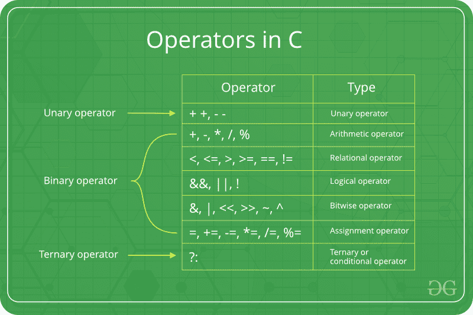

# C/c++中的赋值运算符

> 原文:[https://www.geeksforgeeks.org/assignment-operators-in-c-c/](https://www.geeksforgeeks.org/assignment-operators-in-c-c/)



赋值运算符用于给变量赋值。赋值运算符的左侧操作数是一个变量，而赋值运算符的右侧操作数是一个值。右侧的值必须与左侧变量的数据类型相同，否则编译器将引发错误。
不同类型的赋值运算符如下所示:

*   **"="** :这是最简单的赋值运算符。该运算符用于将右边的值赋给左边的变量。
    例如:

    ```
    a = 10;
    b = 20;
    ch = 'y';

    ```

*   **"+="** :这个运算符是'+'和' = '运算符的组合。该运算符首先将左边变量的当前值与右边的值相加，然后将结果赋给左边的变量。
    例:

```
(a += b) can be written as (a = a + b)

```

如果最初存储在 a 中的值是 5。然后(a += 6) = 11。

*   **“-=”**This operator is combination of ‘-‘ and ‘=’ operators. This operator first subtracts the current value of the variable on left from the value on the right and then assigns the result to the variable on the left.
    Example:

    ```
    (a -= b) can be written as (a = a - b)

    ```

    如果最初存储在 a 中的值是 8。然后(a -= 6) = 2。

    *   **“*=”**This operator is combination of ‘*’ and ‘=’ operators. This operator first multiplies the current value of the variable on left to the value on the right and then assigns the result to the variable on the left.
    Example:

    ```
    (a *= b) can be written as (a = a * b)

    ```

    如果最初存储在 a 中的值是 5。然后(a *= 6) = 30。

    *   **“/=”**This operator is combination of ‘/’ and ‘=’ operators. This operator first divides the current value of the variable on left by the value on the right and then assigns the result to the variable on the left.
    Example:

    ```
    (a /= b) can be written as (a = a / b)

    ```

    如果最初存储在 a 中的值是 6。然后(a /= 2) = 3。

    以下示例说明了各种赋值运算符:

    ## C

    ```
    // C program to demonstrate
    // working of Assignment operators

    #include <stdio.h>

    int main()
    {

        // Assigning value 10 to a
        // using "=" operator
        int a = 10;
        printf("Value of a is %d\n", a);

        // Assigning value by adding 10 to a
        // using "+=" operator
        a += 10;
        printf("Value of a is %d\n", a);

        // Assigning value by subtracting 10 from a
        // using "-=" operator
        a -= 10;
        printf("Value of a is %d\n", a);

        // Assigning value by multiplying 10 to a
        // using "*=" operator
        a *= 10;
        printf("Value of a is %d\n", a);

        // Assigning value by dividing 10 from a
        // using "/=" operator
        a /= 10;
        printf("Value of a is %d\n", a);

        return 0;
    }
    ```

    ## C++

    ```
    // C++ program to demonstrate 
    // working of Assignment operators 

    #include <iostream>
    using namespace std;

    int main() 
    { 

        // Assigning value 10 to a 
        // using "=" operator 
        int a = 10; 
        cout << "Value of a is "<<a<<"\n"; 

        // Assigning value by adding 10 to a 
        // using "+=" operator 
        a += 10; 
        cout << "Value of a is "<<a<<"\n"; 

        // Assigning value by subtracting 10 from a 
        // using "-=" operator 
        a -= 10; 
        cout << "Value of a is "<<a<<"\n"; 

        // Assigning value by multiplying 10 to a 
        // using "*=" operator 
        a *= 10; 
        cout << "Value of a is "<<a<<"\n"; 

        // Assigning value by dividing 10 from a 
        // using "/=" operator 
        a /= 10; 
        cout << "Value of a is "<<a<<"\n"; 

        return 0; 
    }
    ```

    **Output:**

    ```
    Value of a is 10
    Value of a is 20
    Value of a is 10
    Value of a is 100
    Value of a is 10

    ```