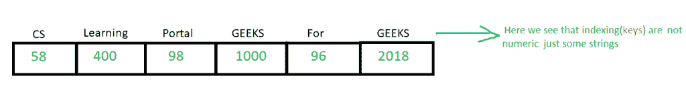

# c++中的关联数组

> 原文:[https://www.geeksforgeeks.org/associative-arrays-in-cpp/](https://www.geeksforgeeks.org/associative-arrays-in-cpp/)

关联数组也称为映射或字典。在 C++中。这些是特殊类型的数组，其中索引可以是*数字*或*任何其他数据类型*
，即可以是数字 0、1、2、3..OR 字符 a、b、c、d… OR 字符串 geek、计算机…
这些索引被称为 ***键*** ，存储在该位置的数据被称为
***值*** 。
所以在关联数组中我们有**(键，值)**对。
我们使用 [STL 映射](https://www.geeksforgeeks.org/map-associative-containers-the-c-standard-template-library-stl/)在 C++中实现关联数组的概念。



**示例** :
现在我们要打印电脑极客的标记，他们的名字和标记如下

```
  Name        Marks
       Jessie       100
       Suraj        91
       Praveen      99   
       Bisa         78
       Rithvik      84

```

```
// CPP program to demonstrate associative arrays
#include <bits/stdc++.h>
using namespace std;
int main()
{
    // the first data type i.e string represents 
    // the type of key we want the second data type
    // i.e int represents the type of values we 
    // want to store at that location
    map<string, int> marks{ { "Rithvik", 78 },
            { "Suraj", 91 }, { "Jessie", 100 },
            { "Praveen", 99 }, { "Bisa", 84 } };

     map<string, int>::iterator i; 
    cout << "The marks of all students are" << endl;
    for (i = marks.begin(); i != marks.end(); i++) 
        cout << i->second << " ";

    cout << endl;

    // the marks of the students based on there names.
    cout << "the marks of Computer geek Jessie are"
         << " " << marks["Jessie"] << endl; 

    cout << "the marks of geeksforgeeks contributer"
          " Praveen are " << marks["Praveen"] << endl;
}
```

**Output:**

```
The marks of all students are
84 100 99 78 91 
the marks of Computer geek Jessie are 100
the marks of geeksforgeeks contributer Praveen are 99

```