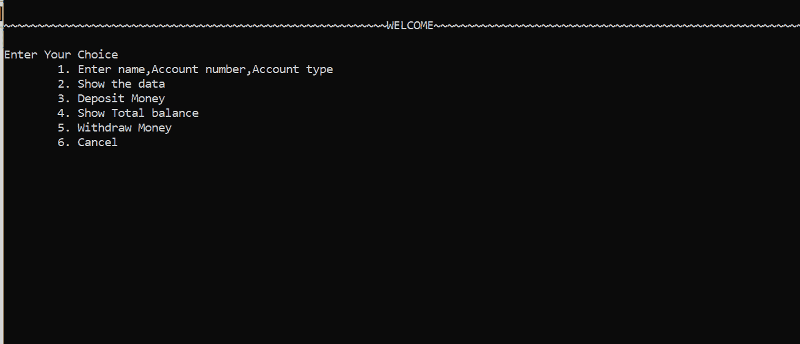
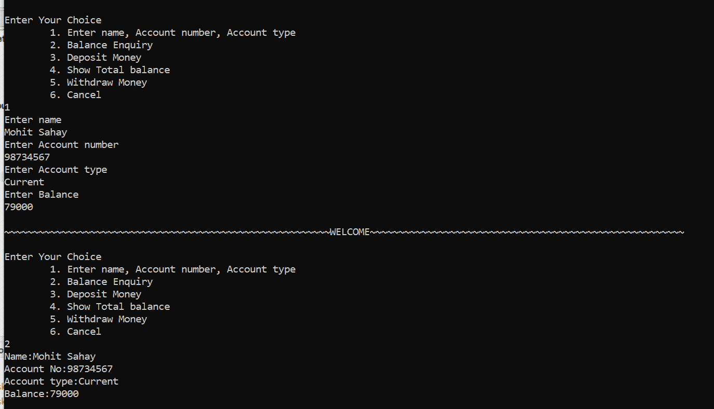
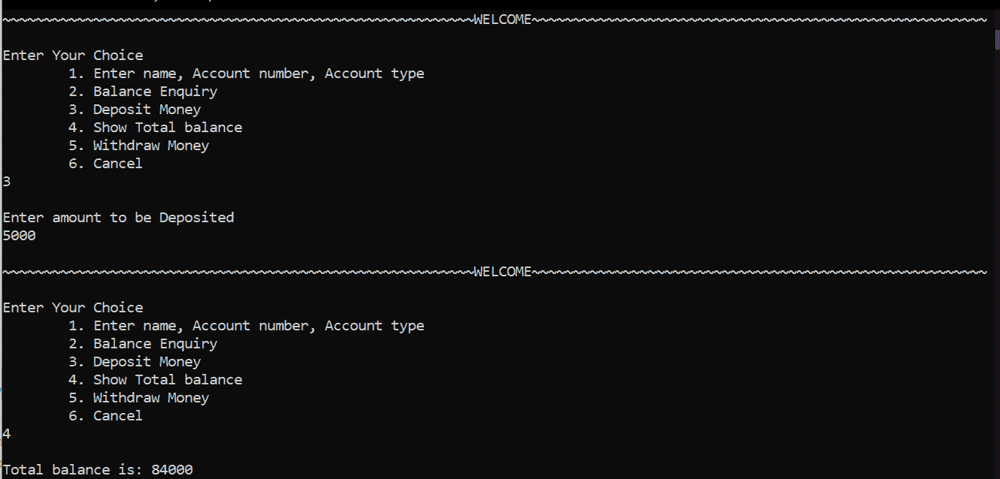
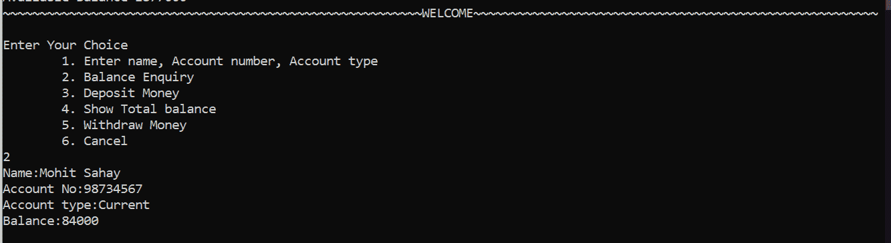
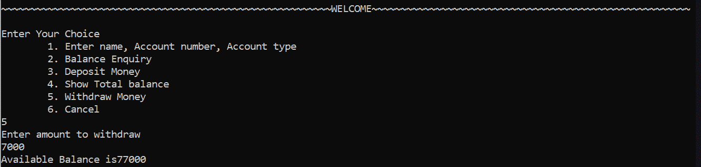

# 使用 C++的 ATM 管理系统

> 原文:[https://www . geesforgeks . org/ATM-管理-系统-使用-cpp/](https://www.geeksforgeeks.org/atm-management-system-using-cpp/)

**自动取款机**是[自动柜员机](https://www.geeksforgeeks.org/use-case-diagram-for-bank-atm-system/)，用于进行日常金融交易。自动取款机可以用来取款或存款，甚至可以知道账户的信息，如余额等。它们方便易用，它允许消费者进行快速的自助交易。

在本文中，我们将讨论 C++中的自动柜员机管理系统，这是一个为用户提供实际自动柜员机(即自动柜员机)应具备的各个方面的应用程序。这是一个菜单驱动的程序，具有自动柜员机功能，包括:

> 1.  Enter the name, account number and account type to be displayed during the transaction.
> 2.  Displays the information of the person who is conducting the transaction.
> 3.  Enter the amount to be deposited into the account.
> 4.  Show account balance.
> 5.  Enter the amount to withdraw from the account, and then display the available balance.
> 6.  Cancel the transaction.

**方法:**该程序使用了 C++中[类](https://www.geeksforgeeks.org/c-classes-and-objects/)、[访问修饰符、](https://www.geeksforgeeks.org/access-modifiers-in-c/)[数据类型](https://www.geeksforgeeks.org/c-data-types/)、[变量](https://www.geeksforgeeks.org/variables-in-c/)、[切换用例](https://www.geeksforgeeks.org/switch-statement-cc/)等基本概念。以下是将要实现的功能:

*   **<u>setvalue()</u> :** 此处使用此功能，使用 C++中的基本输入输出方法设置数据，即 cout 和 cin 语句，分别从键盘(即用户)显示和获取输入。
*   **<u>显示值</u> ():** 该功能用于打印数据。
*   **<u>存款():</u>** 该功能有助于将钱存入特定账户。
*   **<u>showbal(</u> ):** 此功能显示沉积后可用的总余额。
*   **<u>取款():</u>** 该功能有助于从账户中取款。
*   **<u>main()</u> :** 这个功能在一个无限的 **while 循环**里面有一个简单的**开关盒**(进行选择)，这样每次用户都可以选择。

下面是使用上述方法的 C++程序:

## C++

```cpp
// C++ program to implement the ATM
// Management System
#include <iostream>
#include <stdlib.h>
#include <string.h>
using namespace std;
class Bank {

    // Private variables used inside class
private:
    string name;
    int accnumber;
    char type[10];
    int amount = 0;
    int tot = 0;

    // Public variables
public:
    // Function to set the person's data
    void setvalue()
    {
        cout << "Enter name\n";
        cin.ignore();

        // To use space in string
        getline(cin, name);

        cout << "Enter Account number\n";
        cin >> accnumber;
        cout << "Enter Account type\n";
        cin >> type;
        cout << "Enter Balance\n";
        cin >> tot;
    }

    // Function to display the required data
    void showdata()
    {
        cout << "Name:" << name << endl;
        cout << "Account No:" << accnumber << endl;
        cout << "Account type:" << type << endl;
        cout << "Balance:" << tot << endl;
    }

    // Function to deposit the amount in ATM
    void deposit()
    {
        cout << "\nEnter amount to be Deposited\n";
        cin >> amount;
    }

    // Function to show the balance amount
    void showbal()
    {
        tot = tot + amount;
        cout << "\nTotal balance is: " << tot;
    }

    // Function to withdraw the amount in ATM
    void withdrawl()
    {
        int a, avai_balance;
        cout << "Enter amount to withdraw\n";
        cin >> a;
        avai_balance = tot - a;
        cout << "Available Balance is" << avai_balance;
    }
};

// Driver Code
int main()
{
    // Object of class
    Bank b;

    int choice;

    // Infinite while loop to choose
    // options everytime
    while (1) {
        cout << "\n~~~~~~~~~~~~~~~~~~~~~~~~~~"
             << "~~~~~~~~~~~~~~~~~~~~~~~~~~~~"
             << "~~~WELCOME~~~~~~~~~~~~~~~~~~"
             << "~~~~~~~~~~~~~~~~~~~~~~~~~~~~"
             << "~~~~~~~~~\n\n";
        cout << "Enter Your Choice\n";
        cout << "\t1\. Enter name, Account "
             << "number, Account type\n";
        cout << "\t2\. Balance Enquiry\n";
        cout << "\t3\. Deposit Money\n";
        cout << "\t4\. Show Total balance\n";
        cout << "\t5\. Withdraw Money\n";
        cout << "\t6\. Cancel\n";
        cin >> choice;

        // Choices to select from
        switch (choice) {
        case 1:
            b.setvalue();
            break;
        case 2:
            b.showdata();
            break;
        case 3:
            b.deposit();
            break;
        case 4:
            b.showbal();
            break;
        case 5:
            b.withdrawl();
            break;
        case 6:
            exit(1);
            break;
        default:
            cout << "\nInvalid choice\n";
        }
    }
}
```

**输出:**

*   显示选项:



*   选择 1:



*   对于选择 3:



*   对于选择 2:



*   选择 5:

