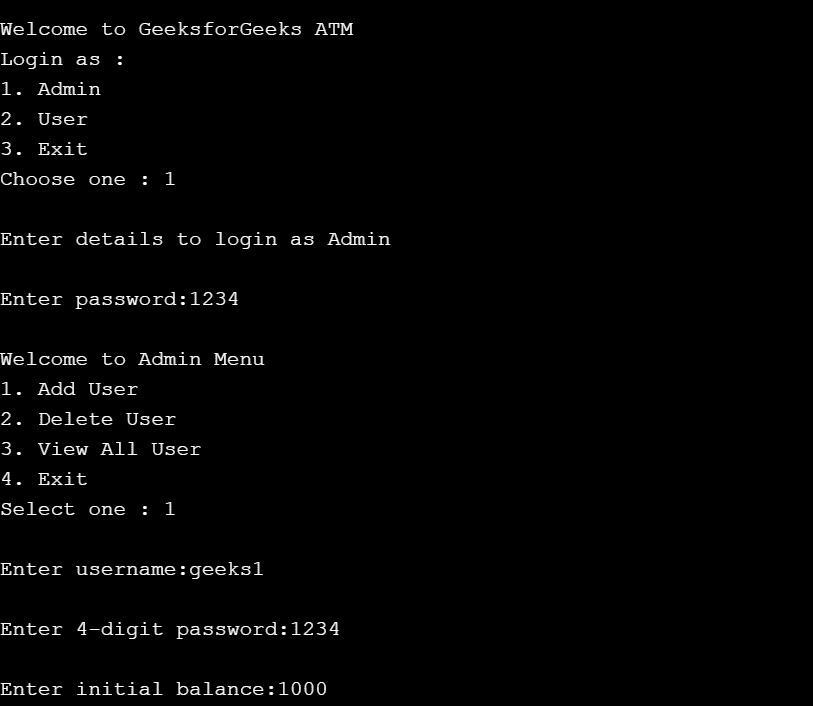
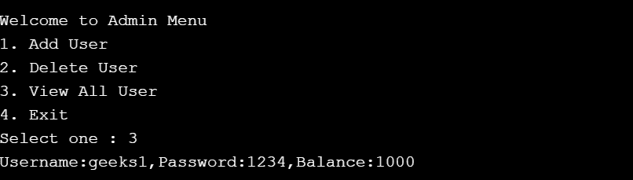
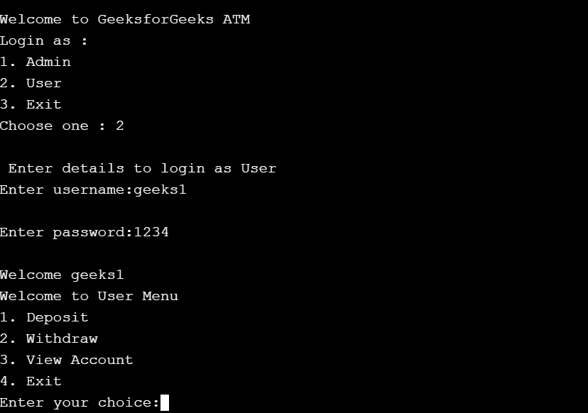
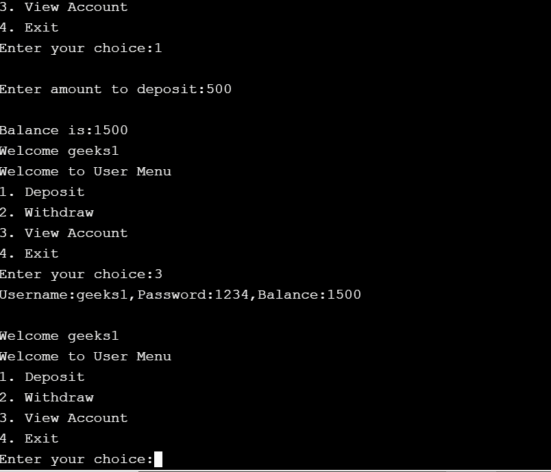
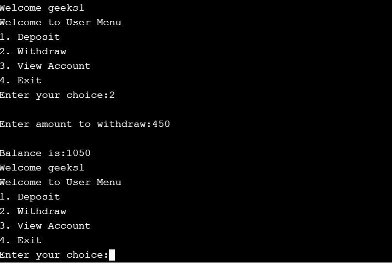
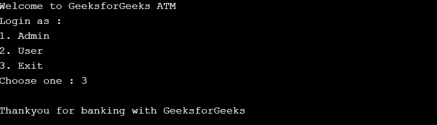

# 在 C++ 中使用文件处理的 ATM

> 原文:[https://www . geesforgeks . org/ATM-使用文件处理-in-cpp/](https://www.geeksforgeeks.org/atm-using-file-handling-in-cpp/)

在本文中，任务是使用 C++ 中的**文件处理**实现一个[自动柜员机](https://www.geeksforgeeks.org/use-case-diagram-for-bank-atm-system/)，具有添加、删除、搜索和更新用户等功能。

**文件处理:**

*   [文件处理](https://www.geeksforgeeks.org/file-handling-c-classes/)用于将程序的输出存储在文件中。
*   在 C++ 中，文件使用三个类[**fsstream**、 **ifstream** 、 **ofstream**](https://www.geeksforgeeks.org/file-handling-c-classes/) 在[**fsstream**](https://www.geeksforgeeks.org/file-handling-c-classes/)头文件中提供用于文件处理。

**一些重要说明:**

1.  **管理员**登录密码为 **1234** 。
2.  最初，文件是空的，确保首先以管理员身份登录并添加用户，然后以用户身份登录。

**进场:**

*   选择用户类型并输入密码。
*   在给定的菜单中，选择基本操作，并在添加、删除、搜索和更新用户等操作中输入详细信息。
*   完成所有功能和操作后，退出自动柜员机系统。
*   所有文件操作都在名为 **aaa.txt** 的文件中完成，其中数据使用 **ofstream** 模式写入，并可以使用 **ifstream** 模式读取。
*   此后，必须使用 [**<文件名>关闭文件。关闭()**](https://www.geeksforgeeks.org/php-fclose-function/) 。

下面是上述方法的实现:

## C++

```cpp
// C++ code to implement an ATM and
// its basic functions
#include <fstream>
#include <iostream>
#include <limits>
#include <string.h>
#include <unistd.h>
using namespace std;

// Class ATM to get user details
class atm {
private:
    char username[30];
    int password;
    int balance;

public:
    char* usernames(void)
    {
        // Return username
        return the username;
    }

    int passwords(void)
    {
        // Return the password
        return password;
    }

    // Function to get the data
    void getData(void)
    {
        cin.ignore(
            numeric_limits<streamsize>::max(),
            '\n');
        cout << "\nEnter username:";

        cin.getline(username, 30);
        cout << "\nEnter 4-digit "
             << "password:";

        cin >> password;
        cin.ignore(
            numeric_limits<streamsize>::max(),
            '\n');
        cout << "\nEnter initial"
             << " balance:";

        cin >> balance;
        cin.ignore(
            numeric_limits<streamsize>::max(),
            '\n');
    }

    // Function displaying the data
    void showData(void)
    {
        cout << "Username:" << username
             << ", Password:" << password
             << ", Balance:" << balance
             << endl;
    }

    // Member Functions
    int adduser();
    int viewallusers();
    int deleteuser(char*);
    void updateuserasdeposit(char*);
    void updateuseraswithdraw(char*);
    int searchspecificuser(char*, int);
    int searchallusertodisplay(char*);
};

// Function to implement functionality
// of ATM User
void atmUser()
{
    atm a;

    char uname[30];
    int pass, ch, ch1, ch2, found = 0;

mainmenu:

    // System("cls");
    cout << "\nWelcome to GeeksforGeeks ATM";
    cout << "\nLogin as :\n1\. Admin\n2."
         << " User\n3\. "
            "Exit\nChoose one : ";
    cin >> ch;

    switch (ch) {
    case 1:
    rerun:
        // System("cls");
        cout << "\nEnter details to"
             << " login as Admin\n";
        cout << "\nEnter password:";
        cin >> pass;
        if (pass == 1234) {
        admin:
            // System("cls");
            cout << "\nWelcome to"
                 << " Admin Menu";
            cout << "\n1\. Add User\n2."
                 << " Delete User\n3\. "
                    "View All User\n4\. "
                 << "Exit";
            cout << "\nSelect one : ";
            cin >> ch1;
            switch (ch1) {
            case 1:
                a.adduser();
                goto admin;

            case 2:
                cout << "\nEnter the "
                     << "Username to be "
                        "deleted : ";
                cin.ignore(
                    numeric_limits<streamsize>::max(),
                    '\n');
                cin.getline(uname, 30);
                a.deleteuser(uname);
                goto admin;

            case 3:
                a.viewallusers();
                // sleep(4);
                goto admin;

            case 4:
                break;
            }
        }
        else {
            cout << "\nDetails are "
                 << "incorrect ! Please"
                    " try again";
            cin.get();
            goto rerun;
        }
        goto mainmenu;

    case 2:
        // System("cls");
        cout << "\n Enter details to"
             << " login as User\n";

        cin.ignore(
            numeric_limits<streamsize>::max(),
            '\n');
        cout << "Enter username:";
        cin.getline(uname, 30);
        cout << "\nEnter password:";

        cin >> pass;
        found = a.searchspecificuser(
            uname, pass);

        if (found) {
        user:
            // System("cls");
            cout << "\nWelcome "
                 << uname;
            cout << "\nWelcome to"
                 << " User Menu";
            cout << "\n1\. Deposit\n2."
                 << " Withdraw\n3\. View "
                    "Account\n4\. "
                 << "Exit\nEnter your choice:";
            cin >> ch2;

            switch (ch2) {
            case 1:
                a.updateuserasdeposit(uname);
                goto user;
            case 2:
                a.updateuseraswithdraw(uname);
                goto user;
            case 3:
                a.searchallusertodisplay(uname);
                // sleep(4);
                goto user;
            case 4:
                cout << "Thank you";
                break;
            }
        }
        else {
            cout << "\nNo account found"
                 << " with username "
                    ":(\n\nHit ENTER to continue "
                 << uname;
            cin.get();
        }
        goto mainmenu;

    case 3:
        cout << "\nThankyou for "
             << "banking with "
             << "GeeksforGeeks";
        cin.get();
        break;
    }
}

// Function to add user
int atm::adduser()
{
    atm a;

    ofstream file;

    // Open file in write mode
    file.open("aaa.txt",
              ios::out | ios::app);
    if (!file) {
        cout << "Error in creating "
             << "file.." << endl;
        return 0;
    }

    // Read from user
    a.getData();

    // Write into file
    file.write((char*)&a, sizeof(a));

    // Close the file
    file.close();

    return 0;
}

// View Users
int atm::viewallusers()
{

    atm a;

    ifstream file1;

    // Open file in read mode
    file1.open("aaa.txt", ios::in);
    if (!file1) {
        cout << "Error in opening file..";
        return 0;
    }

    // Read data from file
    file1.read((char*)&a, sizeof(a));
    while (!file1.eof()) {

        // Display data on monitor
        a.showData();
        file1.read((char*)&a, sizeof(a));
    }

    // Close the file
    file1.close();
    return 0;
}

// Function to delete the user
int atm::deleteuser(char* uname)
{

    atm a;

    fstream original, temp;
    original.open("aaa.txt", ios::in);
    if (!original) {
        cout << "\nfile not found";
        return 0;
    }
    else {
        temp.open("temp.txt",
                  ios::out | ios::app);
        original.read((char*)&a, sizeof(a));

        // Till end of file is reached
        while (!original.eof()) {

            if (!strcmp(a.usernames(),
                        uname)) {
                cout << "data found "
                     << "and deleted\n"
                     << a.username
                     << "\n";
            }
            else {
                temp.write((char*)&a,
                           sizeof(a));
            }

            original.read((char*)&a,
                          sizeof(a));
        }

        original.close();
        temp.close();
        remove("aaa.txt");
        rename("temp.txt", "aaa.txt");
        a.viewallusers();
    }
    return 0;
}

// Function to update user by
// depositing money
void atm::updateuserasdeposit(char* uname)
{

    atm a;
    fstream file, temp;
    file.open("aaa.txt",
              ios::in | ios::out | ios::ate);
    temp.open("temp.txt",
              ios::out | ios::app);
    file.seekg(0);
    file.read((char*)&a, sizeof(a));

    // Till end of the file
    while (!file.eof()) {
        if (!strcmp(a.usernames(), uname)) {
            int b;

            cout << "\nEnter amount "
                 << "to deposit:";
            cin >> b;
            a.balance = a.balance + b;
            cout << "\nBalance is:"
                 << a.balance;
            temp.write((char*)&a, sizeof(a));
        }
        else {
            temp.write((char*)&a, sizeof(a));
        }
        file.read((char*)&a, sizeof(a));
    }
    file.close();
    temp.close();
    remove("aaa.txt");
    rename("temp.txt", "aaa.txt");
}

// Function to update user by
// depositing withdrawing money
void atm::updateuseraswithdraw(char* uname)
{

    atm a;
    fstream file, temp;
    file.open("aaa.txt",
              ios::in | ios::out | ios::ate);
    temp.open("temp.txt",
              ios::out | ios::app);
    file.seekg(0);
    file.read((char*)&a, sizeof(a));

    // Till end of file is reached
    while (!file.eof()) {
        if (!strcmp(a.usernames(), uname)) {
            int b;
            cout << "\nEnter amount "
                 << "to withdraw:";
            cin >> b;
            if (a.balance < b) {
                cout
                    << "\nInsufficient "
                    << "balance to withdraw";
            }
            else {
                a.balance = a.balance - b;
                temp.write((char*)&a,
                           sizeof(a));
                cout << "\nBalance is:"
                     << a.balance;
            }
        }
        else {
            temp.write((char*)&a,
                       sizeof(a));
        }
        file.read((char*)&a, sizeof(a));
    }

    // Close the file
    file.close();
    temp.close();
    remove("aaa.txt");
    rename("temp.txt", "aaa.txt");
}

// Search user
int atm::searchspecificuser(
    char* uname, int pass)
{
    atm a;
    fstream f;

    // Open the file
    f.open("aaa.txt", ios::in);
    if (!f) {
        cout << "Error in opening file..";
        return 0;
    }

    // Read data from file
    f.read((char*)&a, sizeof(a));
    while (!f.eof()) {

        if (!strcmp(a.usernames(), uname)) {
            if (a.passwords() == pass) {
                return 1;
            }
        }
        f.read((char*)&a, sizeof(a));
    }

    // Close the file
    f.close();
    return 0;
}

// Search specific user
int atm::searchallusertodisplay(
    char* uname)
{
    atm a;
    fstream file1;

    // Open the file
    file1.open("aaa.txt", ios::in);
    if (!file1) {
        cout << "Error in opening file..";
        return 0;
    }

    // Read data from file
    file1.read((char*)&a, sizeof(a));
    while (!file1.eof()) {
        if (!strcmp(a.usernames(), uname)) {
            a.showData();
            return 0;
        }
        file1.read((char*)&a, sizeof(a));
    }

    // Close the file
    file1.close();
    return 0;
}

// Driver Code
int main()
{
    // Function Call
    atmUser();

    return 0;
}
```

**输出:**

[](https://media.geeksforgeeks.org/wp-content/uploads/20210118201332/output1.png)

[](https://media.geeksforgeeks.org/wp-content/uploads/20210118201407/output2.png)

[](https://media.geeksforgeeks.org/wp-content/uploads/20210118201416/output3.png)

[](https://media.geeksforgeeks.org/wp-content/uploads/20210118201423/output4.png)

[](https://media.geeksforgeeks.org/wp-content/uploads/20210118201430/output5.png)

[](https://media.geeksforgeeks.org/wp-content/uploads/20210118201438/output6.png)