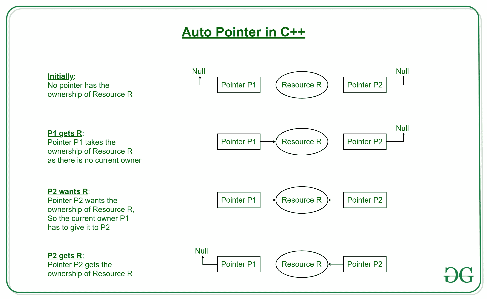
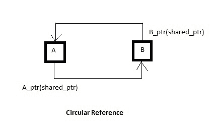
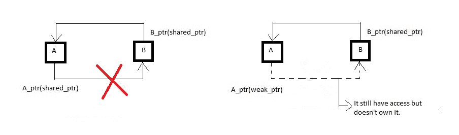

# auto_ptr、unique_ptr、shared_ptr 和 weak_ptr

> 原文:[https://www . geesforgeks . org/auto _ ptr-unique _ ptr-shared _ ptr-weak _ ptr-2/](https://www.geeksforgeeks.org/auto_ptr-unique_ptr-shared_ptr-weak_ptr-2/)

先决条件–[智能指针](https://www.geeksforgeeks.org/smart-pointers-cpp/)
C++库提供以下类型的智能指针实现:

*   auto_ptr
*   S7-1200 可编程控制器
*   共享 _ptr
*   弱 _ptr

它们都在内存头文件中声明。

**auto_ptr**

从 C++11 开始，不推荐使用此类模板。 **unique_ptr** 是一个新设施，功能类似，但安全性有所提高。
auto_ptr 是一个智能指针，用于管理通过新表达式获得的对象，并在 auto_ptr 本身被破坏时删除该对象。
当使用 auto_ptr 类描述一个对象时，它存储一个指向单个已分配对象的指针，这确保了当它超出范围时，它所指向的对象必须被自动销毁。它基于**独占所有权模型**，即同类型的两个指针不能同时指向同一个资源。如下图所示，指针的复制或分配会改变所有权，即源指针必须赋予目标指针所有权。

[](https://media.geeksforgeeks.org/wp-content/cdn-uploads/20190917111931/Auto-Pointer-in-C1.jpg)

```cpp
// C++ program to illustrate the use of auto_ptr
#include <iostream>
#include <memory>
using namespace std;

class A {
public:
    void show() { cout << "A::show()" << endl; }
};

int main()
{
    // p1 is an auto_ptr of type A
    auto_ptr<A> p1(new A);
    p1->show();

    // returns the memory address of p1
    cout << p1.get() << endl;

    // copy constructor called, this makes p1 empty.
    auto_ptr<A> p2(p1);
    p2->show();

    // p1 is empty now
    cout << p1.get() << endl;

    // p1 gets copied in p2
    cout << p2.get() << endl;

    return 0;
}
```

**输出:**

```cpp
A::show()
0x1b42c20
A::show()
0          
0x1b42c20

```

auto_ptr 的复制构造函数和赋值操作符实际上并不复制存储的指针，而是转移它，使第一个 auto_ptr 对象为空。这是实现严格所有权的一种方法，以便在任何给定时间只有一个 auto_ptr 对象可以拥有指针，即 auto_ptr 不应用于需要复制语义的地方。

**auto _ ptr 为什么被弃用？**
它以这样一种方式获得指针的所有权，即没有两个指针应该包含相同的对象。赋值转移所有权并将右值自动指针重置为空指针。因此，由于前面提到的无法复制，它们不能在 STL 容器中使用。

unique _ ptr

std::unique_ptr 是在 C++11 中开发的，作为 std::auto_ptr 的替代。
unique_ptr 是一个新的设施，具有类似的功能，但具有改进的安全性(没有伪造的副本分配)、增加的功能(删除器)和对数组的支持。它是原始指针的容器。它显式地防止复制其包含的指针，就像正常赋值一样，即它只允许底层指针的一个所有者。
因此，当使用 unique_ptr 时，在任何一个资源上最多只能有一个 unique_ptr，当该 unique_ptr 被销毁时，该资源将被自动声明。此外，由于任何资源只能有一个 unique_ptr，因此任何复制 unique_ptr 的尝试都会导致编译时错误。

```cpp
 unique_ptr<A> ptr1 (new A);

 // Error: can't copy unique_ptr
 unique_ptr<A> ptr2 = ptr1;    

```

但是，unique_ptr 可以使用新的移动语义进行移动，即使用 std::move()函数将包含的指针的所有权转移到另一个 unique_ptr。

```cpp
// Works, resource now stored in ptr2
unique_ptr<A> ptr2 = move(ptr1); 

```

因此，当我们想要一个指向某个对象的单个指针时，最好使用 unique_ptr，当该单个指针被销毁时，该对象将被回收。

```cpp
// C++ program to illustrate the use of unique_ptr
#include <iostream>
#include <memory>
using namespace std;

class A {
public:
    void show()
    {
        cout << "A::show()" << endl;
    }
};

int main()
{
    unique_ptr<A> p1(new A);
    p1->show();

    // returns the memory address of p1
    cout << p1.get() << endl;

    // transfers ownership to p2
    unique_ptr<A> p2 = move(p1);
    p2->show();
    cout << p1.get() << endl;
    cout << p2.get() << endl;

    // transfers ownership to p3
    unique_ptr<A> p3 = move(p2);
    p3->show();
    cout << p1.get() << endl;
    cout << p2.get() << endl;
    cout << p3.get() << endl;

    return 0;
}
```

**输出:**

```cpp
A::show()
0x1c4ac20
A::show()
0          // NULL
0x1c4ac20
A::show()
0          // NULL
0          // NULL
0x1c4ac20

```

下面的代码返回一个资源，如果我们不显式捕获返回值，这个资源将被清除。如果我们这样做了，那么我们就拥有该资源的专属所有权。这样，我们就可以认为 unique_ptr 是 auto_ptr 更安全、更好的替代品。

```cpp
unique_ptr<A> fun()
{
    unique_ptr<A> ptr(new A);

    /* ...
       ... */

    return ptr;
}

```

**何时使用 unique_ptr？**
当您想要拥有资源的单一所有权(独占)时，请使用 unique_ptr。只有一个 unique_ptr 可以指向一个资源。因为单个资源可以有一个唯一的 ptr，所以不可能将一个唯一的 ptr 复制到另一个。

**shared_ptr**

shared_ptr 是原始指针的容器。它是一个**引用计数所有权模型**，也就是说，它与 shared_ptr 的所有副本一起维护其包含的指针的引用计数。因此，每当新指针指向资源时，计数器就递增，而当对象的析构函数被调用时，计数器就递减。

**引用计数:**它是一种存储对资源(如对象、内存块、磁盘空间或其他资源)的引用、指针或句柄数量的技术。

在引用计数大于零之前，即在 shared_ptr 的所有副本都被删除之前，包含的原始指针所引用的对象不会被销毁。
所以，当我们想要将一个原始指针分配给多个所有者时，应该使用 shared_ptr。

```cpp
// C++ program to demonstrate shared_ptr
#include <iostream>
#include <memory>
using namespace std;

class A {
public:
    void show()
    {
        cout << "A::show()" << endl;
    }
};

int main()
{
    shared_ptr<A> p1(new A);
    cout << p1.get() << endl;
    p1->show();
    shared_ptr<A> p2(p1);
    p2->show();
    cout << p1.get() << endl;
    cout << p2.get() << endl;

    // Returns the number of shared_ptr objects
    // referring to the same managed object.
    cout << p1.use_count() << endl;
    cout << p2.use_count() << endl;

    // Relinquishes ownership of p1 on the object
    // and pointer becomes NULL
    p1.reset();
    cout << p1.get() << endl;
    cout << p2.use_count() << endl;
    cout << p2.get() << endl;

    return 0;
}
```

**输出:**

```cpp
0x1c41c20
A::show()
A::show()
0x1c41c20
0x1c41c20
2
2
0          // NULL
1
0x1c41c20

```

**什么时候使用 shared_ptr？**
如果你想共享资源的所有权，请使用 shared_ptr。许多 shared_ptr 可以指向一个资源。shared_ptr 维护此建议的引用计数。当所有指向资源的 shared_ptr 超出范围时，资源就会被销毁。

**弱 _ptr**

弱 _ptr 被创建为 shared_ptr 的副本。它提供对由一个或多个 shared_ptr 实例拥有但不参与引用计数的对象的访问。weak_ptr 的存在或销毁对 shared_ptr 或其其他副本没有影响。在某些情况下，需要中断 shared_ptr 实例之间的循环引用。

 **循环依赖(shared_ptr 的问题):**让我们考虑一个场景，我们有两个类 A 和 B，都有指向其他类的指针。所以，它总是像 A 指着 B and B 指着 A。因此，use_count 永远不会达到零，也永远不会被删除。

[](https://media.geeksforgeeks.org/wp-content/uploads/Image_2.jpg)

这就是我们使用**弱指针** (weak_ptr)的原因，因为它们没有被引用计数。因此，其中声明了 weak_ptr 的类没有它的据点，即所有权不共享，但是它们可以访问这些对象。

[](https://media.geeksforgeeks.org/wp-content/uploads/Image_3.jpg)

所以，在 shared_ptr 的情况下，由于循环依赖，use_count 永远不会达到零，这就阻止了使用 weak_ptr，这通过将 A_ptr 声明为 weak_ptr 来消除这个问题，因此 A 类不拥有它，只拥有对它的访问权，我们还需要检查对象的有效性，因为它可能会超出范围。总的来说，这是一个设计问题。

**什么时候使用 weak_ptr？**
当你确实想从多个地方引用你的对象时——对于那些可以忽略和解除分配的引用(所以当你试图解除引用时，它们会注意到对象已经不存在了)。

**参考:**
[https://www . quora . com/When-I-应用文-shared _ ptr-and-unique _ ptr-in-c++-and-它们是什么-好-适合](https://www.quora.com/When-should-I-use-shared_ptr-and-unique_ptr-in-C++-and-what-are-they-good-for)

本文由**希曼舒·古普塔(巴格里)**供稿。如果你喜欢 GeeksforGeeks 并想投稿，你也可以使用[write.geeksforgeeks.org](https://write.geeksforgeeks.org)写一篇文章或者把你的文章邮寄到 review-team@geeksforgeeks.org。看到你的文章出现在极客博客主页上，帮助其他极客。

如果你发现任何不正确的地方，或者你想分享更多关于上面讨论的话题的信息，请写评论。