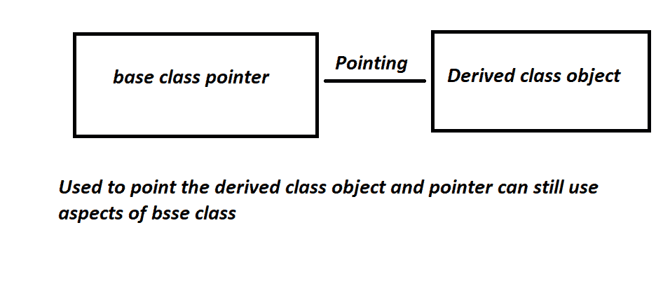

# 指向派生类对象的基类指针

> 原文:[https://www . geesforgeks . org/基类-指针-指向派生类-对象/](https://www.geeksforgeeks.org/base-class-pointer-pointing-to-derived-class-object/)

[**指针**](https://www.geeksforgeeks.org/pointers-in-c-and-c-set-1-introduction-arithmetic-and-array/) 是存储其他数据类型地址的数据类型。

**[**基类**](https://www.geeksforgeeks.org/difference-between-base-class-and-derived-class-in-c/) **的指针指向派生类的不同对象:****

**[](https://media.geeksforgeeks.org/wp-content/uploads/20210221202239/pointerstoderivedclass.png)**

****进场:****

*   **派生类是从其基类中获取一些属性的类。**
*   **诚然，一个类的指针可以指向另一个类，但类必须是基类和派生类，才有可能。**
*   **要访问基类的**变量，将使用基类指针。****
*   **因此，指针是基类的类型，它可以访问基类的所有公共[函数](https://www.geeksforgeeks.org/functions-in-c/)和[变量](https://www.geeksforgeeks.org/variables-and-keywords-in-c/)，因为指针是基类的，这被称为绑定指针。**
*   **在这个指针中，基类归基类所有，但指向派生类[对象](https://www.geeksforgeeks.org/c-classes-and-objects/)。**
*   **同样适用于派生类指针，值被更改。**

**下面是 C++程序，用来说明指向派生类的基类指针的实现:**

## **C++**

```cpp
// C++ program to illustrate the
// implementation of the base class
// pointer pointing to derived class
#include <iostream>
using namespace std;

// Base Class
class BaseClass {
public:
    int var_base;

    // Function to display the base
    // class members
    void display()
    {
        cout << "Displaying Base class"
             << " variable var_base: " << var_base << endl;
    }
};

// Class derived from the Base Class
class DerivedClass : public BaseClass {
public:
    int var_derived;

    // Function to display the base
    // and derived class members
    void display()
    {
        cout << "Displaying Base class"
             << "variable var_base: " << var_base << endl;
        cout << "Displaying Derived "
             << " class variable var_derived: "
             << var_derived << endl;
    }
};

// Driver Code
int main()
{
    // Pointer to base class
    BaseClass* base_class_pointer;
    BaseClass obj_base;
    DerivedClass obj_derived;

    // Pointing to derived class
    base_class_pointer = &obj_derived;

    base_class_pointer->var_base = 34;

    // Calling base class member function
    base_class_pointer->display();

    base_class_pointer->var_base = 3400;
    base_class_pointer->display();

    DerivedClass* derived_class_pointer;
    derived_class_pointer = &obj_derived;
    derived_class_pointer->var_base = 9448;
    derived_class_pointer->var_derived = 98;
    derived_class_pointer->display();

    return 0;
}
```

****输出:****

```cpp
Displaying Base class variable var_base: 34
Displaying Base class variable var_base: 3400
Displaying Base classvariable var_base: 9448
Displaying Derived  class variable var_derived: 98
```

****结论:****

*   **指向派生类的指针是指向派生类的基类指针，但是它将保存它的方面。**
*   **基类的这个指针将能够锤炼自己类的[函数](https://www.geeksforgeeks.org/functions-in-c/)和[变量](https://www.geeksforgeeks.org/variables-and-keywords-in-c/)，并且仍然可以指向派生类对象。**