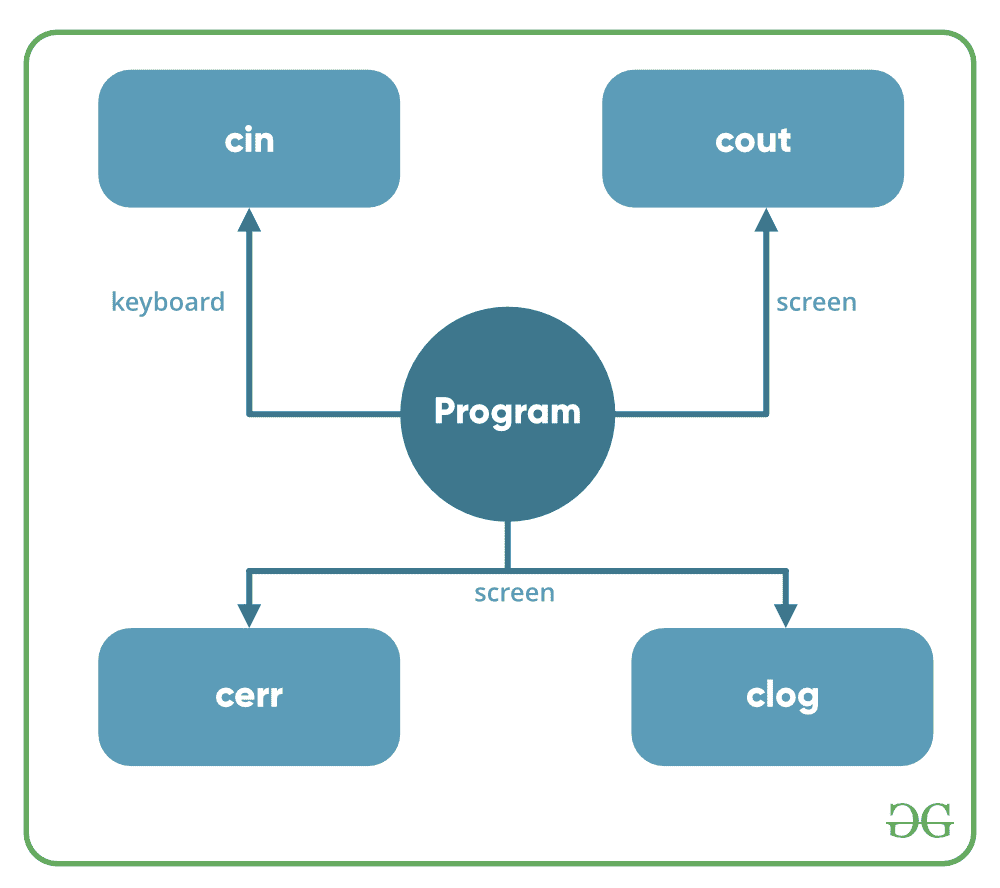

# c++中的基本输入/输出

> 原文:[https://www.geeksforgeeks.org/basic-input-output-c/](https://www.geeksforgeeks.org/basic-input-output-c/)

C++自带的库为我们提供了许多执行输入和输出的方法。在 C++中，输入和输出以字节序列或更常见的**流**的形式执行。

*   **输入流:**如果字节流的方向是从设备(例如键盘)到主存储器，那么这个过程称为输入。
*   **输出流:**如果字节流的方向相反，即从主存储器到设备(显示屏)的方向，那么这个过程称为输出。



**c++中可用于输入输出操作的头文件有:**

1.  **iostream** : iostream 代表标准输入输出流。这个头文件包含像 cin、cout、cerr 等对象的定义。
2.  **iomanip** : iomanip 代表输入输出机械手。这些文件中声明的方法用于操作流。该文件包含 setw、setprecision 等的定义。
3.  **fsstream**:这个头文件主要描述文件流。该头文件用于处理作为输入从文件中读取的数据或作为输出写入文件的数据。

C++ 中的 **cout 和 C++** 中的 **cin 这两个关键词分别非常常用于打印输出和获取输入。这两种是 C++中取输入和打印输出最基本的方法。要在 C++中使用 cin 和 cout，必须在程序中包含头文件 *iostream* 。**

本文主要讨论头文件 *iostream* 中定义的对象，如 cin 和 cout。

*   **标准输出流(cout)** :通常标准输出设备是显示屏。C++ **cout** 语句是 ostream 类的实例。它用于在标准输出设备(通常是显示屏)上产生输出。使用插入操作符( **< <** )将需要在屏幕上显示的数据插入标准输出流(cout)。

## C++

```cpp
#include <iostream>

using namespace std;

int main()
{
    char sample[] = "GeeksforGeeks";

    cout << sample << " - A computer science portal for geeks";

    return 0;
}
```

**输出:**

```cpp
GeeksforGeeks - A computer science portal for geeks
```

在上面的程序中，插入操作符( **< <** )在标准输出流 **cout** 中插入字符串变量**样本**的值，后跟字符串“极客的计算机科学门户”，然后显示在屏幕上。

*   **标准输入流(cin)** :通常电脑中的输入设备是键盘。C++ cin 语句是类**的实例，用于从标准输入设备(通常是键盘)读取输入。
    提取运算符( **> >** )与对象 **cin** 一起用于读取输入。提取操作员从使用键盘输入的对象 **cin** 中提取数据。**

## C++

```cpp
#include <iostream>
using namespace std;

int main()
{
    int age;

    cout << "Enter your age:";
    cin >> age;
    cout << "\nYour age is: " << age;

    return 0;
}
```

**输入:**

```cpp
18
```

**输出:**

```cpp
Enter your age:
Your age is: 18
```

上述程序要求用户输入年龄。对象 cin 连接到输入设备。使用提取操作符( **> >** )从 cin 提取用户输入的年龄，然后将提取的数据存储在提取操作符右侧的变量**年龄**中。

*   **未缓冲的标准错误流(cerr)**:c++ cerr 是用于输出错误的标准错误流。这也是 ostream 类的一个实例。因为 C++中的 cerr 是不缓冲的，所以当需要立即显示错误消息时就使用它。它没有任何缓冲区来存储错误消息并在以后显示。
*   cerr 和 cout 的主要区别在于，当您想使用“cout”重定向输出时，输出会被重定向到文件。如果您使用“cerr”，错误不会存储在文件中。(这就是未缓冲的意思..它不能存储消息)

## C++

```cpp
#include <iostream>

using namespace std;

int main()
{
    cerr << "An error occurred";
    return 0;
}
```

**输出:**

```cpp
An error occurred
```

*   **缓冲的标准错误流(clog)** :这也是 ostream 类的一个实例，用于显示错误，但与 cerr 不同的是，错误首先被插入缓冲区，并存储在缓冲区中，直到它没有被完全填满。或者缓冲区没有被显式刷新(使用 flush())。错误信息也会显示在屏幕上。

## C++

```cpp
#include <iostream>

using namespace std;

int main()
{
    clog << "An error occurred";

    return 0;
}
```

**输出:**

```cpp
An error occurred
```

& list = plqm 7 alxfysgg 6 gsrme 2 ini 4k 8 fph 5 qvb

**相关文章**:

*   [cout<T3】endl vs cout<T5】c++中的“\n”](https://www.geeksforgeeks.org/endl-vs-n/)
*   [当后面有 fgets()/get()/scanf()时，scanf()有问题](https://www.geeksforgeeks.org/problem-with-scanf-when-there-is-fgetsgetsscanf-after-it/)
*   [当输入中有空行时，如何在 C++中使用 getline()？](https://www.geeksforgeeks.org/how-to-use-getline-in-c-when-there-are-black-lines-in-input/)
*   [Cin-Cout vs Scanf-Printf](https://www.geeksforgeeks.org/cincout-vs-scanfprintf/)

本文由 [**哈什·阿加瓦尔**](https://www.facebook.com/harsh.agarwal.16752) 供稿。如果你喜欢 GeeksforGeeks 并想投稿，你也可以使用[write.geeksforgeeks.org](https://write.geeksforgeeks.org)写一篇文章或者把你的文章邮寄到 review-team@geeksforgeeks.org。看到你的文章出现在极客博客主页上，帮助其他极客。
如果发现有不正确的地方，或者想分享更多关于上述话题的信息，请写评论。