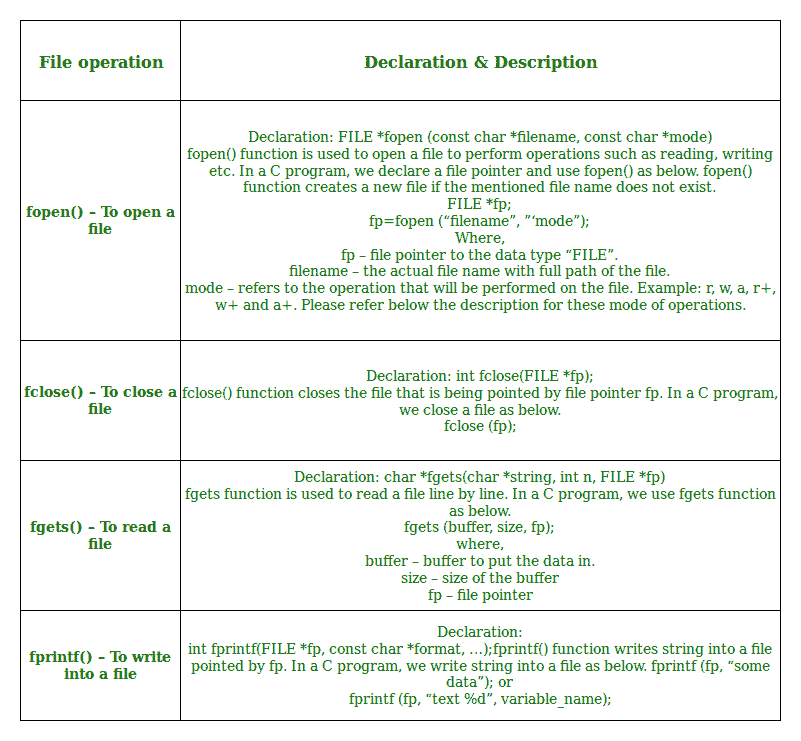

# C 语言文件处理基础

> 原文:[https://www.geeksforgeeks.org/basics-file-handling-c/](https://www.geeksforgeeks.org/basics-file-handling-c/)

到目前为止，使用 C 程序的操作都是在提示符/终端上完成的，而提示符/终端并没有存储在任何地方。但是在软件行业，大多数程序都是为了存储从程序中获取的信息而编写的。一种方法是将提取的信息存储在文件中。可以对文件进行的不同操作有:

1.  创建属性为“a”或“a+”或“w”或“w++”的新文件(**fopen)**
2.  打开现有文件( **fopen** )
3.  从文件中读取( **fscanf 或 fgets** )
4.  写入文件( **fprintf 或 fputs** )
5.  移动到文件中的特定位置(**偏移，倒回**)
6.  关闭文件( **fclose** )

括号中的文本表示用于执行这些操作的功能。
**文件操作中的功能:**



**打开或创建文件**
打开文件时，fopen 功能用于所需的访问模式。下面提到一些常用的文件访问模式。
**C 中的文件打开模式:**

*   **“r”–**搜索文件。如果文件打开成功，fopen()会将其加载到内存中，并设置一个指向其中第一个字符的指针。如果文件无法打开，fopen()返回空值。
*   **“Rb”–**以二进制模式打开进行读取。如果文件不存在，fopen()将返回空值。
*   **“w”–**搜索文件。如果文件存在，其内容将被覆盖。如果文件不存在，则会创建一个新文件。如果无法打开文件，则返回空值。
*   **“WB”–**以二进制模式打开进行写入。如果文件存在，其内容将被覆盖。如果文件不存在，将创建它。
*   **“a”–**搜索文件。如果文件打开成功，fopen()会将其加载到内存中，并设置一个指向其中最后一个字符的指针。如果文件不存在，则会创建一个新文件。如果无法打开文件，则返回空值。
*   **“ab”–**以二进制模式打开追加。数据被添加到文件的末尾。如果文件不存在，将创建它。
*   **“r+”–**搜索文件。如果打开成功，fopen()会将其加载到内存中，并设置一个指向其中第一个字符的指针。如果无法打开文件，则返回空值。
*   **“Rb+”–**以二进制模式打开进行读写。如果文件不存在，fopen()将返回空值。
*   **“w+”–**搜索文件。如果文件存在，其内容将被覆盖。如果文件不存在，则会创建一个新文件。如果无法打开文件，则返回空值。
*   **“WB+”–**以二进制模式打开进行读写。如果文件存在，其内容将被覆盖。如果文件不存在，将创建它。
*   **“a+”–**搜索文件。如果文件打开成功，fopen()会将其加载到内存中，并设置一个指向其中最后一个字符的指针。如果文件不存在，则会创建一个新文件。如果无法打开文件，则返回空值。
*   **“ab+”–**以二进制模式打开进行读取和追加。如果文件不存在，将创建它。

如上所述，如果您想对二进制文件执行操作，那么您必须在最后追加“b”。比如不用“w”，就得用“wb”，不用“a+”，就得用“a+b”。为了对文件执行操作，使用了一个称为文件指针的特殊指针，声明为

```cpp
FILE *filePointer; 

So, the file can be opened as 

filePointer = fopen(“fileName.txt”, “w”)
```

第二个参数可以更改为包含上表中列出的所有属性。

*   **读取文件–**
    文件读取操作可以使用函数 fscanf 或 fgets 来执行。这两个函数执行与 scanf 和 get 相同的操作，但带有一个附加参数，即文件指针。所以，要看你是一行一行地读文件，还是一个字符一个字符地读。
    读取文件的代码片段如下:

```cpp
FILE * filePointer; 

filePointer = fopen(“fileName.txt”, “r”);

fscanf(filePointer, "%s %s %s %d", str1, str2, str3, &year);
```

*   **写文件–**:
    文件写操作可以通过与读操作类似的函数 fprintf 和 fputs 来执行。写入文件的代码片段如下:

```cpp
FILE *filePointer ; 

filePointer = fopen(“fileName.txt”, “w”);

fprintf(filePointer, "%s %s %s %d", "We", "are", "in", 2012);
```

*   **关闭文件–**:
    每次成功的文件操作后，必须始终关闭一个文件。要关闭一个文件，你必须使用 fclose 函数。关闭文件的代码片段如下:

```cpp
FILE *filePointer ; 

filePointer= fopen(“fileName.txt”, “w”);

---------- Some file Operations -------

fclose(filePointer)
```

**例 1:** 打开文件、写入文件、关闭文件的程序

## C

```cpp
// C program to Open a File,
// Write in it, And Close the File

# include <stdio.h>
# include <string.h>

int main( )
{

    // Declare the file pointer
    FILE *filePointer ;

    // Get the data to be written in file
    char dataToBeWritten[50]
        = "GeeksforGeeks-A Computer Science Portal for Geeks";

    // Open the existing file GfgTest.c using fopen()
    // in write mode using "w" attribute
    filePointer = fopen("GfgTest.c", "w") ;

    // Check if this filePointer is null
    // which maybe if the file does not exist
    if ( filePointer == NULL )
    {
        printf( "GfgTest.c file failed to open." ) ;
    }
    else
    {

        printf("The file is now opened.\n") ;

        // Write the dataToBeWritten into the file
        if ( strlen ( dataToBeWritten ) > 0 )
        {

            // writing in the file using fputs()
            fputs(dataToBeWritten, filePointer) ;
            fputs("\n", filePointer) ;
        }

        // Closing the file using fclose()
        fclose(filePointer) ;

        printf("Data successfully written in file GfgTest.c\n");
        printf("The file is now closed.") ;
    }
    return 0;       
}
```

**示例 2:** 打开文件、从中读取并关闭文件的程序

## C

```cpp
// C program to Open a File,
// Read from it, And Close the File

# include <stdio.h>
# include <string.h>

int main( )
{

    // Declare the file pointer
    FILE *filePointer ;

    // Declare the variable for the data to be read from file
    char dataToBeRead[50];

    // Open the existing file GfgTest.c using fopen()
    // in read mode using "r" attribute
    filePointer = fopen("GfgTest.c", "r") ;

    // Check if this filePointer is null
    // which maybe if the file does not exist
    if ( filePointer == NULL )
    {
        printf( "GfgTest.c file failed to open." ) ;
    }
    else
    {

        printf("The file is now opened.\n") ;

        // Read the dataToBeRead from the file
        // using fgets() method
        while( fgets ( dataToBeRead, 50, filePointer ) != NULL )
        {

            // Print the dataToBeRead
            printf( "%s" , dataToBeRead ) ;
        }

        // Closing the file using fclose()
        fclose(filePointer) ;

        printf("Data successfully read from file GfgTest.c\n");
        printf("The file is now closed.") ;
    }
    return 0;       
}
```

**示例 3:** 使用 fwrite()
向二进制文件写入的程序

## C

```cpp
#include <stdio.h>
#include <stdlib.h>
struct threeNum
{
int n1, n2, n3;
};
int main()
{
 int n;
 struct threeNum num;
 FILE *fptr;
 if ((fptr = fopen("C:\\program.bin","wb")) == NULL){
 printf("Error! opening file");
 // Program exits if the file pointer returns NULL.
 exit(1);
 }
 for(n = 1; n < 5; ++ n)  //Program Code Submitted by Susobhan Akhuli
 {
 num.n1 = n;
 num.n2 = 5*n;
 num.n3 = 5*n + 1;
 fwrite(&num, sizeof(struct threeNum), 1, fptr);
 }
 fclose(fptr);
 return 0;
}
```

**示例 4:** 使用 fread()
从二进制文件读取的程序

## C

```cpp
#include <stdio.h>
#include <stdlib.h>
struct threeNum
{
 int n1, n2, n3;
};
int main()
{
 int n;
 struct threeNum num;
 FILE *fptr;
 if ((fptr = fopen("C:\\program.bin","rb")) == NULL){
 printf("Error! opening file");
 // Program exits if the file pointer returns NULL.
 exit(1);
 }
 for(n = 1; n < 5; ++ n)  //Program Code Submitted by Susobhan Akhuli
 {
 fread(&num, sizeof(struct threeNum), 1, fptr);
 printf("n1: %d\tn2: %d\tn3: %d", num.n1, num.n2, num.n3);
 }
 fclose(fptr);

 return 0;
}
```