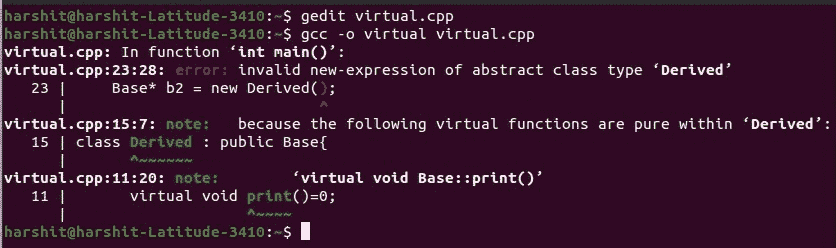

# 基类和抽象类的派生类中虚函数的行为

> 原文:[https://www . geesforgeks . org/从基类和抽象类派生的类中虚拟函数的行为/](https://www.geeksforgeeks.org/behavior-of-virtual-function-in-the-derived-class-from-the-base-class-and-abstract-class/)

在本文中，我们将讨论[派生类](https://www.geeksforgeeks.org/difference-between-base-class-and-derived-class-in-c/)中[虚函数](https://www.geeksforgeeks.org/virtual-function-cpp/)的行为，以及 C++ 中[抽象基类的派生类](https://www.geeksforgeeks.org/pure-virtual-functions-and-abstract-classes/)。

考虑以下程序:

## C++

```cpp
// C++ program to illustrate the concept
// of Virtual Function

#include <bits/stdc++.h>
using namespace std;

// Base Class
class Base {
public:
    // Virtual Function
    virtual void print()
    {
        cout << "Inside Base" << endl;
    }
};

// Derived Class
class Derived : public Base {
};

// Driver Code
int main()
{

    // Object of the derived class
    Base* b2 = new Derived();

    // Function Call to Base Class
    b2->print();

    return 0;
}
```

**Output:**

```cpp
Inside Base

```

**说明:**当**基类**的指针被声明为指向**派生类**的对象时，那么只有当需要在派生类中重写该函数时，才在基类中将该函数声明为虚函数。如果函数在基类中声明为虚函数，那么不建议在派生类中重写，它仍然会调用**虚函数**并执行。

**虚拟关键字**只在前往[运行时多态](https://www.geeksforgeeks.org/difference-between-compile-time-and-run-time-polymorphism-in-java/)并在派生类中重写基类的函数时有效。如果使用了虚拟关键字，并且不建议在派生类中重写该函数，则虚拟关键字没有任何用处。这个属性对于**抽象基类**不成立**因为基类中也没有函数体。下面是同样的程序来说明:**

**程序 1:**

## C++

```cpp
// C++ program to illustrate the concept
// of virtual function

#include <bits/stdc++.h>
using namespace std;

// Base Class
class Base {
public:
    // Virtual Function
    virtual void print() = 0;
};

// Derived Class
class Derived : public Base {

    // Overriding of virtual function
    void print()
    {
        cout << "Inside Derived"
 << endl;
    }
};

// Driver Code
int main()
{
    // Object of the derived class
    Base* b2 = new Derived();

    // Function Call to Base Class
    b2->print();

    return 0;
}
```

**Output:**

```cpp
Inside Derived

```

**程序 2:**

## C++

```cpp
// C++ program to illustrate the concept
// of virtual function

#include <bits/stdc++.h>
using namespace std;

// Base Class
class Base {
public:
    // Virtual Function
    virtual void print() = 0;
};

// Derived Class
class Derived : public Base {
};

// Driver Code
int main()
{

    // Object of the derived class
    Base* b2 = new Derived();

    // Function Call to Base Class
    b2->print();

    return 0;
}
```

**输出:**

[](https://media.geeksforgeeks.org/wp-content/uploads/20210406163029/VirtualFunctionCE.jpg)

**解释:**如果比较以上两个程序，当抽象类的函数被覆盖时，那么 virtual 关键字的工作方式就是它预期的工作方式。但是在上面的程序中，该函数没有在基类中被覆盖，并且该函数也没有在基类中定义，导致了[编译错误](https://www.geeksforgeeks.org/difference-between-compile-time-errors-and-runtime-errors/)。