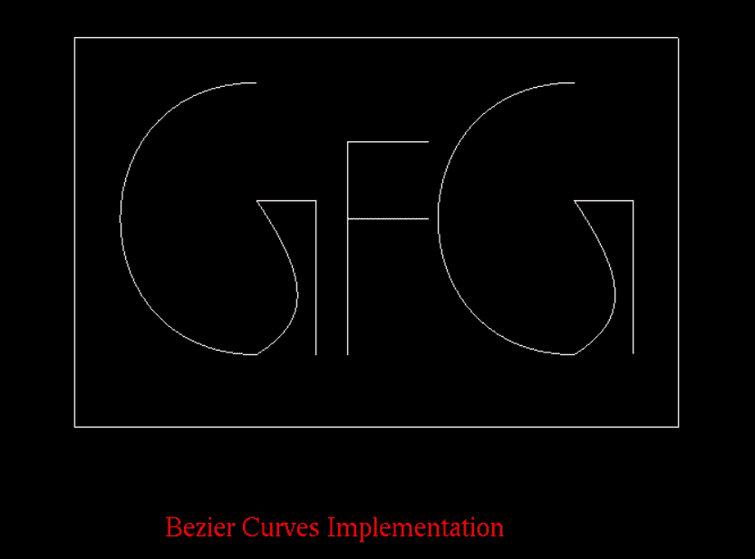

# OpenGL 中的贝塞尔曲线

> 原文:[https://www.geeksforgeeks.org/bezier-curves-in-opengl/](https://www.geeksforgeeks.org/bezier-curves-in-opengl/)

[OpenGL](https://www.geeksforgeeks.org/how-to-setup-opengl-with-visual-studio-2019-on-windows-10/) 是一个跨语言、跨平台的 API，用于渲染 2D 和 3D [矢量图形](https://www.geeksforgeeks.org/vector-vs-raster-graphics/)。使用 **OpenGL** 进行大量设计和动画制作。在本文中，我们将讨论**贝塞尔曲线** [OpenGL](https://www.geeksforgeeks.org/getting-started-with-opengl/) 的概念和实现。

**<u>贝泽曲线</u> :**

*   贝塞尔曲线的概念是由法国工程师皮埃尔·贝塞尔发现的。
*   [贝塞尔曲线](https://www.geeksforgeeks.org/cubic-bezier-curve-implementation-in-c/)基本上用于[计算机图形学](https://www.geeksforgeeks.org/introduction-to-computer-graphics/)中绘制形状，用于 CSS 动画，以及很多其他地方。
*   这些曲线是在其他一些点(也称为控制点)的控制下生成的。

**<u>贝塞尔曲线的属性</u> :**

*   贝塞尔曲线的一个非常重要的属性是，它们总是通过第一个和最后一个控制点。
*   定义曲线段的多项式的次数总是比定义多边形点数少一次。所以，例如，如果我们有 4 个控制点，那么多项式的次数是 3，即三次多项式。
*   在贝塞尔曲线中，移动控制点会改变整条曲线的形状。
*   贝塞尔曲线通常遵循定义多边形的形状。
*   曲线总是在控制点的凸包内。

下面是实现贝塞尔曲线的 [C++程序](https://www.geeksforgeeks.org/c-plus-plus/):

## C++

```cpp
// C++ program to implement Bezier Curves
#include <GL/gl.h>
#include <GL/glu.h>
#include <GL/glut.h>
#include <stdlib.h>

int i;

// Function to initialize the Beizer
// curve pointer
void init(void)
{
    glClearColor(1.0, 1.0, 1.0, 1.0);
}

// Function to draw the Bitmap Text
void drawBitmapText(char* string, float x,
                    float y, float z)
{
    char* c;
    glRasterPos2f(x, y);

    // Traverse the string
    for (c = string; *c != '\0'; c++) {
        glutBitmapCharacter(
            GLUT_BITMAP_TIMES_ROMAN_24, *c);
    }
}

// Function to draw the shapes
void draw(GLfloat ctrlpoints[4][3])
{
    glShadeModel(GL_FLAT);
    glMap1f(GL_MAP1_VERTEX_3, 0.0, 1.0, 3, 4,
            &ctrlpoints[0][0]);

    glEnable(GL_MAP1_VERTEX_3);

    // Fill the color
    glColor3f(1.0, 1.0, 1.0);
    glBegin(GL_LINE_STRIP);

    // Find the coordinates
    for (i = 0; i <= 30; i++)
        glEvalCoord1f((GLfloat)i / 30.0);

    glEnd();
    glFlush();
}

// Function to display the curved
// drawn using the Beizer Curve
void display(void)
{
    int i;

    // Specifying all the control
    // points through which the
    // curve will pass
    GLfloat ctrlpoints[4][3]
        = { { -0.00, 2.00, 0.0 },
            { -2.00, 2.00, 0.0 },
            { -2.00, -1.00, 0.0 },
            { -0.00, -1.00, 0.0 } };
    draw(ctrlpoints);

    GLfloat ctrlpoints2[4][3]
        = { { 0.0, -1.00, 0.0 },
            { 0.55, -0.65, 0.0 },
            { 0.65, -0.25, 0.0 },
            { 0.00, 0.70, 0.0 } };

    draw(ctrlpoints2);
    GLfloat ctrlpoints3[4][3]
        = { { 0.0, 0.70, 0.0 },
            { 0.15, 0.70, 0.0 },
            { 0.25, 0.70, 0.0 },
            { 0.65, 0.700, 0.0 } };

    draw(ctrlpoints3);
    GLfloat ctrlpoints4[4][3]
        = { { 0.65, 0.70, 0.0 },
            { 0.65, -0.90, 0.0 },
            { 0.65, -0.70, 0.0 },
            { 0.65, -1.00, 0.0 } };

    draw(ctrlpoints4);

    GLfloat ctrlpoints5[4][3]
        = { { 1.00, -1.00, 0.0 },
            { 1.00, -0.5, 0.0 },
            { 1.00, -0.20, 0.0 },
            { 1.00, 1.35, 0.0 } };

    draw(ctrlpoints5);
    GLfloat ctrlpoints6[4][3]
        = { { 1.00, 1.35 },
            { 1.10, 1.35, 0.0 },
            { 1.10, 1.35, 0.0 },
            { 1.90, 1.35, 0.0 } };

    draw(ctrlpoints6);
    GLfloat ctrlpoints7[4][3]
        = { { 1.00, 0.50, 0.0 },
            { 1.10, 0.5, 0.0 },
            { 1.10, 0.5, 0.0 },
            { 1.90, 0.5, 0.0 } };

    draw(ctrlpoints7);
    GLfloat ctrlpoints8[4][3]
        = { { 3.50, 2.00, 0.0 },
            { 1.50, 2.00, 0.0 },
            { 1.50, -1.00, 0.0 },
            { 3.50, -1.00, 0.0 } };
    draw(ctrlpoints8);

    GLfloat ctrlpoints9[4][3]
        = { { 3.50, -1.00, 0.0 },
            { 4.05, -0.65, 0.0 },
            { 4.15, -0.25, 0.0 },
            { 3.50, 0.70, 0.0 } };
    draw(ctrlpoints9);

    GLfloat ctrlpoints10[4][3]
        = { { 3.50, 0.70, 0.0 },
            { 3.65, 0.70, 0.0 },
            { 3.75, 0.70, 0.0 },
            { 4.15, 0.700, 0.0 } };

    draw(ctrlpoints10);
    GLfloat ctrlpoints11[4][3]
        = { { 4.15, 0.70, 0.0 },
            { 4.15, -0.90, 0.0 },
            { 4.15, -0.70, 0.0 },
            { 4.15, -1.00, 0.0 } };

    draw(ctrlpoints11);

    GLfloat ctrlpoints12[4][3]
        = { { -2.0, 2.50, 0.0 },
            { 2.05, 2.50, 0.0 },
            { 3.15, 2.50, 0.0 },
            { 4.65, 2.50, 0.0 } };

    draw(ctrlpoints12);

    GLfloat ctrlpoints13[4][3]
        = { { -2.0, -1.80, 0.0 },
            { 2.05, -1.80, 0.0 },
            { 3.15, -1.80, 0.0 },
            { 4.65, -1.80, 0.0 } };

    draw(ctrlpoints13);

    GLfloat ctrlpoints14[4][3]
        = { { -2.0, -1.80, 0.0 },
            { -2.0, 1.80, 0.0 },
            { -2.0, 1.90, 0.0 },
            { -2.0, 2.50, 0.0 } };

    draw(ctrlpoints14);
    GLfloat ctrlpoints15[4][3]
        = { { 4.650, -1.80, 0.0 },
            { 4.65, 1.80, 0.0 },
            { 4.65, 1.90, 0.0 },
            { 4.65, 2.50, 0.0 } };

    draw(ctrlpoints15);

    // Specifying the colour of
    // text to be displayed
    glColor3f(1, 0, 0);
    drawBitmapText("Bezier Curves "
                   "Implementation",
                   -1.00, -3.0, 0);
    glFlush();
}

// Function perform the reshaping
// of the curve
void reshape(int w, int h)
{
    glViewport(0, 0, (GLsizei)w,
               (GLsizei)h);

    // Matrix mode
    glMatrixMode(GL_PROJECTION);
    glLoadIdentity();

    if (w <= h)
        glOrtho(-5.0, 5.0, -5.0
                               * (GLfloat)h / (GLfloat)w,
                5.0 * (GLfloat)h / (GLfloat)w, -5.0, 5.0);
    else
        glOrtho(-5.0 * (GLfloat)w / (GLfloat)h,
                5.0 * (GLfloat)w / (GLfloat)h,
                -5.0, 5.0,
                -5.0, 5.0);

    glMatrixMode(GL_MODELVIEW);
    glLoadIdentity();
}

// Driver Code
int main(int argc, char** argv)
{
    glutInit(&argc, argv);
    glutInitDisplayMode(
        GLUT_SINGLE | GLUT_RGB);

    // Specifies the window size
    glutInitWindowSize(500, 500);
    glutInitWindowPosition(100, 100);

    // Creates the window as
    // specified by the user
    glutCreateWindow(argv[0]);
    init();

    // Links display event with the
    // display event handler(display)
    glutDisplayFunc(display);
    glutReshapeFunc(reshape);

    // Loops the current event
    glutMainLoop();

    return 0;
}
```

**输出:**

[](https://media.geeksforgeeks.org/wp-content/uploads/20210604225311/article.PNG)