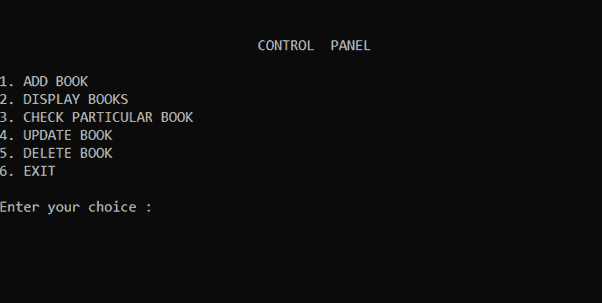
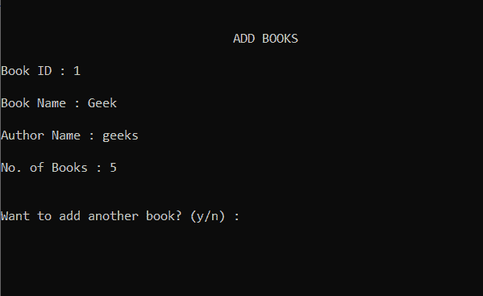
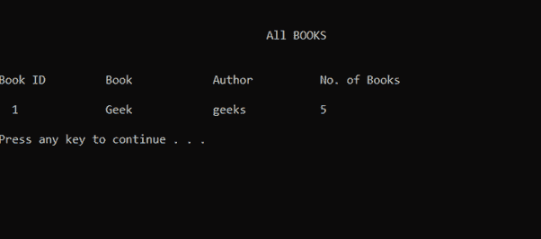
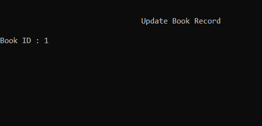
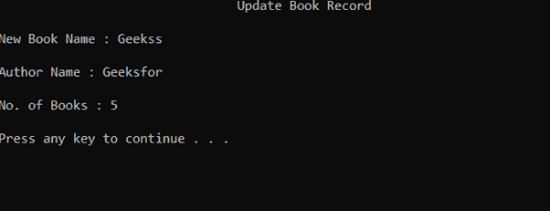
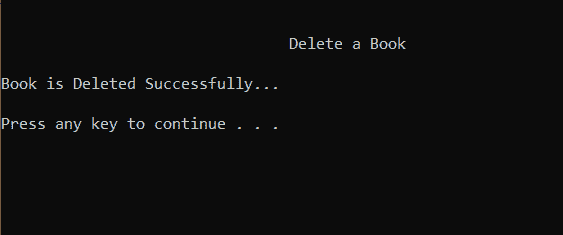

# 书店管理系统使用文件处理

> 原文:[https://www . geesforgeks . org/book-management-system-use-file-handling/](https://www.geeksforgeeks.org/bookshop-management-system-using-file-handling/)

任务是使用 [C++](https://www.geeksforgeeks.org/c-plus-plus/) 中的[文件处理](https://www.geeksforgeeks.org/basics-file-handling-c/)来构建书店管理系统，该系统有助于跟踪文件中的所有书籍记录。以下是要实现的功能:

*   添加新书，书的详细内容有:
    *   图书编号
    *   图书名称
    *   作者姓名
    *   书籍数量
*   删除一本书
*   更新书籍
*   查看所有书籍
*   出口

**进场:**

*   所有功能将在[开关箱](https://www.geeksforgeeks.org/switch-statement-cc/)下提供。
*   文件处理的概念将用于在文本文件中写入数据，并读取写入的数据。
*   所需功能将写在[开关盒](https://www.geeksforgeeks.org/switch-statement-cc/)下，根据用户的输入执行。
*   简单的[文件处理](https://www.geeksforgeeks.org/file-handling-c-classes/)概念，如打开文件、关闭文件、写入文件和读取文件等。用于开发代码。
*   用于编译 C++语言代码的集成开发环境。

下面是上述方法的实现:

## C++

```
// C++ program to illustrate bookshop
// management system using File Handling
#include <fstream>
#include <iostream>
#include <stdio.h>
#include <stdlib.h>
using namespace std;

// Bookshop Class
class bookshope {
public:
    void control_panel();
    void add_book();
    void show_book();
    void check_book();
    void update_book();
    void del_book();
};

// Function to display the menus
void bookshope::control_panel()
{
    system("cls");
    cout << "\n\n\t\t\t\tCONTROL  PANEL";
    cout << "\n\n1\. ADD BOOK";
    cout << "\n2\. DISPLAY BOOKS";
    cout << "\n3\. CHECK PARTICULAR BOOK";
    cout << "\n4\. UPDATE BOOK";
    cout << "\n5\. DELETE BOOK";
    cout << "\n6\. EXIT";
}

// Function to add book
void bookshope::add_book()
{
    system("cls");
    fstream file;
    int no_copy;
    string b_name, a_name, b_id;
    cout << "\n\n\t\t\t\tADD BOOKS";
    cout << "\n\nBook ID : ";
    cin >> b_id;
    cout << "\nBook Name : ";
    cin >> b_name;
    cout << "\nAuthor Name : ";
    cin >> a_name;
    cout << "\nNo. of Books : ";
    cin >> no_copy;

    // Open file in append or
    // output mode
    file.open("D:// book.txt",
              ios::out | ios::app);
    file << " " << b_id << " "
         << b_name << " " << a_name
         << " " << no_copy << "\n";
    file.close();
}

// Function to display book
void bookshope::show_book()
{
    system("cls");
    fstream file;
    int no_copy;
    string b_name, b_id, a_name;
    cout << "\n\n\t\t\t\t\tAll BOOKS";

    // Open the file in input mode
    file.open("D:// book.txt", ios::in);
    if (!file)
        cout << "\n\nFile Opening Error!";
    else {

        cout << "\n\n\nBook ID\t\tBook"
             << "\t\tAuthor\t\tNo. of "
                "Books\n\n";
        file >> b_id >> b_name;
        file >> a_name >> no_copy;

        // Till end of file is reached
        while (!file.eof()) {

            cout << "  " << b_id
                 << "\t\t" << b_name
                 << "\t\t" << a_name
                 << "\t\t" << no_copy
                 << "\n\n";
            file >> b_id >> b_name;
            file >> a_name >> no_copy;
        }

        system("pause");

        // Close the file
        file.close();
    }
}

// Function to check the book
void bookshope::check_book()
{
    system("cls");
    fstream file;
    int no_copy, count = 0;
    string b_id, b_name, a_name, b_idd;

    cout << "\n\n\t\t\t\tCheck "
         << "Particular Book";

    // Open the file in input mode
    file.open("D:// book.txt", ios::in);
    if (!file)
        cout << "\n\nFile Opening Error!";
    else {

        cout << "\n\nBook ID : ";
        cin >> b_idd;
        file >> b_id >> b_name;
        file >> a_name >> no_copy;

        while (!file.eof()) {

            if (b_idd == b_id) {

                system("cls");
                cout << "\n\n\t\t\t\t"
                     << "Check Particular Book";
                cout << "\n\nBook ID : "
                     << b_id;
                cout << "\nName : "
                     << b_name;
                cout << "\nAuthor : "
                     << a_name;
                cout << "\nNo. of Books : "
                     << no_copy;
                cout << endl
                     << endl;
                count++;
                break;
            }
            file >> b_id >> b_name;
            file >> a_name >> no_copy;
        }
        system("pause");
        file.close();
        if (count == 0)
            cout << "\n\nBook ID Not"
                 << " Found...";
    }
}

// Function to update the book
void bookshope::update_book()
{
    system("cls");
    fstream file, file1;
    int no_copy, no_co, count = 0;
    string b_name, b_na, a_name;
    string a_na, b_idd, b_id;

    cout << "\n\n\t\t\t\tUpdate Book Record";
    file1.open("D:// book1.txt",
               ios::app | ios::out);
    file.open("D:// book.txt", ios::in);

    if (!file)
        cout << "\n\nFile Opening Error!";
    else {

        cout << "\n\nBook ID : ";
        cin >> b_id;
        file >> b_idd >> b_name;
        file >> a_name >> no_copy;

        // Till end of file is reached
        while (!file.eof()) {
            if (b_id == b_idd) {
                system("cls");
                cout << "\t\t\t\t"
                     << "Update Book Record";
                cout << "\n\nNew Book Name : ";
                cin >> b_na;
                cout << "\nAuthor Name : ";
                cin >> a_na;
                cout << "\nNo. of Books : ";
                cin >> no_co;
                file1 << " " << b_id << " "
                      << b_na << " "
                      << a_na << " " << no_co
                      << "\n\n";
                count++;
            }
            else
                file1 << " " << b_idd
                      << " " << b_name
                      << " " << a_name
                      << " " << no_copy
                      << "\n\n";
            file >> b_idd >> b_name;
            file >> a_name >> no_copy;
        }
        if (count == 0)
            cout << "\n\nBook ID"
                 << " Not Found...";
    }
    cout << endl;
    system("pause");

    // Close the files
    file.close();
    file1.close();
    remove("D:// book.txt");
    rename("D:// book1.txt",
           "D:// book.txt");
}

// Function to delete book
void bookshope::del_book()
{
    system("cls");
    fstream file, file1;
    int no_copy, count = 0;
    string b_id, b_idd, b_name, a_name;
    cout << "\n\n\t\t\t\tDelete a Book";

    // Append file in output mode
    file1.open("D:// book1.txt",
               ios::app | ios::out);
    file.open("D:// book.txt",
              ios::in);

    if (!file)
        cout << "\n\nFile Opening Error...";
    else {

        cout << "\n\nBook ID : ";
        cin >> b_id;
        file >> b_idd >> b_name;
        file >> a_name >> no_copy;
        while (!file.eof()) {

            if (b_id == b_idd) {

                system("cls");
                cout << "\n\n\t\t\t\t"
                     << "Delete a Book";
                cout << "\n\nBook is Deleted "
                        "Successfully...\n\n";
                count++;
            }
            else
                file1 << " " << b_idd
                      << " " << b_name
                      << " " << a_name
                      << " " << no_copy
                      << "\n\n";
            file >> b_idd >> b_name;
            file >> a_name >> no_copy;
        }
        if (count == 0)
            cout << "\n\nBook ID "
                 << "Not Found...";
    }
    system("pause");

    // Close the file
    file.close();
    file1.close();
    remove("D:// book.txt");
    rename("D:// book1.txt",
           "D:// book.txt");
}

// Function for book shop record
void bookShopRecord()
{
    int choice;
    char x;
    bookshope b;

    while (1) {

        b.control_panel();
        cout << "\n\nEnter your choice : ";
        cin >> choice;
        switch (choice) {

        case 1:
            do {

                b.add_book();
                cout << "\n\nWant to add"
                     << " another book? "
                        "(y/n) : ";
                cin >> x;
            } while (x == 'y');
            break;

        case 2:
            b.show_book();
            break;

        case 3:
            b.check_book();
            break;
        case 4:
            b.update_book();
            break;

        case 5:
            b.del_book();
            break;

        case 6:
            exit(0);
            break;

        default:
            cout << "\n\nINVALID CHOICE\n";
        }
    }
}

// Driver Code
int main()
{
    // Function Call
    bookShopRecord();

    return 0;
}
```

**输出:**

     