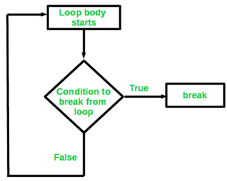

# C/c++ 中的 Break 语句

> 原文:[https://www.geeksforgeeks.org/break-statement-cc/](https://www.geeksforgeeks.org/break-statement-cc/)

C 或 C++ 中的中断是用于终止循环的循环控制语句。一旦在循环中遇到 break 语句，循环迭代就停止在那里，控制立即从循环返回到循环后的第一个语句。
**语法:**

```cpp
break;

```

基本上，break 语句用于我们不确定循环的实际迭代次数，或者我们希望基于某种条件终止循环的情况。

**我们将在这里看到带有三种不同类型循环的 break 语句的用法:**

1.  简单循环
2.  嵌套循环
3.  无限循环

现在让我们看看上面三种使用 break 语句的循环的例子。

1.  **简单循环**:考虑一下我们想要在数组中搜索一个元素的情况。为此，使用循环从第一个索引开始遍历数组，并将数组元素与给定的键进行比较。
    下面是这个想法的实现:

## C

```cpp
// C program to illustrate 
// Linear Search 

#include <stdio.h>

void findElement(int arr[], int size, int key) 
{ 
    // loop to traverse array and search for key 
    for (int i = 0; i < size; i++) { 
        if (arr[i] == key) { 
            printf("Element found at position: %d", (i + 1)); 
        } 
    } 
} 

int main() {
    int arr[] = { 1, 2, 3, 4, 5, 6 }; 

    // no of elements
    int n = 6;  

    // key to be searched 
    int key = 3; 

    // Calling function to find the key 
    findElement(arr, n, key); 

    return 0;
}
```

## C++

```cpp
// CPP program to illustrate
// Linear Search
#include <iostream>
using namespace std;

void findElement(int arr[], int size, int key)
{
    // loop to traverse array and search for key
    for (int i = 0; i < size; i++) {
        if (arr[i] == key) {
            cout << "Element found at position: " << (i + 1);
        }
    }
}

// Driver program to test above function
int main()
{
    int arr[] = { 1, 2, 3, 4, 5, 6 };
    int n = 6; // no of elements
    int key = 3; // key to be searched

    // Calling function to find the key
    findElement(arr, n, key);

    return 0;
}
```

**Output:**

```cpp
Element found at index: 3

```

上面的代码运行良好，没有错误。但是上面的代码效率不高。上面的代码完成了所有的迭代，甚至在找到元素之后。假设数组中有 **1000 个**元素，并且要搜索的关键字出现在第 1 个位置，那么上述方法将执行 **999** 迭代，这些迭代是无用的。
为了避免这些无用的迭代，我们可以在程序中使用 break 语句。一旦遇到 break 语句，循环中的控件将在条件得到满足后立即返回。所以将 break 语句与 if 条件一起使用，它将键与数组元素进行比较，如下所示:

## C

```cpp
// C program to illustrate
// using break statement 
// in Linear Search
#include <stdio.h>

void findElement(int arr[], int size, int key)
{
    // loop to traverse array and search for key
    for (int i = 0; i < size; i++) {
        if (arr[i] == key) {
            printf("Element found at position: %d", (i + 1)); 

            // using break to terminate loop execution
            break;
        }
    }
}

int main() {
    int arr[] = { 1, 2, 3, 4, 5, 6 };

    // no of elements
    int n = 6; 

    // key to be searched
    int key = 3;

    // Calling function to find the key
    findElement(arr, n, key);

    return 0;
}
```

## C++

```cpp
// CPP program to illustrate
// using break statement 
// in Linear Search
#include <iostream>
using namespace std;

void findElement(int arr[], int size, int key)
{
    // loop to traverse array and search for key
    for (int i = 0; i < size; i++) {
        if (arr[i] == key) {
            cout << "Element found at position: " << (i + 1);

            // using break to terminate loop execution
            break;
        }
    }
}

// Driver program to test above function
int main()
{
    int arr[] = { 1, 2, 3, 4, 5, 6 };
    int n = 6; // no of elements
    int key = 3; // key to be searched

    // Calling function to find the key
    findElement(arr, n, key);

    return 0;
}
```

**输出:**

```cpp
Element found at position: 3

```

*   **Nested Loops**: We can also use break statement while working with nested loops. If the break statement is used in the innermost loop. The control will come out only from the innermost loop. Below is the example of using break with nested loops:

    ## C

    ```cpp
    // C program to illustrate
    // using break statement 
    // in Nested loops
    #include <stdio.h>

    int main() {
        // nested for loops with break statement
        // at inner loop
        for (int i = 0; i < 5; i++) {
            for (int j = 1; j <= 10; j++) {
                if (j > 3)
                    break;
                else
                    printf("*");
            }
            printf("\n");
        }

        return 0;
    }
    ```

    ## C++

    ```cpp
    // CPP program to illustrate
    // using break statement 
    // in Nested loops
    #include <iostream>
    using namespace std;

    int main()
    {

        // nested for loops with break statement
        // at inner loop
        for (int i = 0; i < 5; i++) {
            for (int j = 1; j <= 10; j++) {
                if (j > 3)
                    break;
                else
                    cout << "*";
            }
            cout << endl;
        }

        return 0;
    }
    ```

    **输出:**

    ```cpp
    ***
    ***
    ***
    ***
    ***

    ```

    在上面的代码中，我们可以清楚地看到内部循环被编程为执行 10 次迭代。但是一旦 **j** 的值变得大于 3，内部循环就停止执行，这将内部循环的迭代次数限制为仅 3 次迭代。然而，外环的迭代保持不受影响。
    **因此，break 仅适用于它所在的循环。**

    *   **Infinite Loops**: break statement can be included in an infinite loop with a condition in order to terminate the execution of the infinite loop.
    Consider the below infinite loop:

    ## C

    ```cpp
    // C program to illustrate
    // using break statement 
    // in Infinite loops
    #include <stdio.h>

    int main() {
        // loop initialization expression
        int i = 0;

        // infinite while loop
        while (1) {
            printf("%d ", i);
            i++ ;
        }

        return 0;
    }
    ```

    ## C++

    ```cpp
    // CPP program to illustrate
    // using break statement 
    // in Infinite loops
    #include <iostream>
    using namespace std;

    int main()
    {
        // loop initialization expression
        int i = 0;

        // infinite while loop
        while (1) {
            cout << i << " ";
            i++ ;
        }

        return 0;
    }
    ```

    **注意**:请不要在你的编译器中运行上述程序，因为这是一个无限循环，所以你可能需要强制退出编译器来终止程序。

    在上面的程序中，循环终止所基于的循环条件总是真的。因此，循环执行了无限多次。我们可以通过使用如下所示的 break 语句来纠正这一点:

    ## C

    ```cpp
    // C program to illustrate
    // using break statement 
    // in Infinite loops
    #include <stdio.h>

    int main() {
        // loop initialization expression
        int i = 1;

        // infinite while loop
        while (1) {
            if (i > 10)
                break;

            printf("%d ", i);
            i++ ;
        }

        return 0;
    }
    ```

    ## C++

    ```cpp
    // CPP program to illustrate
    // using break statement 
    // in Infinite loops
    #include <iostream>
    using namespace std;

    int main()
    {
        // loop initialization expression
        int i = 1;

        // infinite while loop
        while (1) {
            if (i > 10)
                break;

            cout << i << " ";
            i++ ;
        }

        return 0;
    }
    ```

    **输出:**

    ```cpp
    1 2 3 4 5 6 7 8 9 10 

    ```

    上述代码将循环迭代次数限制为 10 次。

    除此之外，break 也可以用于 Switch case 语句。

    本文由 [**哈什·阿加瓦尔**](https://www.facebook.com/harsh.agarwal.16752) 供稿。如果你喜欢 GeeksforGeeks 并想投稿，你也可以使用[contribute.geeksforgeeks.org](http://www.contribute.geeksforgeeks.org)写一篇文章或者把你的文章邮寄到 contribute@geeksforgeeks.org。看到你的文章出现在极客博客主页上，帮助其他极客。

    如果你发现任何不正确的地方，或者你想分享更多关于上面讨论的话题的信息，请写评论。