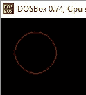

# 布雷森汉的画圆算法

> 原文:[https://www . geesforgeks . org/bresenhams-画圆-算法/](https://www.geeksforgeeks.org/bresenhams-circle-drawing-algorithm/)

在计算机屏幕上显示连续平滑的弧线并不容易，因为我们的计算机屏幕是由以矩阵形式组织的像素组成的。因此，为了在电脑屏幕上画一个圆，我们应该总是从打印的像素中选择最近的像素，这样它们就可以形成一个弧。有两种算法可以做到这一点:

1.  [中点圆绘制算法](https://www.geeksforgeeks.org/mid-point-circle-drawing-algorithm/)
2.  布雷森汉圆绘制算法

我们在之前的帖子中已经讨论过[中点画圆算法](https://www.geeksforgeeks.org/mid-point-circle-drawing-algorithm/)。在这篇文章中，我们将讨论布雷森汉姆的画圆算法。

这两种算法都利用了圆高度对称的关键特征。所以，对于整个 360 度的圆，我们将把它分成 8 个部分，每个部分是 45 度的八分之一。为了做到这一点，我们将使用布雷森汉圆算法来计算 45 度的第一个八分之一的像素位置。它假设圆以原点为中心。因此，对于它计算的每个像素(x，y)，我们在圆的 8 个八分之一处各画一个像素，如下所示:


现在，我们将看到如何从先前已知的像素位置(x，y)计算下一个像素位置。在 Bresenham 的算法中，在任何点(x，y)我们都有两个选择，要么选择东部的下一个像素，即(x+1，y)，要么选择东南部的下一个像素，即(x+1，y-1)。


这可以通过使用判定参数 d 来判定为:

*   如果 d > 0，那么(x+1，y-1)将被选择为下一个像素，因为它将更接近圆弧。
*   否则(x+1，y)将被选为下一个像素。

现在画给定半径“r”和中心(xc，yc)的圆，我们将从(0，r)开始，在第一象限移动，直到 x=y(即 45 度)。我们应该从列出的初始条件开始:

```
d = 3 - (2 * r)
x = 0
y = r
```

现在，对于每个像素，我们将执行以下操作:

1.  设置(xc，yc)和(x，y)的初始值
2.  将决策参数 d 设置为 d = 3 –( 2 * r)。

3.  调用 drawCircle(int xc，int yc，int x，int y)函数。
4.  重复步骤 5 至 8，直到 x < = y
5.  x 的增量值。
6.  如果 d < 0，则设置 d = d + (4*x) + 6
7.  否则，设置 d = d+4 *(x–y)+10，并将 y 减 1。
8.  调用 drawCircle(int xc，int yc，int x，int y)函数

**drawCircle()功能:**

## 卡片打印处理机（Card Print Processor 的缩写）

```
// function to draw all other 7 pixels
// present at symmetric position
drawCircle(int xc, int yc, int x, int y)
{
    putpixel(xc+x, yc+y, RED);
    putpixel(xc-x, yc+y, RED);
    putpixel(xc+x, yc-y, RED);
    putpixel(xc-x, yc-y, RED);
    putpixel(xc+y, yc+x, RED);
    putpixel(xc-y, yc+x, RED);
    putpixel(xc+y, yc-x, RED);
    putpixel(xc-y, yc-x, RED);
}
```

下面是上述方法的 C 实现。

## 卡片打印处理机（Card Print Processor 的缩写）

```
// C-program for circle drawing
// using Bresenham’s Algorithm
// in computer-graphics
#include <stdio.h>
#include <dos.h>
#include <graphics.h>

// Function to put pixels
// at subsequence points
void drawCircle(int xc, int yc, int x, int y)
{
    putpixel(xc+x, yc+y, RED);
    putpixel(xc-x, yc+y, RED);
    putpixel(xc+x, yc-y, RED);
    putpixel(xc-x, yc-y, RED);
    putpixel(xc+y, yc+x, RED);
    putpixel(xc-y, yc+x, RED);
    putpixel(xc+y, yc-x, RED);
    putpixel(xc-y, yc-x, RED);
}

// Function for circle-generation
// using Bresenham's algorithm
void circleBres(int xc, int yc, int r)
{
    int x = 0, y = r;
    int d = 3 - 2 * r;
    drawCircle(xc, yc, x, y);
    while (y >= x)
    {
        // for each pixel we will
        // draw all eight pixels

        x++;

        // check for decision parameter
        // and correspondingly
        // update d, x, y
        if (d > 0)
        {
            y--;
            d = d + 4 * (x - y) + 10;
        }
        else
            d = d + 4 * x + 6;
        drawCircle(xc, yc, x, y);
        delay(50);
    }
}

// Driver code
int main()
{
    int xc = 50, yc = 50, r = 30;
    int gd = DETECT, gm;
    initgraph(&gd, &gm, "");  // initialize graph
    circleBres(xc, yc, r);    // function call
    return 0;
}
```

**输出:**



**优势**

*   这是一个简单的算法。
*   它很容易实现
*   完全基于圆的方程，即 x<sup>2</sup>+y<sup>2</sup>= r<sup>2</sup>

**缺点**

*   生成点时存在精度问题。
*   该算法不适用于复杂和高图形图像。

本文由[**Shivam Pradhan(anuj _ charm)**](https://www.facebook.com/anuj.charm)供稿。如果你喜欢 GeeksforGeeks 并想投稿，你也可以使用[write.geeksforgeeks.org](https://write.geeksforgeeks.org)写一篇文章或者把你的文章邮寄到 review-team@geeksforgeeks.org。看到你的文章出现在极客博客主页上，帮助其他极客。
如果发现有不正确的地方，或者想分享更多关于上述话题的信息，请写评论。