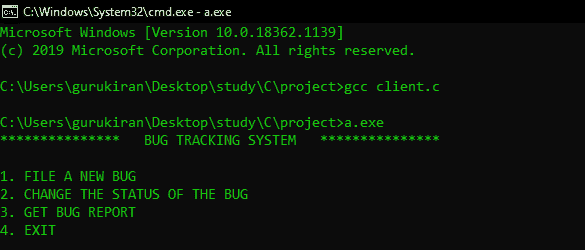
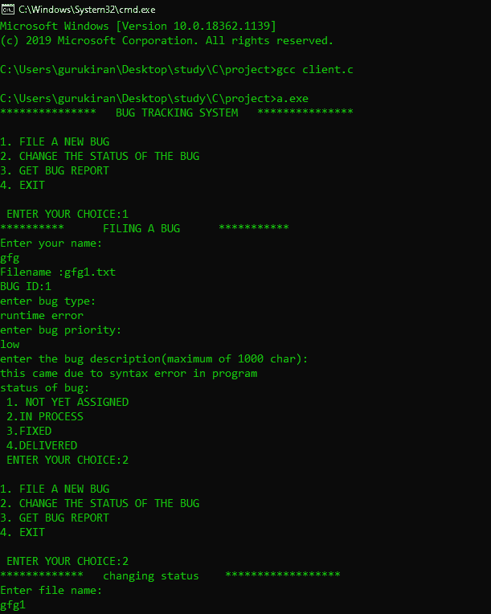
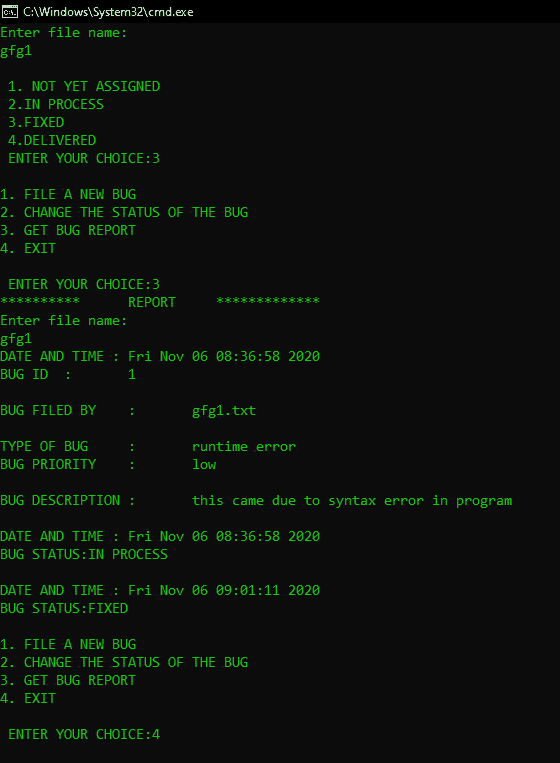
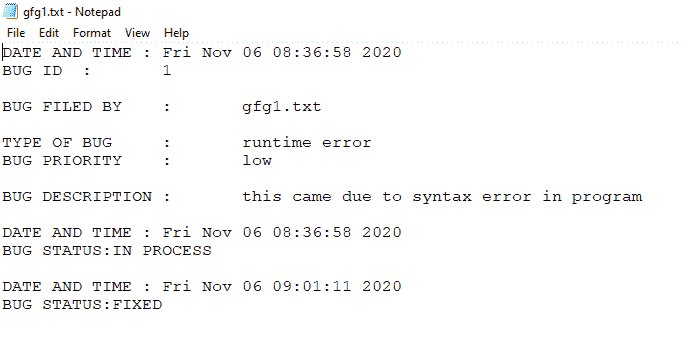

# Bug 跟踪系统

> 原文:[https://www.geeksforgeeks.org/bug-tracking-system/](https://www.geeksforgeeks.org/bug-tracking-system/)

**什么是 Bug 跟踪系统？**bug 跟踪系统是跟踪用户在任何软件开发或任何项目中遇到的 bug 的软件。

错误跟踪系统的三个主要功能是:

1.  创建新的文本文件，并将用户输入的详细信息写入文本文件。
2.  选项来改变错误的状态。
3.  特定错误文件的报告。

现在将看到涉及哪些功能

**<u>驱动程序功能</u>** :想法是保留一个变量 *id* ，存储到现在注册的 bug 的 id。用户可以选择的功能主要有三个选项:

1.  创建新 Bug
2.  更改错误状态
3.  报告错误
4.  出口

[切换语句](https://www.geeksforgeeks.org/switch-statement-cc/)用于切换到用户喜欢的功能。

**<u>新建 Bug:</u>** 该功能会询问用户姓名，新建一个文本文件作为姓名，并附上身份证号。

<u>例如:</u>

*   如果用户第一次创建 bug 文件的 id 最初是 0 加 1，如果用户输入的名称是 *bugfile* ，那么我们的程序将创建的文件将被命名为 *bugfile1.txt*
*   如果用户第三次创建 bug 文件时 id 增加 1 三次，并且如果用户再次输入名称为 *bugfile* ，那么我们的程序将创建的文件将被命名为 *bugfile3.txt*

命名文件后，从用户那里获取信息，并将其添加到附加了创建时间的文本文件中

用户获取的错误信息是:

1.  用户提交的错误。
2.  错误类型
3.  错误优先级
4.  错误描述
5.  错误状态

**<u>更改 bug 状态:</u>** 获取 bug 的相关信息，在需要的文件中更改 Bug 的状态。另外，更新 Bug 的最后更新时间。

**<u>报告 Bug:</u>** 获取 Bug 的相关信息。比如 Bug 文件名和打印 Bug 的内容。

下面是错误跟踪系统的实现:

## 潜水员功能

```cpp
// C program for the Driver Function
// of the Bug Tracking System

#include <stdio.h>

// Driver Code
void main()
{
    printf("***************");
    printf("BUG TRACKING SYSTEM");
    printf("***************\n");

    int number, i = 1;

    // Id initialised to 0
    int id = 0;

    // while loop to run
    while (i != 0) {
        printf("\n1\. FILE A NEW BUG\n");
        printf("2\. CHANGE THE STATUS OF THE BUG\n");
        printf("3\. GET BUG REPORT\n4\. EXIT");
        printf("\n\n ENTER YOUR CHOICE:");

        scanf("%d", &number);

        // Using switch to go case by case
        switch (number) {
        case 1:
            id++ ;

            // Creating a New Bug
            filebug(id);
            break;
        case 2:

            // Change Status of Bug
            changestatus();
            break;
        case 3:

            // Report the Bug
            report();
            break;
        case 4:
            i = 0;
            break;
        default:
            printf("\ninvalid entry");
            break;
        }
    }
}
```

## 创建 Bug

```cpp
// C program for filing a bug
// in Bug Tracking System

#include <conio.h>
#include <stdio.h>
#include <stdlib.h>
#include <string.h>
#include <time.h>

// Function to file the Bug into
// the Bug Tracking System
void filebug(int id)
{
    printf("**********");
    printf("FILING A BUG");
    printf("***********\n");

    // Current Time
    time_t CurrentTime;
    time(&CurrentTime);

    char name[20], bugtype[50];
    char bugdescription[1000];
    char bugpriority[30];
    int bugstatus;

    FILE* ptr;

    // User name
    printf("Enter your name:\n");
    scanf("%s", name);
    char ids[10];
    itoa(id, ids, 10);
    strcat(name, ids);
    char ex[] = ".txt";
    strcat(name, ex);

    // Filename of the Bug
    printf("Filename :%s\n", name);
    ptr = fopen(name, "w");

    // Case when file cannot be created
    if (ptr == NULL)
        printf("cannot create file!!!\n");

    fprintf(ptr, "DATE AND TIME : %s",
            ctime(&CurrentTime));

    // ID in the Text File
    fprintf(ptr, "BUG ID    :    %d\n", id);

    // Adding New Line in Text File
    fprintf(ptr, "\n");

    // Bug ID
    printf("BUG ID:%d\n", id);

    fprintf(ptr, "BUG FILED BY: %s\n",
            name);
    fprintf(ptr, "\n");

    printf("Enter bug type:\n");
    scanf(" %[^\n]", bugtype);

    // Bug Type
    fprintf(ptr, "TYPE OF BUG: %s",
            bugtype);
    fprintf(ptr, "\n");

    // Bug Priority
    printf("Enter bug priority:\n");
    scanf(" %[^\n]s", bugpriority);

    fprintf(ptr, "BUG PRIORITY: %s\n",
            bugpriority);
    fprintf(ptr, "\n");

    // Bug Description
    printf("Enter the bug description:\n");
    scanf(" %[^\n]s", bugdescription);

    fprintf(ptr, "BUG DESCRIPTION: %s\n",
            bugdescription);
    fprintf(ptr, "\n");

    printf("Status of bug:\n");
    printf("1\. NOT YET ASSIGNED\n");
    printf("2.IN PROCESS\n 3.FIXED\n");
    printf("4.DELIVERED\n ENTER YOUR CHOICE:");

    int j;
    scanf("%d", &j);

    // Date and time of Bug Creation
    fprintf(ptr, "DATE AND TIME: %s",
            ctime(&CurrentTime));

    fprintf(ptr, "BUG STATUS:");

    // Switching for the Status of the
    // Bug
    switch (j) {
    case 1:
        fprintf(ptr, "NOT YET ASSIGNED\n");
        break;
    case 2:
        fprintf(ptr, "IN PROCESS\n");
        break;
    case 3:
        fprintf(ptr, "FIXED\n");
        break;
    case 4:
        fprintf(ptr, "DELIVERED\n");
        break;
    default:
        printf("invalid choice\n");
        break;
    }

    fclose(ptr);
}
```

## 错误状态

```cpp
// C program for changing Status
// in Bug Tracking System

#include <conio.h>
#include <stdio.h>
#include <stdlib.h>
#include <string.h>
#include <time.h>

// Function to Change the status
// of the Bug
void changestatus()
{
    printf("*************");
    printf("Change status");
    printf("**************\n");

    // Current Time
    time_t CurrentTime;
    time(&CurrentTime);

    FILE* file;
    char name[50];

    // Bug File name
    printf("Enter file name:\n");
    scanf("%s", name);
    char ex[] = ".txt";
    strcat(name, ex);

    // Opening the Bug in Append Mode
    file = fopen(name, "a");

    printf("\n 1\. NOT YET ASSIGNED\n");
    printf(" 2.IN PROCESS\n 3.FIXED\n");
    printf(" 4.DELIVERED\n ENTER YOUR CHOICE:");

    // Change the Status
    int k;
    scanf("%d", &k);

    fprintf(file, "\n");
    fprintf(file, "DATE AND TIME : %s",
            ctime(&CurrentTime));

    fprintf(file, "BUG STATUS:");

    // Changing the status on the
    // basis of the user input
    switch (k) {
    case 1:
        fprintf(file, "NOT YET ASSIGNED\n");
        break;
    case 2:
        fprintf(file, "IN PROCESS\n");
        break;
    case 3:
        fprintf(file, "FIXED\n");
        break;
    case 4:
        fprintf(file, "DELIVERED\n");
        break;
    default:
        printf("invalid choice\n");
        break;
    }
    fclose(file);
}
```

## 报告错误

```cpp
// C program for report a bug
// in Bug Tracking System

#include <conio.h>
#include <stdio.h>
#include <stdlib.h>
#include <string.h>
#include <time.h>

// Function to report the Bug
// in the Bug Tracking System
void report()
{
    printf("**********");
    printf("REPORT");
    printf("**********\n");

    FILE* fp;
    char name[50];

    // Asking the Filename to report
    // the bug of the file
    printf("Enter file name:\n");
    scanf("%s", name);
    char ex[] = ".txt";
    strcat(name, ex);

    // Opening the file into the
    // Read mode
    fp = fopen(name, "r");

    char ch;
    ch = getc(fp);

    // Character of the File
    while (ch != EOF) {
        printf("%c", ch);
        ch = getc(fp);
    }

    fclose(fp);
    getch();
}
```

## 完全码

```cpp
// C program for the
// Bug Tracking System

#include <conio.h>
#include <stdio.h>
#include <stdlib.h>
#include <string.h>
#include <time.h>

// Function to file the Bug into
// the Bug Tracking System
void filebug(int id)
{
    printf("**********");
    printf("FILING A BUG");
    printf("***********\n");

    // Current Time
    time_t CurrentTime;
    time(&CurrentTime);

    char name[20], bugtype[50];
    char bugdescription[1000];
    char bugpriority[30];
    int bugstatus;

    FILE* ptr;

    // User name
    printf("Enter your name:\n");
    scanf("%s", name);
    char ids[10];
    itoa(id, ids, 10);
    strcat(name, ids);
    char ex[] = ".txt";
    strcat(name, ex);

    // Filename of the Bug
    printf("Filename :%s\n", name);
    ptr = fopen(name, "w");

    // Case when file cannot be created
    if (ptr == NULL)
        printf("cannot create file!!!\n");

    fprintf(ptr, "DATE AND TIME : %s",
            ctime(&CurrentTime));

    // ID in the Text File
    fprintf(ptr, "BUG ID    :    %d\n", id);

    // Adding New Line in Text File
    fprintf(ptr, "\n");

    // Bug ID
    printf("BUG ID:%d\n", id);

    fprintf(ptr, "BUG FILED BY: %s\n",
            name);
    fprintf(ptr, "\n");

    printf("Enter bug type:\n");
    scanf(" %[^\n]", bugtype);

    // Bug Type
    fprintf(ptr, "TYPE OF BUG: %s",
            bugtype);
    fprintf(ptr, "\n");

    // Bug Priority
    printf("Enter bug priority:\n");
    scanf(" %[^\n]s", bugpriority);

    fprintf(ptr, "BUG PRIORITY: %s\n",
            bugpriority);
    fprintf(ptr, "\n");

    // Bug Description
    printf("Enter the bug description:\n");
    scanf(" %[^\n]s", bugdescription);

    fprintf(ptr, "BUG DESCRIPTION: %s\n",
            bugdescription);
    fprintf(ptr, "\n");

    printf("Status of bug:\n");
    printf("1\. NOT YET ASSIGNED\n");
    printf("2.IN PROCESS\n 3.FIXED\n");
    printf("4.DELIVERED\n ENTER YOUR CHOICE:");

    int j;
    scanf("%d", &j);

    // Date and time of Bug Creation
    fprintf(ptr, "DATE AND TIME: %s",
            ctime(&CurrentTime));

    fprintf(ptr, "BUG STATUS:");

    // Switching for the Status of the
    // Bug
    switch (j) {
    case 1:
        fprintf(ptr, "NOT YET ASSIGNED\n");
        break;
    case 2:
        fprintf(ptr, "IN PROCESS\n");
        break;
    case 3:
        fprintf(ptr, "FIXED\n");
        break;
    case 4:
        fprintf(ptr, "DELIVERED\n");
        break;
    default:
        printf("invalid choice\n");
        break;
    }

    fclose(ptr);
}

// Function to Change the status
// of the Bug
void changestatus()
{
    printf("*************");
    printf("Change status");
    printf("**************\n");

    // Current Time
    time_t CurrentTime;
    time(&CurrentTime);

    FILE* file;
    char name[50];

    // Bug File name
    printf("Enter file name:\n");
    scanf("%s", name);
    char ex[] = ".txt";
    strcat(name, ex);

    // Opening the Bug in Append Mode
    file = fopen(name, "a");

    printf("\n 1\. NOT YET ASSIGNED\n");
    printf(" 2.IN PROCESS\n 3.FIXED\n");
    printf(" 4.DELIVERED\n ENTER YOUR CHOICE:");

    // Change the Status
    int k;
    scanf("%d", &k);

    fprintf(file, "\n");
    fprintf(file, "DATE AND TIME : %s",
            ctime(&CurrentTime));

    fprintf(file, "BUG STATUS:");

    // Changing the status on the
    // basis of the user input
    switch (k) {
    case 1:
        fprintf(file, "NOT YET ASSIGNED\n");
        break;
    case 2:
        fprintf(file, "IN PROCESS\n");
        break;
    case 3:
        fprintf(file, "FIXED\n");
        break;
    case 4:
        fprintf(file, "DELIVERED\n");
        break;
    default:
        printf("invalid choice\n");
        break;
    }
    fclose(file);
}

// Function to report the Bug
// in the Bug Tracking System
void report()
{
    printf("**********");
    printf("REPORT");
    printf("**********\n");

    FILE* fp;
    char name[50];

    // Asking the Filename to report
    // the bug of the file
    printf("Enter file name:\n");
    scanf("%s", name);
    char ex[] = ".txt";
    strcat(name, ex);

    // Opening the file into the
    // Read mode
    fp = fopen(name, "r");

    char ch;
    ch = getc(fp);

    // Character of the File
    while (ch != EOF) {
        printf("%c", ch);
        ch = getc(fp);
    }

    fclose(fp);
    getch();
}

// Driver Code
void main()
{
    printf("***************");
    printf("BUG TRACKING SYSTEM");
    printf("***************\n");

    int number, i = 1;

    // Id initialised to 0
    int id = 0;

    // while loop to run
    while (i != 0) {
        printf("\n1\. FILE A NEW BUG\n");
        printf("2\. CHANGE THE STATUS OF THE BUG\n");
        printf("3\. GET BUG REPORT\n4\. EXIT");
        printf("\n\n ENTER YOUR CHOICE:");

        scanf("%d", &number);

        // Using switch to go case by case
        switch (number) {
        case 1:
            id++ ;

            // Creating a New Bug
            filebug(id);
            break;
        case 2:

            // Change Status of Bug
            changestatus();
            break;
        case 3:

            // Report the Bug
            report();
            break;
        case 4:
            i = 0;
            break;
        default:
            printf("\ninvalid entry");
            break;
        }
    }
}
```

**输出:**

**<u>驾驶员功能:</u>**



**<u>创建 Bug:</u>**



**<u>更改状态&报告 Bug</u>**



**<u>Bug 文件:</u>**

