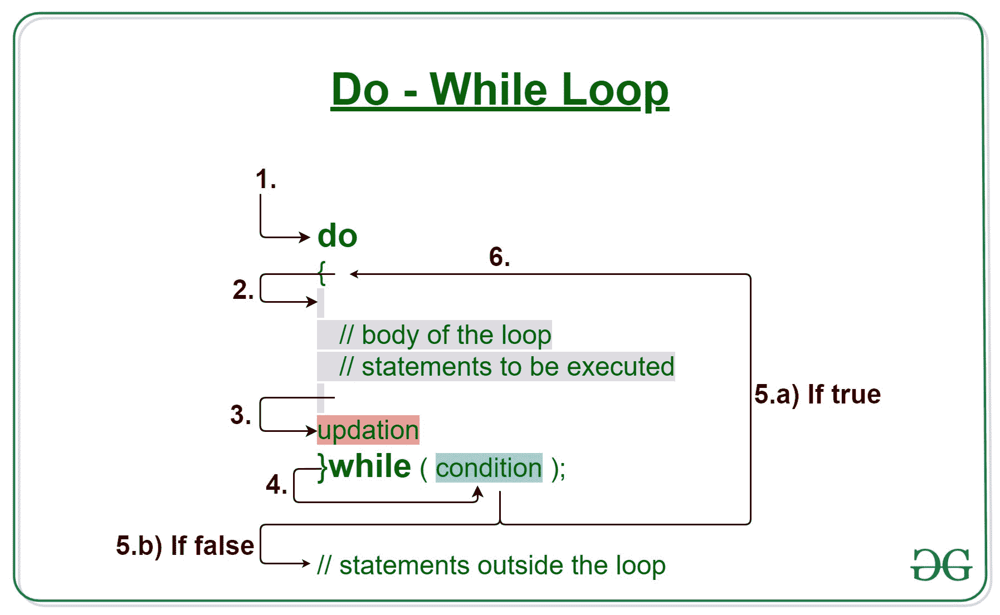
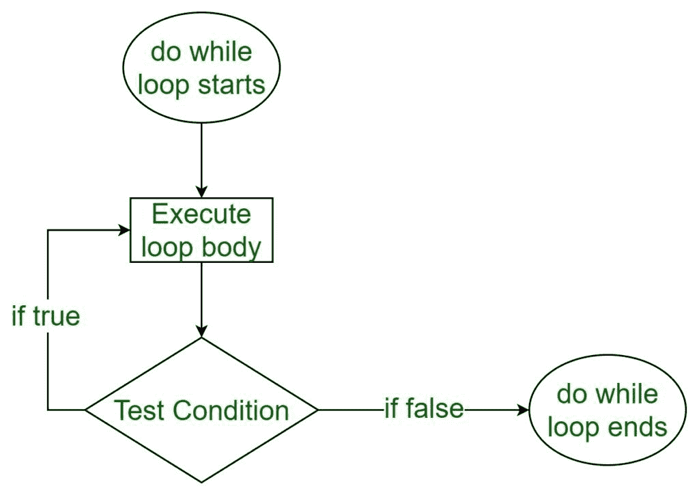

# C/C++ 边做边循环示例

> 原文:[https://www . geesforgeks . org/c-c-do-while-loop-with-examples/](https://www.geeksforgeeks.org/c-c-do-while-loop-with-examples/)

[当我们需要重复执行一个语句块时，C/C++ ](https://www.geeksforgeeks.org/loops-in-c-and-cpp/) 中的循环开始使用。
与**同时**一样，**边做边循环**的执行也基于测试条件而终止。边做边循环和边做边循环的主要区别在于边做边循环在循环体的末端测试条件，即边做边循环是出口控制的，而其他两个循环是入口控制的循环。
**注意**:在 do-while 循环中，不管测试条件如何，循环体将至少执行一次。



**语法:**

```cpp
do
{
   // loop body

   update_expression;
} 
while (test_expression);
```

**注意**:注意分号(；))在循环结束时。
边做边循环的各个**部分是:** 

1.  **测试表达式:**在这个表达式中我们要测试条件。如果条件评估为真，那么我们将执行循环体并更新表达式。否则，我们将退出 while 循环。
    **例:**

```cpp
i <= 10
```

2.  **更新表达式**:执行循环体后，该表达式将循环变量递增/递减某个值。
    **例:**

```cpp
i++ ;
```

**do-While 循环是如何执行的？**

1.  控制落入边做边循环。
2.  循环体内部的语句被执行。
3.  上升发生。
4.  流程跳转到条件
5.  测试条件。
    1.  如果条件为真，转到步骤 6。
    2.  如果条件为假，流程将超出循环
6.  流程返回到步骤 2。

**边做边循环流程图:**



**例 1:** 这个程序会根据几个条件尝试打印“Hello World”。

## C

```cpp
// C program to illustrate do-while loop

#include <stdio.h>

int main()
{
    // Initialization expression
    int i = 2;

    do {
        // loop body
        printf("Hello World\n");

        // Update expression
        i++ ;
    }
    // Test expression
    while (i < 1);

    return 0;
}
```

## C++

```cpp
// C++ program to illustrate do-while loop

#include <iostream>
using namespace std;

int main()
{
    // Initialization expression
    int i = 2;

    do {
        // Loop body
        cout << "Hello World\n";

        // Update expression
        i++ ;

    }
    // Test expression
    while (i < 1);

    return 0;
}
```

**Output:** 

```cpp
Hello World
```

**空转例 1:**

```cpp
1\. Program starts.
2\. i is initialised to 2.
3\. Execution enters the loop
  3.a) "Hello World" gets printed 1st time.
  3.b) Updation is done. Now i = 2.
4\. Condition is checked. 2 < 2 yields false.
5\. The flow goes outside the loop.
```

**例 2:**

## C

```cpp
// C program to illustrate do-while loop

#include <stdio.h>

int main()
{
    // Initialization expression
    int i = 1;

    do {
        // Loop body
        printf("%d\n", i);

        // Update expression
        i++ ;

    }
    // Test expression
    while (i <= 5);

    return 0;
}
```

## C++

```cpp
// C++ program to illustrate do-while loop

#include <iostream>
using namespace std;

int main()
{
    // Initialization expression
    int i = 1;

    do {
        // Loop body
        cout << i << endl;

        // Update expression
        i++ ;

    }
    // Test expression
    while (i <= 5);

    return 0;
}
```

**Output:** 

```cpp
1
2
3
4
5
```

**相关文章:**

1.  [C 和 C++ 中的循环](https://www.geeksforgeeks.org/loops-in-c-and-cpp/)
2.  [C/C++ while 循环示例](https://www.geeksforgeeks.org/c-c-while-loop-with-examples/)
3.  [C/C++ For 循环示例](https://www.geeksforgeeks.org/c-c-for-loop-with-examples/)
4.  [C、C++、Java 中 while 和 do-while 循环的区别](https://www.geeksforgeeks.org/difference-between-while-and-do-while-loop-in-c-c-java/)
5.  [C、C++、Java 中 for 和 while 循环的区别](https://www.geeksforgeeks.org/difference-between-for-and-while-loop-in-c-c-java/)