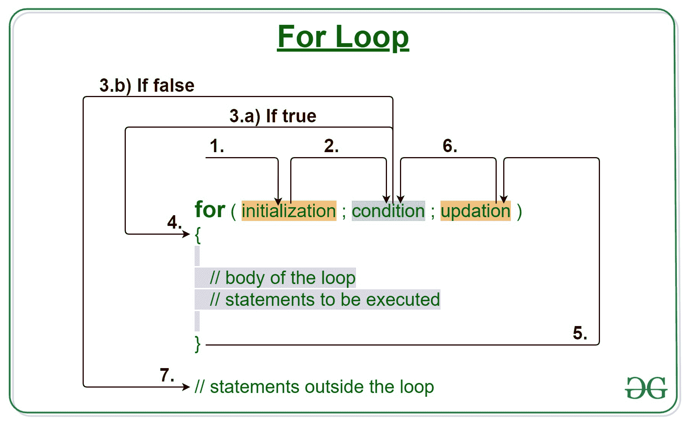
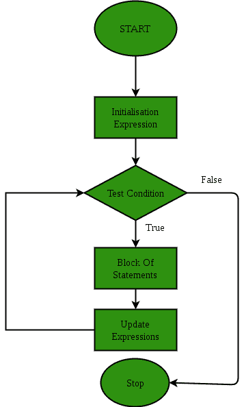

# C/C++ For 循环示例

> 原文:[https://www.geeksforgeeks.org/c-c-for-loop-with-examples/](https://www.geeksforgeeks.org/c-c-for-loop-with-examples/)

[**C/c++**](https://www.geeksforgeeks.org/loops-in-c-and-cpp/)中的循环在我们需要重复执行一个语句块时开始使用。

**For loop** 是一个重复控制结构，它允许我们编写一个执行特定次数的循环。该循环使我们能够在一行中一起执行 n 个步骤。

[](https://media.geeksforgeeks.org/wp-content/uploads/20191108131134/For-Loop.jpg)

**语法:**

```cpp
for (initialization expr; test expr; update expr)
{    
     // body of the loop
     // statements we want to execute
}

```

For 循环的各个**部分是:**

1.  **初始化表达式:**在这个表达式中，我们必须将循环计数器初始化为某个值。
    **例:**

    ```cpp
    int i=1;
    ```

2.  **条件:**在这个表达式中我们要测试条件。如果条件评估为真，那么我们将执行循环体并更新表达式。否则，我们将退出 for 循环。
    **例:**

    ```cpp
    i <= 10
    ```

3.  **更新表达式**:执行循环体后，该表达式将循环变量增加/减少某个值。
    **例:**

    ```cpp
    i++ ;
    ```

**For 循环是如何执行的？**

1.  控件落入 for 循环。初始化完成
2.  流程跳转到条件
3.  测试条件。
    1.  如果条件为真，流体进入身体
    2.  如果条件为假，流程将超出循环
4.  循环体内部的语句被执行。
5.  流向上升
6.  上升发生，流程再次进入步骤 3
7.  for 循环已结束，流已流出。

**循环流程图(控制流程):**
[](https://media.geeksforgeeks.org/wp-content/uploads/20191107122709/C-for-loop.png)

**例 1:** 本程序将尝试打印《Hello World》5 次。该程序将以下列方式执行:

## C

```cpp
// C program to illustrate for loop

#include <stdio.h>

int main()
{
    int i = 0;

    // Writing a for loop
    // to print Hello World 5 times
    for (i = 1; i <= 5; i++) {
        printf("Hello World\n");
    }

    return 0;
}
```

## C++

```cpp
// C++ program to illustrate for loop

#include <iostream>
using namespace std;

int main()
{

    // Writing a for loop
    // to print Hello World 5 times
    for (int i = 1; i <= 5; i++) {
        cout << "Hello World\n";
    }

    return 0;
}
```

**Output:**

```cpp
Hello World
Hello World
Hello World
Hello World
Hello World

```

**空转示例 1:**

```cpp
1\. Program starts.
2\. i is initialized with value 1.
3\. Condition is checked. 1 <= 0 2 3 4 5 6 yields true. 3.a) "hello world" gets printed 1st time. 3.b) updation is done. now i="2." 4\. condition checked. <="5" 4.a) 2nd 4.b) 5\. 5.a) 3rd time 5.b) 6\. 6.a) 4th 6.b) 7\. 7.a) 5th 7.b) 8\. false. 9\. flow goes outside the loop to return pre>**例 2: ** 

## C

```
// C program to illustrate for loop

#include <stdio.h>

int main()
{
    int i = 0;

    // Writing a for loop
    // to print odd numbers upto N
    for (i = 1; i <= 10; i += 2) {
        printf("%d\n", i);
    }

    return 0;
}
```cpp

## C++

```
// C++ program to illustrate for loop

#include <iostream>
using namespace std;

int main()
{
    int i = 0;

    // Writing a for loop
    // to print odd numbers upto N
    for (i = 1; i <= 10; i += 2) {
        cout << i << "\n";
    }

    return 0;
}
```cpp

**Output:**

```
1
3
5
7
9

```cpp

**相关文章:**1.  [C 和 C++ 中的循环](https://www.geeksforgeeks.org/loops-in-c-and-cpp/)2.  [C/C++ while 循环示例](https://www.geeksforgeeks.org/c-c-while-loop-with-examples/)3.  [C/C++ 边做边循环示例](https://www.geeksforgeeks.org/c-c-do-while-loop-with-examples/)4.  [C、C++、Java 中 while 和 do-while 循环的区别](https://www.geeksforgeeks.org/difference-between-while-and-do-while-loop-in-c-c-java/)5.  [C、C++、Java 中 for 和 while 循环的区别](https://www.geeksforgeeks.org/difference-between-for-and-while-loop-in-c-c-java/)

=>
```