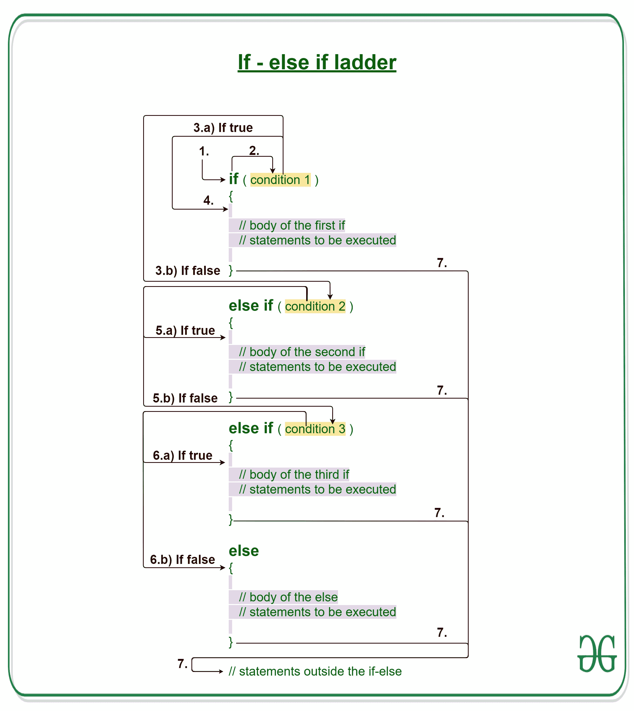

# C/C++ if else if 阶梯示例

> 原文:[https://www . geeksforgeeks . org/c-c-if-else-if-ladder-with-examples/](https://www.geeksforgeeks.org/c-c-if-else-if-ladder-with-examples/)

[C/c++](https://www.geeksforgeeks.org/decision-making-c-c-else-nested-else/)中的决策有助于编写决策驱动的语句，并基于某些条件执行一组特定的代码。

在 C/C++中 **if-else-if 阶梯**帮助用户从多个选项中进行选择。C/C++ if 语句是自上而下执行的。一旦控制 if 的条件之一为真，就执行与该 if 相关联的语句，并绕过 C else-if 阶梯的其余部分。如果这些条件都不成立，那么将执行最后的 else 语句。

[](https://media.geeksforgeeks.org/wp-content/uploads/20191114112014/If-else-if-ladder-GeeksforGeeks-1.jpg)

**语法:**

```cpp
if (condition)
    statement 1;
else if (condition)
    statement 2;
.
.
else
    statement;
```

**if-else-if 梯子的工作:**

1.  控件落入 if 块。
2.  流程跳转到条件 1。
3.  测试条件。
    1.  如果条件为真，转到步骤 4。
    2.  如果条件为假，转到步骤 5。
4.  执行当前块。转到步骤 7。
5.  流程跳转到条件 2。
    1.  如果条件为真，转到步骤 4。
    2.  如果条件为假，转到步骤 6。
6.  流程跳转到条件 3。
    1.  如果条件为真，转到步骤 4。
    2.  如果条件为假，则执行 else 块。转到步骤 7。
7.  退出 if-else-if 阶梯。

**流程图 if-else-if 阶梯:**


**例 1:**

## C

```cpp
// C program to illustrate nested-if statement

#include <stdio.h>

int main()
{
    int i = 20;

    // Check if i is 10
    if (i == 10)
        printf("i is 10");

    // Since i is not 10
    // Check if i is 15
    else if (i == 15)
        printf("i is 15");

    // Since i is not 15
    // Check if i is 20
    else if (i == 20)
        printf("i is 20");

    // If none of the above conditions is true
    // Then execute the else statement
    else
        printf("i is not present");

    return 0;
}
```

## C++

```cpp
// C++ program to illustrate if-else-if ladder
#include <iostream>
using namespace std;

int main()
{
    int i = 20;

    // Check if i is 10
    if (i == 10)
        cout << "i is 10";

    // Since i is not 10
    // Check if i is 15
    else if (i == 15)
        cout << "i is 15";

    // Since i is not 15
    // Check if i is 20
    else if (i == 20)
        cout << "i is 20";

    // If none of the above conditions is true
    // Then execute the else statement
    else
        cout << "i is not present";

    return 0;
}
```

**Output:**

```cpp
i is 20

```

**干运转例 1:**

```cpp
1\. Program starts.
2\. i is initialized to 20.
3\. condition 1 is checked. 20 == 10, yields false.
4\. condition 2 is checked. 20 == 15, yields false.
5\. condition 3 is checked. 20 == 20, yields true.
  5.a) "i is 20" gets printed.
6\. "Outside if-else-if" gets printed.
7\. Program ends.
```

**例 2:**

## C

```cpp
// C program to illustrate nested-if statement

#include <stdio.h>

int main()
{
    int i = 25;

    // Check if i is between 0 and 10
    if (i >= 0 && i <= 10)
        printf("i is between 0 and 10");

    // Since i is not between 0 and 10
    // Check if i is between 11 and 15
    else if (i >= 11 && i <= 15)
        printf("i is between 11 and 15");

    // Since i is not between 11 and 15
    // Check if i is between 16 and 20
    else if (i >= 16 && i <= 20)
        printf("i is between 16 and 20");

    // Since i is not between 0 and 20
    // It means i is greater than 20
    else
        printf("i is greater than 20");
}
```

## C++

```cpp
// C++ program to illustrate if-else-if ladder

#include <iostream>
using namespace std;

int main()
{
    int i = 25;

    // Check if i is between 0 and 10
    if (i >= 0 && i <= 10)
        cout << "i is between 0 and 10" << endl;

    // Since i is not between 0 and 10
    // Check if i is between 11 and 15
    else if (i >= 11 && i <= 15)
        cout << "i is between 11 and 15" << endl;

    // Since i is not between 11 and 15
    // Check if i is between 16 and 20
    else if (i >= 16 && i <= 20)
        cout << "i is between 16 and 20" << endl;

    // Since i is not between 0 and 20
    // It means i is greater than 20
    else
        cout << "i is greater than 20" << endl;
}
```

**Output:**

```cpp
i is greater than 20

```

**相关文章:**

1.  [C/c++](https://www.geeksforgeeks.org/decision-making-c-c-else-nested-else/)中的决策
2.  [带有示例的 C/C++ if else 语句](https://www.geeksforgeeks.org/c-c-if-else-statement-with-examples/)
3.  [C/C++ if 语句示例](https://www.geeksforgeeks.org/c-c-if-statement-with-examples/) 
4.  [C/c++中的开关语句](https://www.geeksforgeeks.org/switch-statement-cc/)
5.  [C/c++中的 Break 语句](https://www.geeksforgeeks.org/break-statement-cc/)
6.  [用 C/C++](https://www.geeksforgeeks.org/continue-statement-cpp/) 继续语句
7.  [C/c++中的 goto 语句](https://www.geeksforgeeks.org/goto-statement-in-c-cpp/)
8.  [C/c++中的返回语句，示例](https://www.geeksforgeeks.org/return-statement-in-c-cpp-with-examples/)