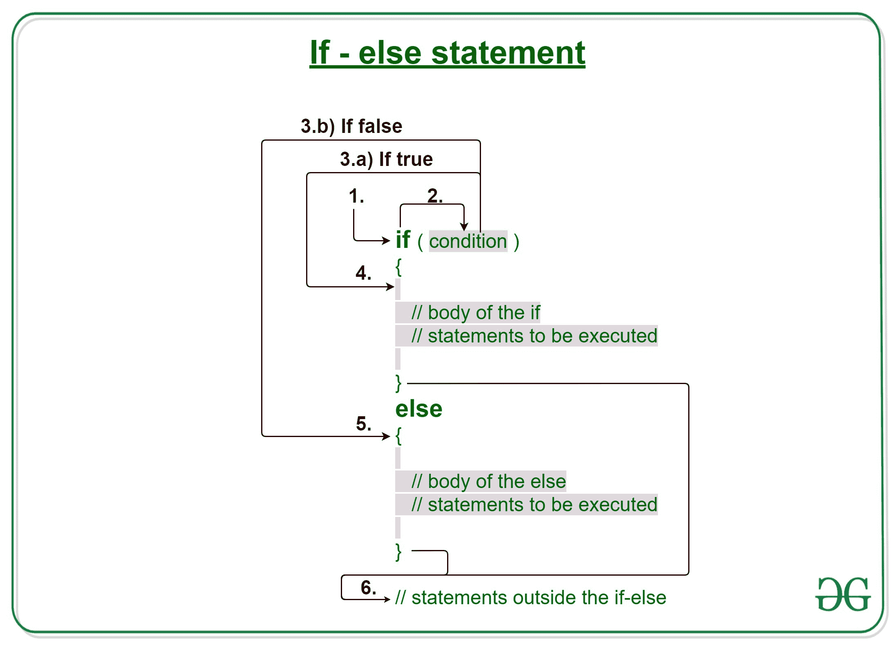
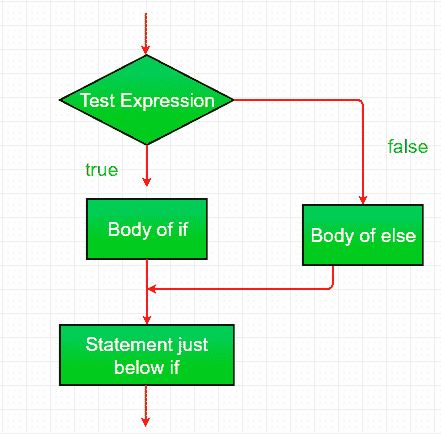

# 带有示例的 C/C++ if else 语句

> 原文:[https://www . geesforgeks . org/c-c-if-else-statement-with-examples/](https://www.geeksforgeeks.org/c-c-if-else-statement-with-examples/)

[C/c++](https://www.geeksforgeeks.org/decision-making-c-c-else-nested-else/)中的决策有助于编写决策驱动的语句，并基于某些条件执行一组特定的代码。

仅 *if* 语句就告诉我们，如果条件为真，它将执行一组语句，如果条件为假，它不会执行。但是如果条件是假的，我们想做别的事情怎么办。C/C++ **else 语句**来了。当条件为假时，我们可以使用 else 语句和 if 语句来执行一段代码。

[](https://media.geeksforgeeks.org/wp-content/uploads/20191118180512/If-else-statement-GeeksforGeeks1.jpg)

**语法:**

```
if (condition)
{
    // Executes this block if
    // condition is true
}
else
{
    // Executes this block if
    // condition is false
}
```

**if-else 语句的工作**

1.  控件落入 if 块。
2.  流程跳转到条件。
3.  测试条件。
    1.  如果条件为真，转到步骤 4。
    2.  如果条件为假，转到步骤 5。
4.  if 块或 if 中的主体被执行。
5.  else 块或 else 中的主体被执行。
6.  流程退出 if-else 块。

**流程图 if-else:**
[](https://media.geeksforgeeks.org/wp-content/uploads/20191119183412/C-Cpp-if-else.png)

**例 1:**

## C

```
// C program to illustrate If statement

#include <stdio.h>

int main()
{
    int i = 20;

    // Check if i is 10
    if (i == 10)
        printf("i is 10");

    // Since is not 10
    // Then execute the else statement
    else
        printf("i is 20");

    printf("Outside if-else block");

    return 0;
}
```

## C++

```
// C++ program to illustrate if-else statement

#include <iostream>
using namespace std;

int main()
{
    int i = 20;

    // Check if i is 10
    if (i == 10)
        cout << "i is 10";

    // Since is not 10
    // Then execute the else statement
    else
        cout << "i is 20\n";

    cout << "Outside if-else block";

    return 0;
}
```

**Output:**

```
i is 20
Outside if-else block

```

**空转示例 1:**

```
1\. Program starts.
2\. i is initialized to 20.
3\. if-condition is checked. i == 10, yields false.
4\. flow enters the else block.
  4.a) "i is 20" is printed
5\. "Outside if-else block" is printed.
```

**例 2:**

## C

```
// C program to illustrate If statement

#include <stdio.h>

int main()
{
    int i = 25;

    if (i > 15)
        printf("i is greater than 15");
    else
        printf("i is smaller than 15");

    return 0;
}
```

## C++

```
// C++ program to illustrate if-else statement

#include <iostream>
using namespace std;

int main()
{
    int i = 25;

    if (i > 15)
        cout << "i is greater than 15";
    else
        cout << "i is smaller than 15";

    return 0;
}
```

**Output:**

```
i is greater than 15

```

**相关文章:**

1.  [C/c++](https://www.geeksforgeeks.org/decision-making-c-c-else-nested-else/)中的决策
2.  [C/C++ if 语句示例](https://www.geeksforgeeks.org/c-c-if-statement-with-examples/)
3.  [C/C++ if else if 阶梯示例](https://www.geeksforgeeks.org/c-c-if-else-if-ladder-with-examples/)
4.  [C/c++中的开关语句](https://www.geeksforgeeks.org/switch-statement-cc/)
5.  [C/c++中的 Break 语句](https://www.geeksforgeeks.org/break-statement-cc/)
6.  [用 C/C++](https://www.geeksforgeeks.org/continue-statement-cpp/) 继续语句
7.  [C/c++中的 goto 语句](https://www.geeksforgeeks.org/goto-statement-in-c-cpp/)
8.  [C/c++中的返回语句，示例](https://www.geeksforgeeks.org/return-statement-in-c-cpp-with-examples/)
9.  [使用嵌套 If Else 为学生分配分数的程序](https://www.geeksforgeeks.org/program-to-assign-grades-to-a-student-using-nested-if-else/)