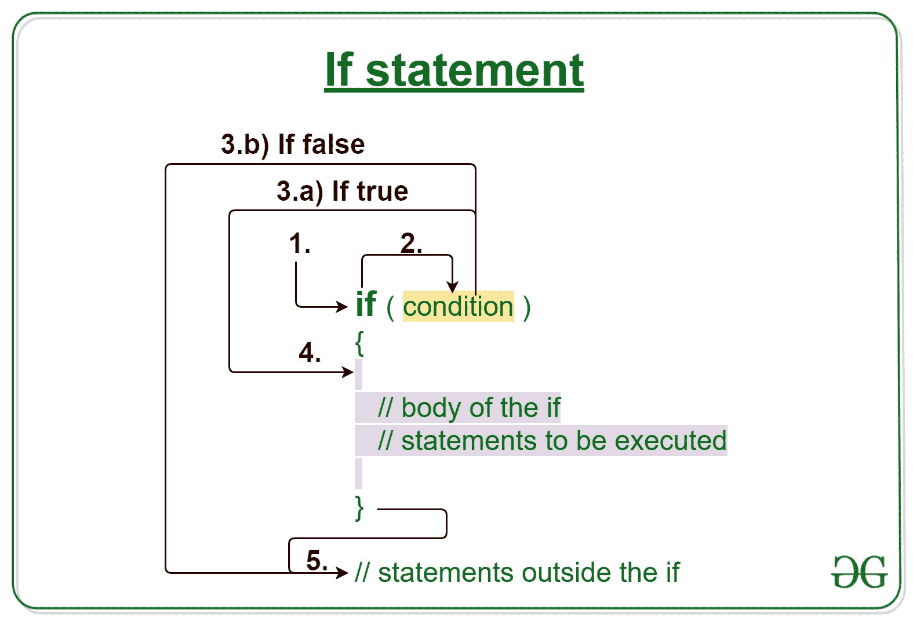
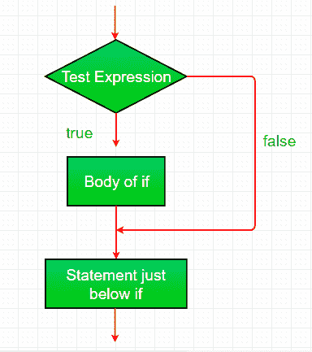

# C/C++ if 语句示例

> 原文:[https://www . geesforgeks . org/c-c-if-statement-with-examples/](https://www.geeksforgeeks.org/c-c-if-statement-with-examples/)

[C/c++ ](https://www.geeksforgeeks.org/decision-making-c-c-else-nested-else/)中的决策有助于编写决策驱动的语句，并基于某些条件执行一组特定的代码。

C/C++ **if 语句**是最简单的决策语句。它用于根据特定类型的条件决定是否执行特定的语句或语句块。

[](https://media.geeksforgeeks.org/wp-content/uploads/20191118171408/If-statement-GeeksforGeeks1.jpg)

**语法:**

```cpp
if(condition) 
{
   // Statements to execute if
   // condition is true
}
```

**if 语句的工作状态**

1.  控件落入 if 块。
2.  流程跳转到条件。
3.  测试条件。
    1.  如果条件为真，转到步骤 4。
    2.  如果条件为假，转到步骤 5。
4.  if 块或 if 中的主体被执行。
5.  流程走出 if 块。

**流程图**
[](https://media.geeksforgeeks.org/wp-content/uploads/20191119173402/C-Cpp-if.png)

**注意:**如果我们没有在 if( condition)之后提供花括号“{ 0 }”和“}”，那么默认情况下 If 语句会将紧接的 one 语句视为在其块内。例如，

```cpp
if(condition)
   statement1;
   statement2;

// Here if the condition is true,
// if block will consider only statement1
// to be inside  its block.
```

**例 1:**

## C

```cpp
// C program to illustrate If statement

#include <stdio.h>

int main()
{
    int i = 10;

    if (i < 15) {
        printf("10 is less than 15 \n");
    }

    printf("I am Not in if");
}
```

## C++

```cpp
// C++ program to illustrate If statement

#include <iostream>
using namespace std;

int main()
{
    int i = 10;

    if (i < 15) {
        cout << "10 is less than 15 \n";
    }

    cout << "I am Not in if";
}
```

**Output:**

```cpp
10 is less than 15 
I am Not in if

```

**空转示例 1:**

```cpp
1\. Program starts.
2\. i is initialized to 10.
3\. if-condition is checked. 10 < 15, yields true.
  3.a) "10 is less than 15" gets printed.
4\. "I am Not in if" is printed.

```

**例 2:**

## C

```cpp
// C program to illustrate If statement

#include <stdio.h>

int main()
{
    int i = 10;

    if (i > 15) {
        printf("10 is greater than 15 \n");
    }

    printf("I am Not in if");
}
```

## C++

```cpp
// C++ program to illustrate If statement

#include <iostream>
using namespace std;

int main()
{
    int i = 10;

    if (i > 15) {
        cout << "10 is greater than 15 \n";
    }

    cout << "I am Not in if";
}
```

**Output:**

```cpp
I am Not in if

```

**相关文章:**

1.  [C/c++ ](https://www.geeksforgeeks.org/decision-making-c-c-else-nested-else/)中的决策
2.  [带有示例的 C/C++ if else 语句](https://www.geeksforgeeks.org/c-c-if-else-statement-with-examples/)
3.  [C/C++ if else if 阶梯示例](https://www.geeksforgeeks.org/c-c-if-else-if-ladder-with-examples/)
4.  [C/c++ 中的开关语句](https://www.geeksforgeeks.org/switch-statement-cc/)
5.  [C/c++ 中的 Break 语句](https://www.geeksforgeeks.org/break-statement-cc/)
6.  [用 C/C++ ](https://www.geeksforgeeks.org/continue-statement-cpp/) 继续语句
7.  [C/c++ 中的 goto 语句](https://www.geeksforgeeks.org/goto-statement-in-c-cpp/)
8.  [C/c++ 中的返回语句，示例](https://www.geeksforgeeks.org/return-statement-in-c-cpp-with-examples/)