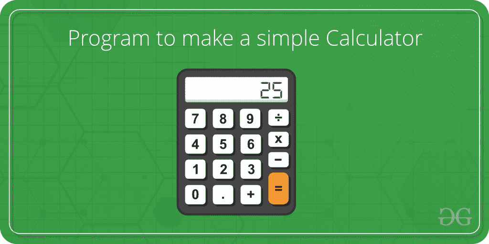
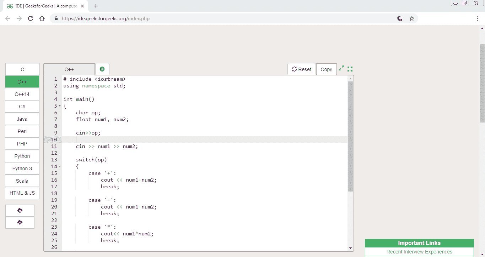
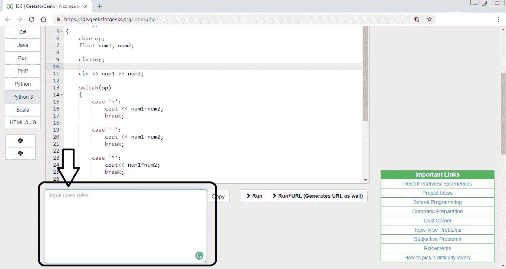
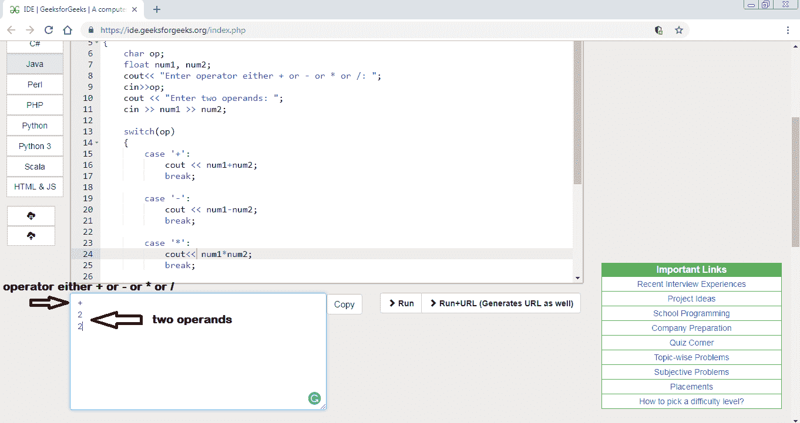
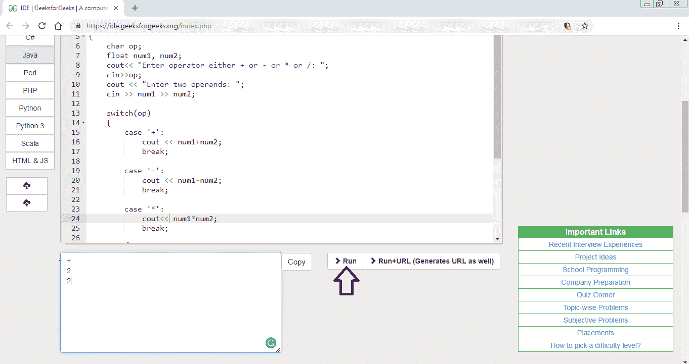
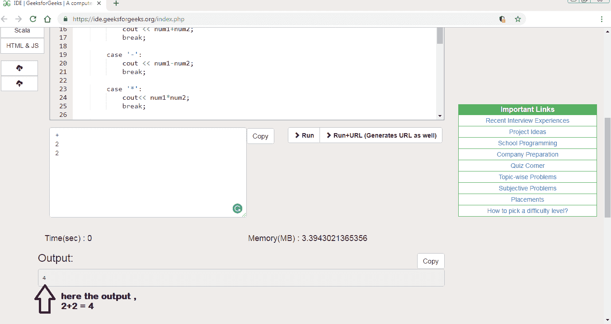

# C/C++程序制作简单计算器

> 原文:[https://www . geesforgeks . org/c-c-program-to-make-a-simple-calculator/](https://www.geeksforgeeks.org/c-c-program-to-make-a-simple-calculator/)



计算器是现在广泛使用的设备。它使计算更容易和更快。计算器在日常生活中被每个人使用。一个简单的计算器可以使用 C++程序来实现，该程序能够对用户输入的两个操作数进行加、减、乘和除。switch 和 break 语句用于创建计算器。

**程序:**

```
// C++ program to create calculator using
// switch statement
#include <iostream>
using namespace std;

// Main program
main()
{
    char op;
    float num1, num2;

    // It allows user to enter operator i.e. +, -, *, /
    cin >> op;

    // It allow user to enter the operands
    cin >> num1 >> num2;

    // Switch statement begins
    switch (op) {

        // If user enter + 
        case '+':
            cout << num1 + num2;
            break;

        // If user enter - 
        case '-':
            cout << num1 - num2;
            break;

        // If user enter *
        case '*':
            cout << num1 * num2;
            break;

        // If user enter /
        case '/':
            cout << num1 / num2;
            break;

        // If the operator is other than +, -, * or /, 
        // error message will display
        default:
            cout << "Error! operator is not correct";
            break;
    } // switch statement ends

    return 0; 
}
```

**输出:**

*   点击运行 ide 按钮，会打开另一个标签页，网址为
    【https://ide . geeksforgeks . org/index . PHP】
    
*   将输入放入输入框
    
*   输入算术运算符(即:+、-、*或/)，然后输入需要执行计算的两个操作数
    
*   点击运行按钮
    
*   然后输出框会出现输出
    