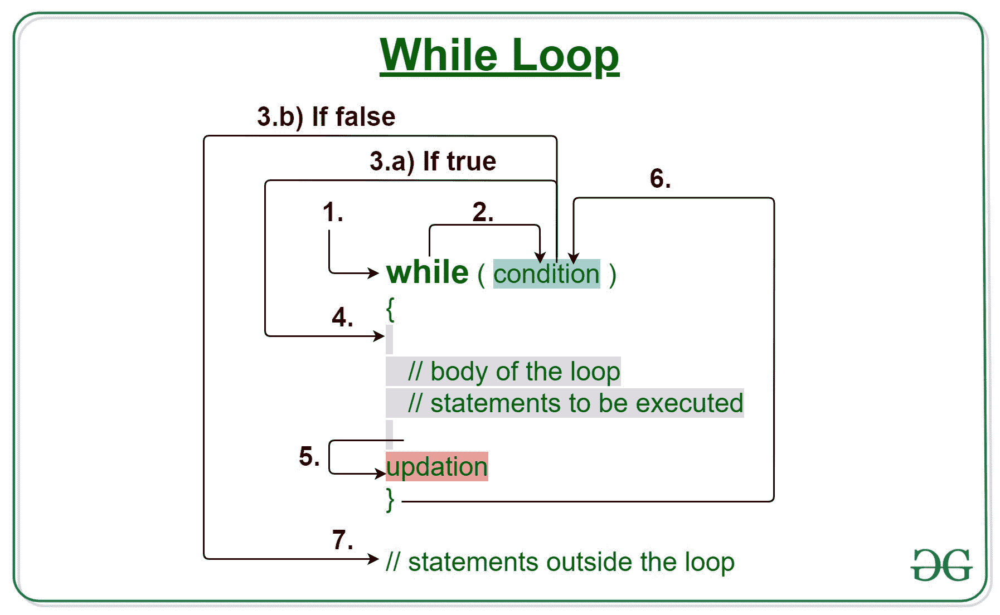
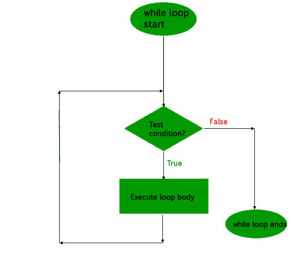

# C/C++ while 循环示例

> 原文:[https://www.geeksforgeeks.org/c-c-while-loop-with-examples/](https://www.geeksforgeeks.org/c-c-while-loop-with-examples/)

[**C/c++**](https://www.geeksforgeeks.org/loops-in-c-and-cpp/)中的循环在我们需要重复执行一个语句块时开始使用。

在对 C 或 C++ 中的“循环”的**的研究中，我们已经看到迭代的次数是预先已知的，即循环体需要被执行的次数是我们已知的。C/C++** 中的 **while 循环用于我们事先不知道循环的确切迭代次数的情况。基于测试条件终止循环执行。**

[](https://media.geeksforgeeks.org/wp-content/uploads/20191118170432/While-Loop-GeeksforGeeks1.jpg)

**语法:**

```
while (test_expression)
{
   // statements

  update_expression;
}
```

While 循环的各个**部分是:**

1.  **测试表达式:**在这个表达式中，我们必须测试条件。如果条件评估为真，那么我们将执行循环体并更新表达式。否则，我们将退出 while 循环。
    **例:**

    ```
    i <= 10
    ```

2.  **更新表达式**:执行循环体后，该表达式将循环变量增加/减少某个值。
    **例:**

    ```
    i++;
    ```

**While 循环是如何执行的？**

1.  控件落入 while 循环。
2.  流程跳转到条件
3.  测试条件。
    1.  如果条件为真，则该流进入身体。
    2.  如果条件为假，流程将超出循环
4.  循环体内部的语句被执行。
5.  上升发生。
6.  控制流回到步骤 2。
7.  边做边循环已经结束，流程已经流出。

**循环时的流程图(用于控制流程):**
[](https://media.geeksforgeeks.org/wp-content/uploads/20191108114819/C-while-loop.jpg)

**例 1:** 本程序将尝试打印《Hello World》5 次。

## C

```
// C program to illustrate while loop

#include <stdio.h>

int main()
{
    // initialization expression
    int i = 1;

    // test expression
    while (i < 6) {
        printf("Hello World\n");

        // update expression
        i++;
    }

    return 0;
}
```

## C++

```
// C++ program to illustrate while loop

#include <iostream>
using namespace std;

int main()
{
    // initialization expression
    int i = 1;

    // test expression
    while (i < 6) {
        cout << "Hello World\n";

        // update expression
        i++;
    }

    return 0;
}
```

**Output:**

```
Hello World
Hello World
Hello World
Hello World
Hello World

```

**试运行示例 1:** 程序将以以下方式执行。

```
1\. Program starts.
2\. i is initialized with value 1.
3\. Condition is checked. 1 < 6 yields true.
  3.a) "Hello World" gets printed 1st time.
  3.b) Updation is done. Now i = 2.
4\. Condition is checked. 2 < 6 yields true.
  4.a) "Hello World" gets printed 2nd time.
  4.b) Updation is done. Now i = 3.
5\. Condition is checked. 3 < 6 yields true.
  5.a) "Hello World" gets printed 3rd time
  5.b) Updation is done. Now i = 4.
6\. Condition is checked. 4 < 6 yields true.
  6.a) "Hello World" gets printed 4th time
  6.b) Updation is done. Now i = 5.
7\. Condition is checked. 5 < 6 yields true.
  7.a) "Hello World" gets printed 5th time
  7.b) Updation is done. Now i = 6.
8\. Condition is checked. 6 < 6 yields false.
9\. Flow goes outside the loop to return 0.

```

**例 2:**

## C

```
// C program to illustrate while loop

#include <stdio.h>

int main()
{
    // initialization expression
    int i = 1;

    // test expression
    while (i > -5) {
        printf("%d\n", i);

        // update expression
        i--;
    }
    return 0;
}
```

## C++

```
// C++ program to illustrate while loop

#include <iostream>
using namespace std;

int main()
{
    // initialization expression
    int i = 1;

    // test expression
    while (i > -5) {
        cout << i << "\n";

        // update expression
        i--;
    }

    return 0;
}
```

**Output:**

```
1
0
-1
-2
-3
-4

```

**相关文章:**

1.  [C 和 C++中的循环](https://www.geeksforgeeks.org/loops-in-c-and-cpp/)
2.  [C/C++ For 循环示例](https://www.geeksforgeeks.org/c-c-for-loop-with-examples/)
3.  [C/C++边做边循环示例](https://www.geeksforgeeks.org/c-c-do-while-loop-with-examples/)
4.  [C、C++、Java 中 while 和 do-while 循环的区别](https://www.geeksforgeeks.org/difference-between-while-and-do-while-loop-in-c-c-java/)
5.  [C、C++、Java 中 for 和 while 循环的区别](https://www.geeksforgeeks.org/difference-between-for-and-while-loop-in-c-c-java/)