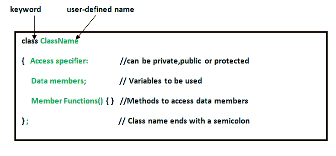

# C++类和对象

> 原文:[https://www.geeksforgeeks.org/c-classes-and-objects/](https://www.geeksforgeeks.org/c-classes-and-objects/)

**类:**c++中的类是通向面向对象编程的构造块。它是用户定义的数据类型，保存自己的数据成员和成员函数，可以通过创建该类的实例来访问和使用。C 与 C++程序设计学习与实验系统类就像一个对象的蓝图。
例如:考虑**汽车的等级**。可能有很多不同名称和品牌的汽车，但它们都有一些共同的属性，比如它们都有 *4 个轮子*、*限速*、*里程范围*等。所以在这里，汽车是级别，车轮、限速、里程是它们的属性。

*   类是用户定义的数据类型，具有数据成员和成员函数。
*   数据成员是数据变量，成员函数是用于操作这些变量的函数，这些数据成员和成员函数一起定义了类中对象的属性和行为。
*   在上面的*级车*的例子中，数据成员将是*限速*、*里程*等，成员功能可以是*踩刹车*、*提速*等。

一个**对象**是一个类的实例。当一个类被定义时，没有分配内存，但是当它被实例化时(即一个对象被创建)，内存被分配。

**定义类和声明对象**

在 C++中，使用关键字 class 后跟类名来定义类。类的主体在花括号内定义，并在末尾以分号结束。

**声明对象:**定义类时，只定义对象的规范；没有分配内存或存储空间。要使用类中定义的数据和访问函数，需要创建对象。

**语法:**

```
ClassName ObjectName;
```

**访问数据成员和成员函数**:类的数据成员和成员函数可以使用点('.'来访问)运算符。例如，如果对象的名称是 *obj* 并且您想要访问名为 *printName()* 的成员函数，那么您必须编写 *obj.printName()* 。

**访问数据成员**

公共数据成员也以相同的方式被访问，但是私有数据成员不允许被对象直接访问。访问数据成员仅取决于该数据成员的访问控制。
这个访问控制是由 C++ 中的[访问修饰符给出的。有三个访问修饰符:**公共、私有和受保护**。](https://www.geeksforgeeks.org/access-modifiers-in-c/)

```
// C++ program to demonstrate
// accessing of data members

#include <bits/stdc++.h>
using namespace std;
class Geeks
{
    // Access specifier
    public:

    // Data Members
    string geekname;

    // Member Functions()
    void printname()
    {
       cout << "Geekname is: " << geekname;
    }
};

int main() {

    // Declare an object of class geeks
    Geeks obj1;

    // accessing data member
    obj1.geekname = "Abhi";

    // accessing member function
    obj1.printname();
    return 0;
}
```

**输出:**

```
Geekname is: Abhi
```

**类中的成员函数**

定义成员函数有两种方法:

*   类内定义
*   类外定义

要在类定义之外定义成员函数，我们必须使用范围解析::运算符以及类名和函数名。

```
// C++ program to demonstrate function
// declaration outside class

#include <bits/stdc++.h>
using namespace std;
class Geeks
{
    public:
    string geekname;
    int id;

    // printname is not defined inside class definition
    void printname();

    // printid is defined inside class definition
    void printid()
    {
        cout << "Geek id is: " << id;
    }
};

// Definition of printname using scope resolution operator ::
void Geeks::printname()
{
    cout << "Geekname is: " << geekname;
}
int main() {

    Geeks obj1;
    obj1.geekname = "xyz";
    obj1.id=15;

    // call printname()
    obj1.printname();
    cout << endl;

    // call printid()
    obj1.printid();
    return 0;
}
```

**输出:**

```
Geekname is: xyz
Geek id is: 15

```

请注意，类定义中定义的所有成员函数默认为**内联**，但您也可以通过使用关键字 inline 将任何非类函数内联。内联函数是实际的函数，在编译过程中会被复制到各处，就像预处理器宏一样，这样就减少了函数调用的开销。

注意:声明一个[友元函数](https://www.geeksforgeeks.org/friend-class-function-cpp/)是给非成员函数私有访问权的一种方式。

**[施工方](https://www.geeksforgeeks.org/constructors-c/)**

构造函数是特殊的类成员，每次实例化该类的对象时，编译器都会调用它。构造函数与类同名，可以在类定义内部或外部定义。
构造函数有 3 种类型:

*   [默认构造函数](https://www.geeksforgeeks.org/constructors-c/)
*   参数化构造函数
*   [复制构造函数](https://www.geeksforgeeks.org/copy-constructor-in-cpp/)

```
// C++ program to demonstrate constructors

#include <bits/stdc++.h>
using namespace std;
class Geeks
{
    public:
    int id;

    //Default Constructor
    Geeks()
    {
        cout << "Default Constructor called" << endl;
        id=-1;
    }

    //Parameterized Constructor
    Geeks(int x)
    {
        cout << "Parameterized Constructor called" << endl;
        id=x;
    }
};
int main() {

    // obj1 will call Default Constructor
    Geeks obj1;
    cout << "Geek id is: " <<obj1.id << endl;

    // obj1 will call Parameterized Constructor
    Geeks obj2(21);
    cout << "Geek id is: " <<obj2.id << endl;
    return 0;
}
```

**输出:**

```
Default Constructor called
Geek id is: -1
Parameterized Constructor called
Geek id is: 21

```

一个**复制构造器**创建一个新对象，它是现有对象的精确副本。编译器为所有类提供默认的复制构造函数。
语法:

```
class-name (class-name &){}

```

**[析构器](https://www.geeksforgeeks.org/destructors-c/)**

析构函数是另一个特殊的成员函数，当对象的作用域结束时，编译器会调用它。

```
// C++ program to explain destructors

#include <bits/stdc++.h>
using namespace std;
class Geeks
{
    public:
    int id;

    //Definition for Destructor
    ~Geeks()
    {
        cout << "Destructor called for id: " << id <<endl;
    }
};

int main()
  {
    Geeks obj1;
    obj1.id=7;
    int i = 0;
    while ( i < 5 )
    {
        Geeks obj2;
        obj2.id=i;
        i++;       
    } // Scope for obj2 ends here

    return 0;
  } // Scope for obj1 ends here
```

**输出:**

```
Destructor called for id: 0
Destructor called for id: 1
Destructor called for id: 2
Destructor called for id: 3
Destructor called for id: 4
Destructor called for id: 7

```

[纯虚拟析构器](https://www.geeksforgeeks.org/pure-virtual-destructor-c/)

**相关文章:**

*   [c++中的多重遗传](https://www.geeksforgeeks.org/multiple-inheritance-in-c/)
*   [C++测验](https://www.geeksforgeeks.org/quiz-corner-gq/)

本文由**阿比拉夫·卡里亚**供稿。如果你喜欢极客博客并想投稿，你也可以用 write.geeksforgeeks.org 写一篇文章或者把你的文章邮寄到 review-team@geeksforgeeks.org。看到你的文章出现在极客博客主页上，帮助其他极客。

如果你发现任何不正确的地方，或者你想分享更多关于上面讨论的话题的信息，请写评论。