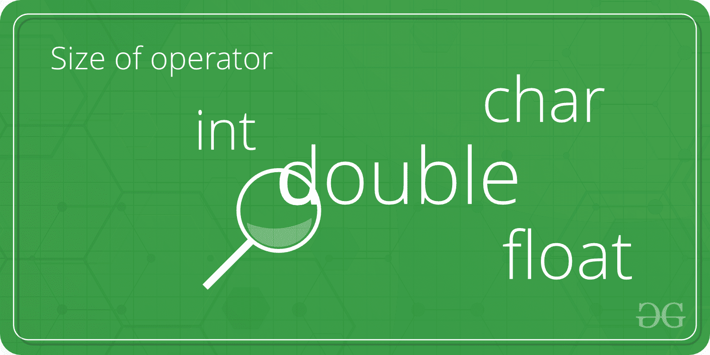

# C/C++ 程序求 int、float、double 和 char 的大小

> 原文:[https://www . geesforgeks . org/c-CPP-program-to-find-size-int-float-double-and-char/](https://www.geeksforgeeks.org/c-cpp-program-to-find-the-size-of-int-float-double-and-char/)

给定四种类型的变量，即 int、char、float 和 double，任务是用 C 或 C++ 编写一个程序来找到这四种类型变量的大小。



**示例**:

```cpp
Input: int
Output: Size of int = 4

Input: double
Output: Size of double = 8

```

以下是所有数据类型及其大小、范围和访问说明符的列表:

| 数据类型 | 内存(字节) | 范围 | 格式规范 |
| --- | --- | --- | --- |
| 短整型 | Two | -32，768 至 32，767 | %hd |
| 无符号短整型 | Two | 0 至 65，535 | %hu |
| 无符号整数 | four | 0 至 4，294，967，295 | %u |
| （同 Internationalorganizations）国际组织 | four | -2，147，483，648 至 2，147，483，647 | %d |
| 长整型 | four | -2，147，483，648 至 2，147，483，647 | %ld |
| 无符号长整型 | four | 0 至 4，294，967，295 | %lu |
| 长整型 | eight | -(2^63)到(2^63)-1 | %lld |
| 无符号长整型 | eight | 0 至 18，446，744，073，709，551，615 | %llu |
| 有符号字符 | one | -128 到 127 | %c |
| 无符号字符 | one | 0 到 255 | %c |
| 漂浮物 | four |  | %f |
| 两倍 | eight |  | %lf |
| 长双 | Twelve |  | %Lf |

要找到四个变量的大小:

1.  在*中定义了四种类型的变量:整数型、浮点型、双精度型和图表型*。
2.  变量的大小是使用 size of()运算符计算的。

下面是查找 int、char、float 和 double 数据类型大小的 C 和 C++ 程序:

## C

```cpp
// C program to find the size of int, char,
// float and double data types

#include <stdio.h>

int main()
{
    int integerType;
    char charType;
    float floatType;
    double doubleType;

    // Calculate and Print
    // the size of integer type
    printf("Size of int is: %ld\n",
           sizeof(integerType));

    // Calculate and Print
    // the size of charType
    printf("Size of char is: %ld\n",
           sizeof(charType));

    // Calculate and Print
    // the size of floatType
    printf("Size of float is: %ld\n",
           sizeof(floatType));

    // Calculate and Print
    // the size of doubleType
    printf("Size of double is: %ld\n",
           sizeof(doubleType));

    return 0;
}
```

## C++

```cpp
// C++ program to find the size of int, char,
// float and double data types
#include <iostream>
using namespace std;

int main() 
{ 
    int integerType; 
    char charType; 
    float floatType; 
    double doubleType; 

    // Calculate and Print 
    // the size of integer type 
    cout << "Size of int is: " << 
    sizeof(integerType) <<"\n"; 

    // Calculate and Print 
    // the size of doubleType 
    cout << "Size of char is: " << 
    sizeof(charType) <<"\n"; 

    // Calculate and Print 
    // the size of charType 
    cout << "Size of float is: " << 
    sizeof(floatType) <<"\n";

    // Calculate and Print 
    // the size of floatType 
    cout << "Size of double is: " << 
    sizeof(doubleType) <<"\n"; 

    return 0; 
} 
```

**Output:**

```cpp
Size of int is: 4
Size of char is: 1
Size of float is: 4
Size of double is: 8

```