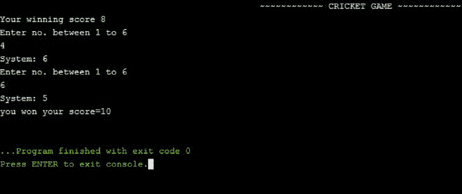
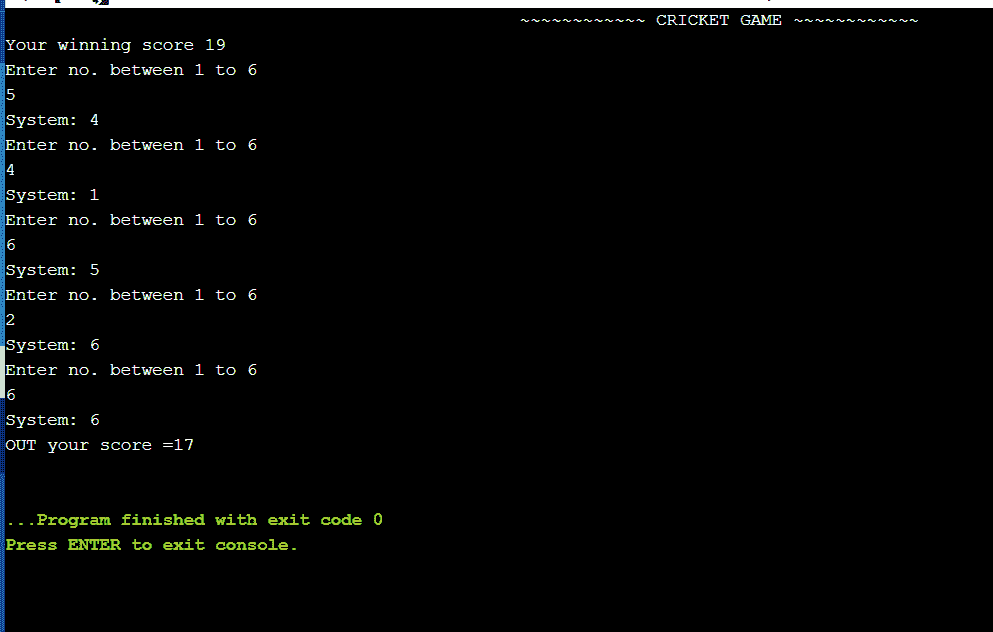

# C/C++程序实现的板球游戏

> 原文:[https://www . geesforgeks . org/c-CPP-程序实现板球比赛/](https://www.geeksforgeeks.org/c-cpp-program-to-implement-the-cricket-game/)

在本文中，任务是创建一个 2 人板球游戏，其中**玩家 1** 是操作程序的用户，**玩家 2** 是计算机。在这个游戏中，遵循以下一系列步骤:

1.  首先，程序会生成一个介于 0 到 25 之间的[随机数](https://www.geeksforgeeks.org/c-program-generate-random-number/)。这个数字将是玩家 1 赢得这场比赛所需的分数。假设程序生成的随机数是 15，那么这个数字将是玩家 1 需要达到的分数。
2.  第二步是玩家 1(用户)和玩家 2(电脑)之间的真实匹配。
3.  用户将使用键盘输入数字 1 到 6。然后，系统将再次生成一个介于 1 和 6 之间的随机数。如果用户的输入不同于系统生成的随机数，那么它就是命中，用户将获得与用户输入的相同数字的分数。如果两个数字匹配，用户将出局，并打印最终总分。
4.  用户评分的总分是用户输入的所有数字的总和。分数是在用户每次输入后计算的。用户的先前输入+当前输入。

**示例:**

> **系统生成的随机数为 15。这是获胜的分数。**
> 
> 现在玩家将输入 1 到 6 之间的数字。
> **玩家:2**
> 系统现在会生成一个 1 到 6 之间的随机数。
> **系统:1**
> 玩家是安全的，因为两个数字不同，他可以玩得更远。
> 
> 玩家将输入一个 1 到 6 之间的随机数。
> **玩家:3**
> 系统现在会生成一个 1 到 6 之间的随机数。
> **系统:4**
> 
> 这个过程一直持续到玩家和系统选择相同的号码
> 
> **玩家:6**
> 
> **系统:6**
> 
> 现在，由于两个数字相同(玩家的和系统的)，玩家出局了。
> 
> **结果:**你输了，总分 5。
> 
> **游戏结束。**

下面是实现上述方法的 [C++程序](https://www.geeksforgeeks.org/c-plus-plus/):

## C++

```cpp
// C++ program for the above approach
#include <cstdlib>
#include <ctime>
#include <iostream>
using namespace std;

// Driver Code
int main()
{
    int totalrun = 0;
    srand(time(0));
    int i;

    // Generate a random number
    // and store in variable
    i = (rand() % 25) + 1;
    cout << "~~~~~~~~ CRICKET GAME ~~~"
         << "~~~~~~~" << endl;

    // Displaying the winning score
    cout << "Your winning score "
         << i << "\n";

    // while loop for true condition
    while (1) {
        int player = 0;
        int a;

        if (totalrun > i) {
            cout << "you won your score="
                 << totalrun << "\n";

            // To exit loop
            exit(0);
        }
        else {

            // Generate random no. and
            // store in a variable
            a = (rand() % 6) + 1;
            cout << "Enter no. between "
                 << "1 to 6" << endl;

            // Taking input from user
            // to score runs
            cin >> player;

            // Checking if user's score
            // exceeds the winning score
            // Displaying random number
            // taken by system on screen
            cout << "System: " << a << endl;

            // Check if number inserted
            // by user is the same random
            // number generated by system
            // inside loop
            if (player == a) {
                cout << "OUT your score ="
                     << totalrun
                     << endl;

                // To exit loop
                exit(0);
            }

            // Storing total runs scored
            // by user
            else {
                totalrun = totalrun + player;
            }
        }
    }

    return 0;
}
```

**输出:**

 