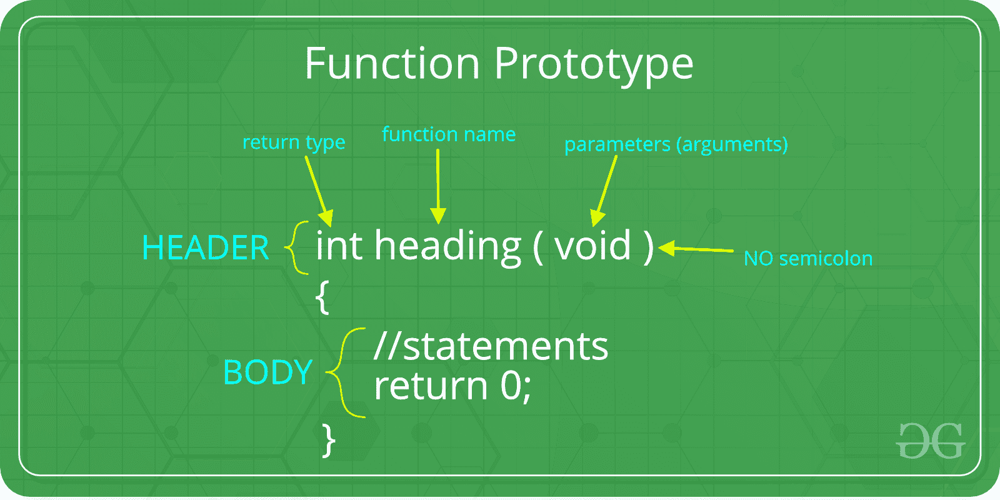
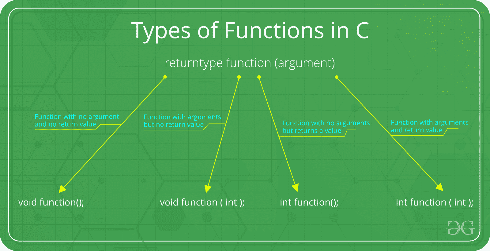

# C 函数参数和返回值

> 原文:[https://www . geesforgeks . org/c-函数-参数-返回值/](https://www.geeksforgeeks.org/c-function-argument-return-values/)

**先决条件:**[C/c++](https://www.geeksforgeeks.org/functions-in-c/) 中的函数
C 中的函数可以用参数调用，也可以不用参数调用。这些函数可以向调用函数返回值，也可以不返回值。在 C 程序中，所有的 C 函数都可以用参数或者不用参数来调用。此外，它们可能会也可能不会返回值。因此，C 语言中函数的函数原型如下:



**有以下几类:**



1.  **Function with no argument and no return value :** When a function has no arguments, it does not receive any data from the calling function. Similarly when it does not return a value, the calling function does not receive any data from the called function.
    Syntax :

    ```
    Function declaration : void function();
    Function call : function();
    Function definition :
                          void function()
                          {
                            statements;
                          }

    ```

    ```
    // C code for  function with no
    //  arguments and no return value

    #include <stdio.h>
    void value(void);
    void main()
    {
        value();
    }
    void value(void)
    {
        int year = 1, period = 5, amount = 5000, inrate = 0.12;
        float sum;
        sum = amount;
        while (year <= period) {
            sum = sum * (1 + inrate);
            year = year + 1;
        }
        printf(" The total amount is %f:", sum);
    }
    ```

    **输出:**

    ```
    The total amount is 5000.000000

    ```

2.  **Function with arguments but no return value :** When a function has arguments, it receive any data from the calling function but it returns no values.

    语法:

    ```
    Function declaration : void function ( int );
    Function call : function( x );
    Function definition:
                 void function( int x )
                 {
                   statements;
                 }

    ```

    ```
    // C code for function 
    // with argument but no return value
    #include <stdio.h>

    void function(int, int[], char[]);
    int main()
    {
        int a = 20;
        int ar[5] = { 10, 20, 30, 40, 50 };
        char str[30] = "geeksforgeeks";
        function(a, &ar[0], &str[0]);
        return 0;
    }

    void function(int a, int* ar, char* str)
    {
        int i;
        printf("value of a is %d\n\n", a);
        for (i = 0; i < 5; i++) {
            printf("value of ar[%d] is %d\n", i, ar[i]);
        }
        printf("\nvalue of str is %s\n", str);
    }
    ```

    **输出:**

    ```
    value of a is 20
    value of ar[0] is 10
    value of ar[1] is 20
    value of ar[2] is 30
    value of ar[3] is 40
    value of ar[4] is 50
    The given string is : geeksforgeeks

    ```

3.  **Function with no arguments but returns a value :** There could be occasions where we may need to design functions that may not take any arguments but returns a value to the calling function. A example for this is getchar function it has no parameters but it returns an integer an integer type data that represents a character.
    Syntax :

    ```
    Function declaration : int function();
    Function call : function();
    Function definition :
                     int function()
                     {
                         statements;
                          return x;
                      }

    ```

    ```
    // C code for function with no arguments 
    // but have return value
    #include <math.h>
    #include <stdio.h>

    int sum();
    int main()
    {
        int num;
        num = sum();
        printf("\nSum of two given values = %d", num);
        return 0;
    }

    int sum()
    {
        int a = 50, b = 80, sum;
        sum = sqrt(a) + sqrt(b);
        return sum;
    }
    ```

    **输出:**

    ```
    Sum of two given values = 16

    ```

4.  **Function with arguments and return value**
    Syntax :

    ```
    Function declaration : int function ( int );
    Function call : function( x );
    Function definition:
                 int function( int x )
                 {
                   statements;
                   return x;
                 }

    ```

    ```
    // C code for function with arguments 
    // and with return value

    #include <stdio.h>
    #include <string.h>
    int function(int, int[]);

    int main()
    {
        int i, a = 20;
        int arr[5] = { 10, 20, 30, 40, 50 };
        a = function(a, &arr[0]);
        printf("value of a is %d\n", a);
        for (i = 0; i < 5; i++) {
            printf("value of arr[%d] is %d\n", i, arr[i]);
        }
        return 0;
    }

    int function(int a, int* arr)
    {
        int i;
        a = a + 20;
        arr[0] = arr[0] + 50;
        arr[1] = arr[1] + 50;
        arr[2] = arr[2] + 50;
        arr[3] = arr[3] + 50;
        arr[4] = arr[4] + 50;
        return a;
    }
    ```

    **输出:**

    ```
    value of a is 40
    value of arr[0] is 60
    value of arr[1] is 70
    value of arr[2] is 80
    value of arr[3] is 90
    value of arr[4] is 100

    ```