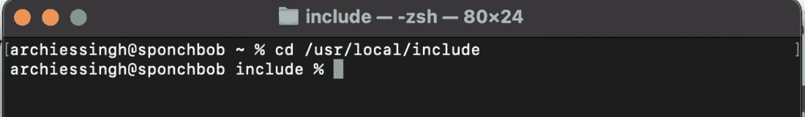
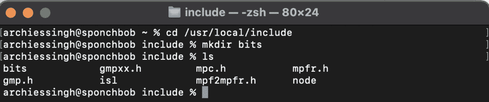
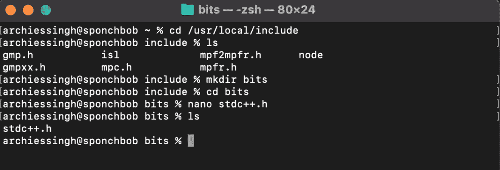

# 在 MacBook M1 上为 VS 代码进行 C++ 安装

> 原文:[https://www . geesforgeks . org/c-macbook 上安装-m1-for-vs-code/](https://www.geeksforgeeks.org/c-installation-on-macbook-m1-for-vs-code/)

本文写的是最新 MacBook M1 处理器的 CPP 安装。并不是说我们不能在最新的 MacBook 中做 CPP 编程，还有 Xcode，它是其他代码编辑器的替代品。但是仍然有许多开发人员喜欢在 Visual Studio 上编写代码。

让我们从在 Visual Studio 代码上安装 CPP 开始。

*   首先[在你的设备上下载 VS 代码](https://code.visualstudio.com)。
*   您也可以[下载 M1 特定的 Visual Studio 代码](https://code.visualstudio.com/insiders/)(即 Visual Studio 代码-内部人员)

下载 Visual Studio 代码或 Visual Studio 代码内部人员后，打开它并转到扩展。有一个搜索选项卡，只需键入 c++ 然后点击 1 推荐并安装它。您必须下载的另一个扩展是代码运行器。

在此过程中，用户可能会遇到两种不同类型的问题。因此，让我们讨论它们是什么以及如何解决它们。

**问题 1:** 在 VS Code 上下载完所有扩展后，无法在 CPP 上工作。

按照以下步骤解决同一问题:

*   **第一步:**打开终端，运行以下命令:

```cpp
arch -x86_64 /bin/bash -c "$(curl -fsSL https://raw.githubusercontent.com/  Homebrew/install/master/install.sh)"
```

*   **步骤 2:** 现在在完成之前的命令类型后:

```cpp
arch -x86_64 brew install mingw-w64
```

**问题 2:**#包含<位/stdc++。h >未找到。

如果想了解更多关于系统头文件[点击这里](https://www.geeksforgeeks.org/c-c-include-directive-with-examples/#:~:text=%23include%20is%20a%20way%20of,file%20into%20the%20following%20program.)。按照以下步骤解决问题:

*   **第一步:**使用命令+空格打开终端，键入终端。
*   **步骤 2:** 现在移动到下面给定的路径:

```cpp
/usr/local/include
```



*   **步骤 3:** 现在在当前位置创建 bits 目录

```cpp
mkdir bits
```



*   **第 4 步:**现在进入 bits 目录，创建一个文件并命名为 ***stdc++。h*** 。

```cpp
nano stdc++.h
```

*   **第五步:**创建文件后，只需从<u>[**<u>GitHub 存储库</u>**](https://github.com/Archies13Singh/cpp-important-packages-file/blob/main/stdc++.h) 复制代码，并将该代码粘贴到 stdc++。文件，然后按</u>

```cpp
 {control+x}-> y -> return
```

<u></u>

<u>现在只需尝试实现任何 CPP 代码，以确保您在 MacBook M1 上完成了 CPP 设置。</u>

## <u>C++ </u>

```cpp
#include <bits/stdc++.h>
using namespace std;

int main()
{
    int a= 2, b=4;
    cout<<a+b<<endl;
    return 0;
}
```

<u>就这样。您已经成功地将 CPP 安装到您的 Mac M1 中。</u>