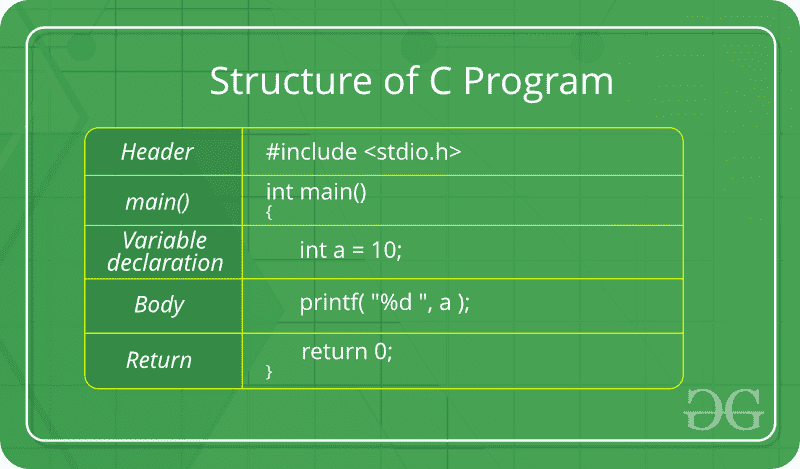

# C 语言介绍

> 原文:[https://www . geesforgeks . org/c-language-set-1-introduction/](https://www.geeksforgeeks.org/c-language-set-1-introduction/)

[C](https://www.geeksforgeeks.org/c-programming-language/) 是一种过程编程语言。它最初是由丹尼斯·里奇在 1972 年开发的。它主要是作为编写操作系统的系统编程语言开发的。C 语言的主要特点包括低级内存访问、一组简单的关键字和简洁的风格，这些特点使 C 语言适合像操作系统或编译器开发这样的系统编程。
许多后来的语言都直接或间接地借用了 C 语言的语法/特征。像 Java 的语法一样，PHP、JavaScript 和许多其他语言主要基于 C 语言。C++几乎是 C 语言的超集(很少有程序可以用 C 语言编译，但不能用 C++)。
**从 C 编程开始:**

1.  **一个 C 程序的结构**
    经过上面的讨论，我们可以正式评估一个 C 程序的结构。结构意味着任何程序都只能用这种结构编写。用任何其他结构编写 C 程序都会导致编译错误。
    一个 C 程序的结构如下:



1.  上述结构的组成部分是:
    1.  **头文件包含**:第一个也是最重要的组件是 C 程序中头文件的包含。
        头文件是扩展名为的文件。它包含 C 函数声明和宏定义，可以在几个源文件之间共享。
        部分 C 头文件:
        *   stddef . h–定义了几种有用的类型和宏。
        *   stdint . h–定义精确的宽度整数类型。
        *   定义核心输入和输出功能
        *   定义数字转换函数、伪随机网络生成器、内存分配
        *   定义字符串处理函数
        *   数学 h–定义常见的数学函数
    2.  **Main 方法声明:**C 程序的下一部分是声明 Main()函数。语法申报主要功能是:
        **语法申报** **主要方法:**

```
int main()
{}
```

2.  **变量声明:**任何 C 程序的下一部分都是变量声明。它指的是要在函数中使用的变量。请注意，在 C 程序中，任何变量都不能不声明就使用。同样在 C 程序中，变量要在函数的任何操作之前声明。
    **例:**

```
int main()
{
    int a;
.
.
```

2.  **Body:**C 程序中函数的体，指的是在函数中执行的操作。它可以是任何操作，搜索，排序，打印等。
    **例:**

```
int main()
{
    int a;

    printf("%d", a);
.
.
```

2.  **返回语句:**任何 C 程序的最后一部分都是返回语句。return 语句是指从函数中返回值。这个返回语句和返回值取决于函数的返回类型。例如，如果返回类型为 void，则不会有 return 语句。在任何其他情况下，都会有一个 return 语句，返回值将是指定返回类型的类型。
    **例:**

```
int main()
{
    int a;

    printf("%d", a);

    return 0;
}
```

2.  **编写第一个程序:**
    以下是 C
    中的第一个程序

## C

```
#include <stdio.h>
int main(void)
{
    printf("GeeksQuiz");
    return 0;
}
```

1.  让我们一行一行地分析这个程序。
    ***第 1 行:【# include<stdio . h>***在 C 程序中，所有以 **#** 开头的行都由[预处理器](http://en.wikipedia.org/wiki/C_preprocessor)处理，该预处理器是由编译器调用的程序。用一个非常基本的术语来说，[预处理器](http://en.wikipedia.org/wiki/C_preprocessor)取一个 C 程序，产生另一个 C 程序。生成的程序没有以#开头的行，所有这样的行都由预处理器处理。在上面的例子中，预处理器将 stdio.h 的预处理代码复制到我们的文件中。那个。h 文件在 c 语言中称为头文件，这些头文件一般包含函数的声明。程序中使用的函数 printf()需要 stdio.h。
    ***第 2 行【int main(void)】***编译好的 C 程序的执行一定要有一个开始的起点。在 C 语言中，执行通常从 main()的第一行开始。括号中写的 void 表示 main 不取任何参数(详见[本](https://www.geeksforgeeks.org/difference-int-main-int-mainvoid/))。main()也可以写成 take 参数。我们将在以后的文章中讨论这个问题。
    int 写在 main 之前，表示 main()的返回类型。main 返回的值表示程序终止的状态。退货类型详见本帖。
    ***第 3 行和第 6 行:[ { and } ]*** 在 C 语言中，一对花括号定义范围，主要用于 if、else、loops 等函数和控制语句。所有函数必须以花括号开始和结束。
    ***4 号线【printf(" GeeksQuiz ")；】*** [printf()](http://www.cplusplus.com/reference/cstdio/printf/) 是在标准输出上打印东西的标准库函数。printf 末尾的分号表示行终止。在 C 语言中，分号总是用来表示语句的结束。
    ***5 号线【返回 0；】***return 语句返回 main()的值。操作系统可以使用返回值来了解程序的终止状态。值 0 通常意味着成功终止。

2.  **How to execute the above program:** 
    In order to execute the above program, we need to have a compiler to compile and run our programs. There are certain online compilers like [https://ide.geeksforgeeks.org/](https://ide.geeksforgeeks.org/), [http://ideone.com/](http://ideone.com/), or [http://codepad.org/](http://codepad.org/) that can be used to start C without installing a compiler. 

    ***Windows:*** 像[代码块](http://www.codeblocks.org/downloads/26)和 [Dev-CPP](http://www.bloodshed.net/download.html) 这样的 C 程序的编译有很多编译器可以免费使用。我们强烈推荐代码块。
    ***Linux:*** 对于 Linux 来说， [gcc](http://en.wikipedia.org/wiki/GNU_Compiler_Collection) 是和 Linux 捆绑的，Code Blocks 也可以和 Linux 一起使用。

如果发现有不正确的地方，请写评论，或者想分享更多关于以上讨论话题的信息