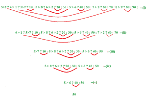

# C++ |嵌套三元运算符

> 原文:[https://www.geeksforgeeks.org/c-nested-ternary-operator/](https://www.geeksforgeeks.org/c-nested-ternary-operator/)

[三元运算符](https://www.geeksforgeeks.org/cc-ternary-operator-some-interesting-observations/)又称条件运算符，使用三个操作数进行运算。
**语法:**

```
op1 ? op2 : op3;
```

**嵌套三元运算符:**三元运算符可以嵌套。嵌套三元运算符可以有多种形式，例如:

*   a？乙:丙
*   a？乙:丙？d : e？外宾:g？我
*   a？b？c : d : e

**让我们一个一个了解语法:**

1.  **一个？b : c = >** 这个三元运算符类似于 if-else 语句。所以可以用 if-else 语句的形式来表达。
    **使用三元运算符的表达式:**

```
a ? b : c
```

**使用 if else 语句的表达式:**

```
if ( a ) 
    then b execute
else 
    c execute
```

**2。示例:**

## C++

```
// C++ program to illustrate
// nested ternary operators
#include <bits/stdc++.h>
using namespace std;

int main()
{
    cout << "Execute expression using"
    << " ternary operator: ";
    // Execute expression using
    // ternary operator
    int a = 2 > 5 ? 2 : 5;
    cout << a << endl;

    cout << "Execute expression using "
    << "if else statement: ";

    // Execute expression using if else
    if ( 2 > 5)
        cout << "2";
    else
        cout << "5";
    return 0;
}
```

**Output:** 

```
Execute expression using ternary operator: 5
Execute expression using if else statement: 5
```

2.**一个？乙:丙？d : e？外宾:g？h : i = >** 这个嵌套三元运算符可以分解为 if、else 和 else-if 语句。表达式可以在三进制运算符和 if else 语句中分成更小的部分，如下所示:
**使用三进制运算符的表达式:**

```
a ? b
    : c ? d
    : e ? f
    : g ? h
    : i
```

**使用 if else 语句的表达式:**

```
 if a then b
    else if c then d
    else if e then f
    else if g then h
    else i
```

## 卡片打印处理机（Card Print Processor 的缩写）

```
// C++ program to illustrate
// nested ternary operators
#include <bits/stdc++.h>

using namespace std;

int main()
{
    cout << "Execute expression using "
    << "ternary operator: ";
    int a = 2 > 3 ? 2 : 3 > 4 ? 3 : 4;
    cout << a << endl;

    cout << "Execute expression using "
    << "if else statement: ";
    if ( 2 > 3 )
        cout << "2";
    else if ( 3 > 4 )
        cout << "3";
    else 
        cout << "4";
    return 0;
}
```

**Output:** 

```
Execute expression using ternary operator: 4
Execute expression using if else statement: 4
```

3.**一个？b？c : d : e = >** 下面是使用三元运算符和 if else 语句对表达式的扩展。
**表达式使用三元运算符:**

```
 a ?
      b ? c
    : d
: e
```

**使用 if else 语句的表达式:**

```
if ( a )
    if ( b )
        c execute
    else 
        d execute
else 
    e execute
```

## 卡片打印处理机（Card Print Processor 的缩写）

```
// C++ program to illustrate
// nested ternary operators
#include <bits/stdc++.h>

using namespace std;

int main()
{
    cout << "Execute expression using "
    << "ternary operator: ";
    int a = 4 > 3 ? 2 > 4 ? 2 : 4 : 3;
    cout << a << endl;

    cout << "Execute expression using "
    << "if else statement: ";
    if ( 4 > 3 )
        if ( 2 > 4 )
            cout << "2";
        else
            cout << "4";
    else
        cout << "3";
    return 0;
}
```

**Output:** 

```
Execute expression using ternary operator: 4
Execute expression using if else statement: 4
```

//由 sathiyamoorthics19 改进

**例 2:** 评估以下语句。

5 > 2 ? 4 > 1 ? 5>7 ? 10 : 5 > 8 ? 6 > 2 ? 20 : 30 : 5 > 6 ? 40 : 50 : 7 > 2 ? 60 : 70 : 8 > 9 ? 80 : 90 ;

要解决上述问题，必须了解分组概念。

首先，检查冒号和问号的数量是否相等。如果相等，则该语句有效，否则为错误语句。

1.  来到第一个冒号( : )并匹配最左边的问号(？)
2.  重复该过程并继续，直到没有冒号( : )留下



要点:

第一个问号(？)到冒号(:)被认为是表达式 2，从冒号(:)到最后一个被认为是表达式 3

(i ) 5 > 2 是真的，那么得出表达式 2，它是问号(？)到冒号(:)被视为表达式 2 并执行。

(ii ) 4 > 1 为真，那么进入表达式 2 并执行。

(iii ) 5 > 7 是假的，所以进入表达式 3 并执行。

(iv ) 5 > 8 是假的，所以进入表达式 3 并执行。

(v ) 5 > 6 又是假的，那么来到表达式 3，答案是 50。

## C

```
#include <stdio.h>

int main()
{
    int result;
    result =5>2 ? 4 > 1 ? 5>7 ? 10 : 5 > 8 ? 6 > 2 ? 20 : 30 : 5 > 6 ? 40 : 50 : 7 > 2 ? 60 : 70 : 8 > 9 ? 80 : 90 ; 
    printf("Output : %d", result);
    return 0;
}

//improved by sathiyamoorthics19
```

**Output**

```
Output : 50
```