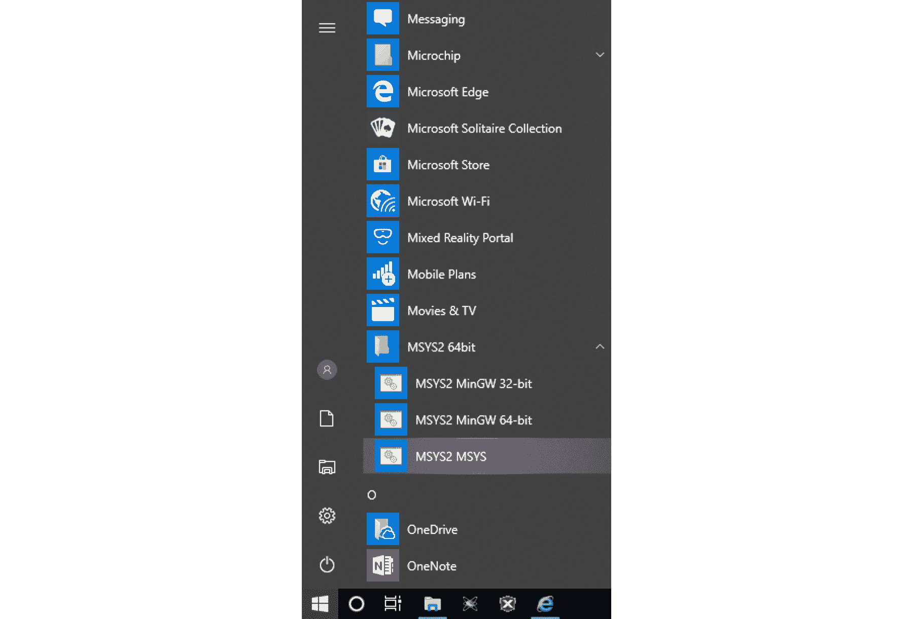
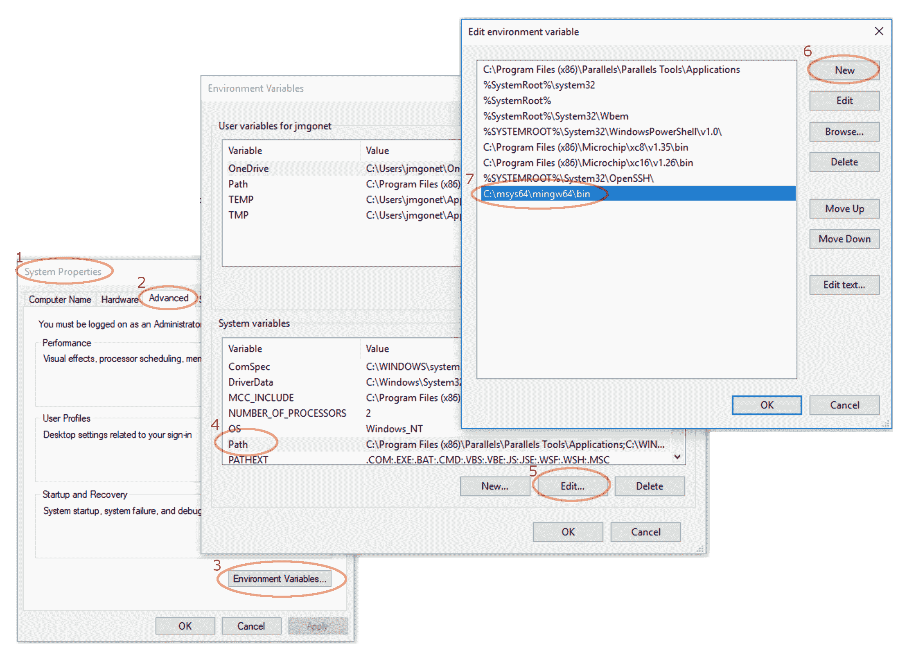
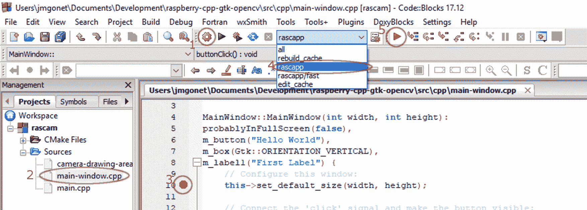
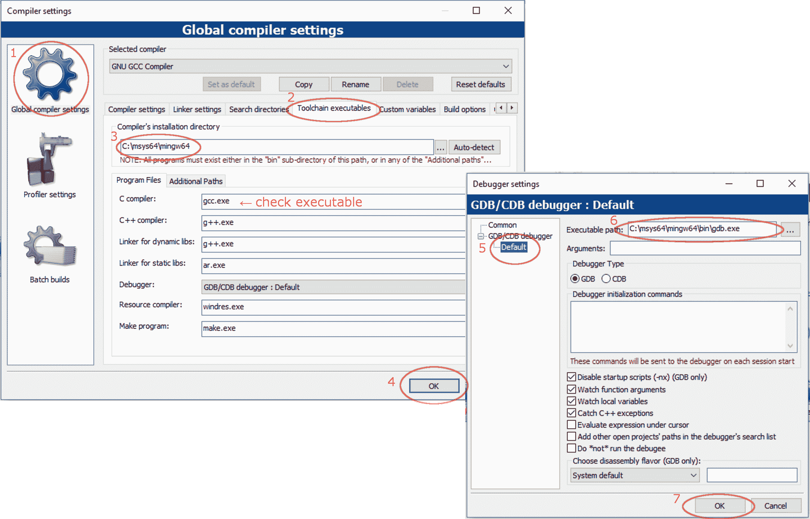

# 用 C++、OpenCV、Gtk 跨平台 Windows /树莓 Pi 项目

> 原文:[https://www . geesforgeks . org/c-opencv-and-GTK 3-windows-dev-environment/](https://www.geeksforgeeks.org/c-opencv-and-gtk3-windows-dev-environment/)

# 介绍

本文属于关于编写、构建和调试一个用 *C++* 编写的应用程序的系列文章，该应用程序使用 *Gtk* 库处理用户界面， *OpenCV* 库捕捉并处理来自摄像头的图像，兼容主平台， *Mac OS X* 、 *Linux* 和 *Windows* ，最终运行在*树莓 Pi* 上。

本系列的主要文章如下:

*   [运行在树莓 PI](https://media.geeksforgeeks.org/geek/full-screen-opencv-gtk-application-in-c-running-on-raspberry-pi/) 上的 C++全屏 OpenCV / GtK 应用。

本文讨论如何配置您的*窗口*来检索源代码，构建和调试这样一个项目。该项目的来源如下:

*   [https://github . com/CPP-tutorial/raspberry-CPP-GTK-opencv](https://github.com/cpp-tutorial/raspberry-cpp-gtk-opencv)

# 安装 M2SYS

*Windows* 没有像 *Linux* 和 *Mac OS X* 那样的标准系统库位置。因此，要获得 *Gtk* 和 *OpenCV* 库，您需要使用一些非标准的过程，包括安装一个名为 *pacman* 的特殊包管理器和一个名为 *MinGW* 的类似 Linux 的特殊开发环境。

获得 *pacman* 和 *MinGW* 最简单的方法是通过一个名为 *MSYS2* 的开源项目。转到 [MSYS2 首页](http://www.msys2.org/)下载最符合你系统的 *M2SYS* 安装程序(可能是 64 位，因为 i686 实际上是 32 位)。

安装所有默认选项，在`C:\msys64`文件夹。

安装后，您将拥有:

*   *MSYS2 MSYS* 环境，可以使用 *pacman* 安装组件。
*   *MSYS2 MinGW 64 位*环境，代表*Windows*的最小 GNU，可以使用通过 *pacman* 安装的所有工具和库。
*   您还可以获得 *MSYS2 MinGW32* ，以访问 32 位工具；如果你的系统是 64 位的，你就不应该安装这些。

[](https://media.geeksforgeeks.org/wp-content/uploads/install-windows-10-msys2-mingw64-1.png)

如下载说明中所述，首先要做的是升级包数据库。打开 *MSYS2 MSYS* 并输入以下命令:

```cpp
$ pacman -Syuu

```

如果遇到下面的消息，用鼠标关闭 *MSYS2 MSYS* 窗口，再次打开，运行同样的命令，直到正常终止。

```cpp
warning: terminate MSYS2 without returning to shell and check for updates again
warning: for example close your terminal window instead of calling exit

```

如果您正在寻找一个特定的包，您可以使用类似下面的命令。假设你找 *CMake* :

```cpp
$ pacman -Ss cmake

```

# 构建一个伟大的类似 linux 的工具包

[受阿列克谢·巴甫洛夫主旨](https://gist.github.com/papesch/b401aa68d0a7c7c96095fa64a7c9f684)的启发，我建议安装以下软件包和工具，这样您就有了一个与 *Linux* 机器中的开发环境非常相似的开发环境。有了它，你可以使用 *Linux* 工具为 windows 编译应用程序:

```cpp
$ pacman -S base base-devel net-utils git ruby wget man
$ pacman -S msys/openssh msys/vim msys/bc nano msys/tmux
$ pacman -S gzip zip unzip msys/p7zip tar msys/tree
$ pacman -S msys/winpty msys/ed msys/pwgen msys/zsh
$ pacman -S mingw64/mingw-w64-x86_64-jq
$ pacman -S msys/screenfetch
$ pacman -S mingw-w64-x86_64-toolchain
$ pacman -S mingw64/mingw-w64-x86_64-cmake

```

下载并安装所有这些包后，您可以验证它们是否正在测试某些包。为此，打开*MSYS2 mingw 64 位*环境，测试一些命令:

```cpp
$ git --version
$ make --version
$ cmake --version
$ gcc --version
$ pkg-config --version

```

另请参见:

*   [安装 GCC & MYSYS2](https://github.com/orlp/dev-on-windows/wiki/Installing-GCC--&-MSYS2) 。
*   [构建一个很棒的类似 linux 的工具包](https://gist.github.com/papesch/b401aa68d0a7c7c96095fa64a7c9f684)。

# 安装 Gtk 和 OpenCV

您可以使用 *MSYS2 MSYS* 中的 *pacman* 安装 *Gtk* 和 *OpenCV* 库，命令如下:

```cpp
$ pacman -S mingw64/mingw-w64-x86_64-gtkmm3
$ pacman -S mingw64/mingw-w64-x86_64-opencv

```

# 带明 W64 的建筑

要构建项目，打开 *MSYS2 MinGW 64 位*，找到一个合适的文件夹(驱动单元映射到根文件夹，例如`C:\Users\me\Document\Development\`将是`/c/Users/me/Development`):

```cpp
$ cd navigate/to/your/project/folder
$ git clone https://github.com/cpp-tutorial/raspberry-cpp-gtk-opencv.git
$ cd raspberry-cpp-gtk-opencv
$ mkdir build
$ cd build
$ cmake -G"Unix Makefiles" ../src/
$ make
$ ./racapp.exe

```

如果要用 *gdb* 调试，可以用稍微不同的`cmake`命令。如果您已经构建了项目，请毫不犹豫地删除`build`文件夹并重新创建:

```cpp
$ cd ..
$ rm -rf build
$ mkdir build
$ cd build
$ cmake -G"Unix Makefiles" -DCMAKE_BUILD_TYPE=Debug ../src
$ make
$ gdb ./rascapp.exe

```

之后你就进入了 *gdb* 。要找到您的方法，请查看 *Linux* 说明。

# 让 MinGW 工具随处可见

默认情况下， *MSYS2* 会在`C:\Msys2\MinGW64\bin`文件夹中安装库和工具。将其添加到`PATH`环境变量中，以便所有应用程序都能找到工具:

[](https://media.geeksforgeeks.org/wp-content/uploads/install-windows-10-mingw-visual-studio-cpp.png)

完成后，您可以打开*窗口*命令行，并验证是否有相同的工具可用:

```cpp
$ pkg-config --version
$ pkg-config gtkmm-3.0 --cflags --libs
$ pkg-config opencv-3.0 --cflags --libs

```

如果你要使用*代码::Blocks* ，这个步骤并不是严格必要的，但是也没有坏处。

# 在窗口中安装代码::块并配置 MSYS2 工具链

Windows 中默认的 IDE 是 *Visual Studio* 。但是， *Visual Studio* 期望调试符号的特殊格式不是 *gcc* 和 *g++* 在 *MinGW* 中产生的格式。在跨平台项目中，如果你不想让你的生活在超复杂的安装过程中变得悲惨，最好不要去管它。

我选择*代码::Blocks* 是因为:

*   它在三大平台都有，所以你可以随处使用，包括*树莓皮*，配置差不多。
*   它非常受欢迎，所以你可以寻求指导和社区支持。
*   它有一个*窗口*安装向导，负责所有配置细节。

安装程序完全是直截了当的，至少在 *Windows 10* 中是如此

1.  从官方网站:[http://www.codeblocks.org/downloads](http://www.codeblocks.org/downloads)安装一个*代码的*窗口*二进制版本::阻止*。
2.  在所有版本中，选择正常设置(您在上一步中已经安装了 *mingw* 工具链)。
3.  用所有默认选项安装它。
4.  启动应用程序

如果没有错误消息，您就完成了。否则，请查看故障排除。

# 用代码构建::块

最简单的方法就是用 *CMake* 为你准备一个*代码::Blocks* 项目。假设您已经在已知位置克隆了项目，并且您的 *MSYS2 MinGW 64 位*终端已经在那里，这是命令序列:

```cpp
$ mkdir codeb
$ cd codeb
$ cmake -DCMAKE_BUILD_TYPE=Debug -G"CodeBlocks - Unix Makefiles" ../src/

```

遵循从*代码到*模块的其余程序:

*   从菜单中，*文件* →打开…，查找刚刚创建的`codeb`文件夹，以及其中的`rascam.cbp`项目文件(注意项目名称与`CMakeLists.txt`中指定的相同)。
*   如果喜欢，可以到*项目* → *项目树*修改*将文件夹显示为磁盘上的*、*隐藏文件夹名称*。
*   选择一个源文件，并通过单击灰色区域在其上放置一个断点。
*   在工具栏中，选择`rascapp`目标。
*   在工具栏中，启动调试器。
*   它应该启动，并在断点处停止。
*   要查看变量，进入*调试* → *调试窗口* → *手表*。

[](https://media.geeksforgeeks.org/wp-content/uploads/build-and-debug-cmake-project-in-windows-with-msys2-mingw.png)

# 解决纷争

## 无效或损坏的包(PGP 签名)

使用 *pacman* 下载、更新或升级时，偶尔可能会发现以下错误信息:

```cpp
(4/4) checking package integrity                                                                                 [###################################################################] 100%
error: jsoncpp: signature from "Alexey Pavlov (Alexpux) " 
is invalid
:: File /var/cache/pacman/pkg/jsoncpp-1.8.4-1-any.pkg.tar.xz is 
corrupted (invalid or corrupted package (PGP signature)).

```

这是一个与创作网站不可用有关的暂时问题，您可以通过等待来解决它(参见“阿列克谢·巴甫洛夫(AlexPux)”关于签名问题的[讨论)。或者，您可以通过编辑`/etc/pacman.conf`(使用*中的 *Vim* 并更改以下条目来停用签名检查:*](https://github.com/Alexpux/MSYS2-pacman/issues/12)

```cpp
SigLevel = Never

```

## 代码::块找不到编译器

启动时， *Code::Blocks* 可能会抱怨找不到编译器工具链。如果你已经如上所述安装了 *MSYS2* ，那只是配置问题:

*   启动时，只需接受要求您选择现有工具链的对话框。
*   在主菜单中，打开*设置* → *编译器……*
*   在对话框中，查找*全局编译器设置*部分和*工具链可执行文件*选项卡。
*   请确保路径正确。如果你安装了带默认选项的 *MSYS2* ，应该是`C:\msys64\mingw64`。
*   还要确保所有提到的程序文件都对应于该文件夹中的现有可执行文件。
*   接受一切，用*设置* → *调试器……*做同样的事情

[](https://cdncontribute.geeksforgeeks.org/wp-content/uploads/install-windows-10-code-blocks-toolchain-setup.png)

注意:我在用 *mingw-setup* 安装 *Code::Blocks* 时出现了这个问题。我猜它期待的是标准的 *MinGW* 安装，而不是 *MSYS2* 安装。

## 代码::块无法保存配置

关闭应用程序时，或保存所有数据时，*代码::Blocks* 可能会抱怨无法保存配置，并显示错误消息。要解决这个问题:

*   记下它试图保存配置文件的路径。
*   创建相同的路径和同名的空文件。
*   使该文件可写。

注意:我在用 *mingw-setup* 安装 *Code::Blocks* 时出现了这个问题。我猜它期待的是标准的 *MinGW* 安装，而不是 *MSYS2* 安装。