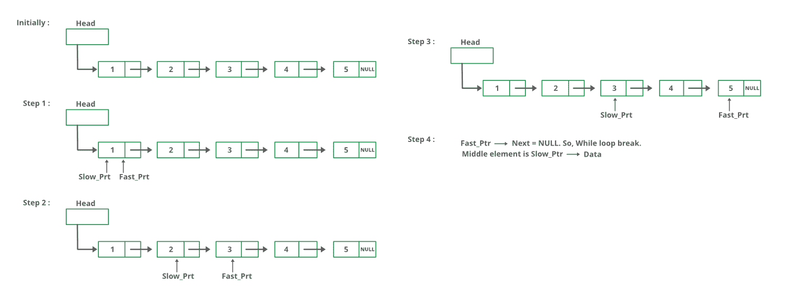

# 寻找给定链表中间元素的 C 程序

> 原文:[https://www . geesforgeks . org/c-program-for-find-给定链表的中间元素/](https://www.geeksforgeeks.org/c-program-for-finding-the-middle-element-of-a-given-linked-list/)

给定一个单链表，找到链表的中间。例如，如果给定的链表是 1->2->3->4->5，那么输出应该是 3。
如果有偶数个节点，那么就会有两个中间节点，我们需要打印第二个中间元素。例如，如果给定的链表是 1->2->3->4->5->6，那么输出应该是 4。

**方法 1:**
遍历整个链表，统计节点数。现在再次遍历列表，直到 count/2，并在 count/2 返回节点。

**方法 2:**
使用两个指针遍历链表。将一个指针移动一个，将另一个指针移动两个。当快速指针到达末尾时，慢速指针将到达链表的中间。

下图显示了 printMiddle 函数在代码中的工作方式:



## C

```cpp
// C program to find middle of linked list
#include<stdio.h> 
#include<stdlib.h> 

// Link list node
struct Node 
{ 
    int data; 
    struct Node* next; 
}; 

// Function to get the middle of 
// the linked list
void printMiddle(struct Node *head) 
{ 
    struct Node *slow_ptr = head; 
    struct Node *fast_ptr = head; 

    if (head!=NULL) 
    { 
        while (fast_ptr != NULL && 
               fast_ptr->next != NULL) 
        { 
            fast_ptr = fast_ptr->next->next; 
            slow_ptr = slow_ptr->next; 
        } 
        printf("The middle element is [%d]", 
                slow_ptr->data); 
    } 
} 

void push(struct Node** head_ref, 
          int new_data) 
{ 
    // Allocate node 
    struct Node* new_node = 
           (struct Node*) malloc(sizeof(struct Node)); 

    // Put in the data
    new_node->data = new_data; 

    // Link the old list off the new node
    new_node->next = (*head_ref); 

    // Move the head to point to the new node 
    (*head_ref) = new_node; 
} 

// A utility function to print a given
//  linked list 
void printList(struct Node *ptr) 
{ 
    while (ptr != NULL) 
    { 
        printf("%d->", ptr->data); 
        ptr = ptr->next; 
    } 
    printf("NULL"); 
} 

// Driver code
int main() 
{ 
    // Start with the empty list 
    struct Node* head = NULL; 
    int i; 

    for (i = 5; i > 0; i--) 
    { 
        push(&head, i); 
        printList(head); 
        printMiddle(head); 
    } 
    return 0; 
} 
```

**输出:**

```cpp
5->NULL
The middle element is [5]

4->5->NULL
The middle element is [5]

3->4->5->NULL
The middle element is [4]

2->3->4->5->NULL
The middle element is [4]

1->2->3->4->5->NULL
The middle element is [3]
```

**方法 3:**
将中间元素初始化为 head，将一个计数器初始化为 0。从头开始遍历列表，遍历时递增计数器，当计数器为奇数时，将中间变为下一个中间>。所以 mid 只会移动列表总长度的一半。
感谢纳伦德拉·康拉尔卡尔提出这个方法。

## C

```cpp
// C program to implement the 
// above approach
#include <stdio.h>
#include <stdlib.h>

// Link list node
struct node 
{
    int data;
    struct node* next;
};

// Function to get the middle of 
// the linked list
void printMiddle(struct node* head)
{
    int count = 0;
    struct node* mid = head;

    while (head != NULL)
    {
        // Update mid, when 'count' 
        // is odd number
        if (count & 1)
            mid = mid->next;

        ++ count;
        head = head->next;
    }

    // If empty list is provided
    if (mid != NULL)
        printf("The middle element is [%d]", 
                mid->data);
}

void push(struct node** head_ref, 
          int new_data)
{
    // Allocate node 
    struct node* new_node = 
           (struct node*)malloc(sizeof(struct node));

    // Put in the data  
    new_node->data = new_data;

    // Link the old list off the new node 
    new_node->next = (*head_ref);

    // Move the head to point to the new node
    (*head_ref) = new_node;
}

// A utility function to print a 
// given linked list
void printList(struct node* ptr)
{
    while (ptr != NULL) 
    {
        printf("%d->", ptr->data);
        ptr = ptr->next;
    }
    printf("NULL");
}

// Driver code
int main()
{
    // Start with the empty list 
    struct node* head = NULL;
    int i;

    for (i = 5; i > 0; i--) 
    {
        push(&head, i);
        printList(head);
        printMiddle(head);
    }
    return 0;
}
```

**输出:**

```cpp
5->NULL
The middle element is [5]

4->5->NULL
The middle element is [5]

3->4->5->NULL
The middle element is [4]

2->3->4->5->NULL
The middle element is [4]

1->2->3->4->5->NULL
The middle element is [3]
```

更多详情请参考[找到给定链表](https://www.geeksforgeeks.org/write-a-c-function-to-print-the-middle-of-the-linked-list/)中间的整篇文章！