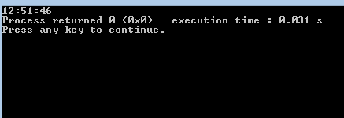

# C 程序打印当前时间的数字钟

> 原文:[https://www . geesforgeks . org/c-program-print-digital-clock-current-time/](https://www.geeksforgeeks.org/c-program-print-digital-clock-current-time/)

**time.h** 头定义了四种变量类型，两个宏和各种操作日期和时间的函数。标题 time.h 中定义的变量类型的简要描述如下:

*   **size_t :** 这是无符号整型，是 sizeof 关键字的结果。
*   **clock_t :** 这是一种适合存储处理器时间的类型。
*   **time_t 为:**这是一种适合存储日历时间的类型。
*   **struct tm :** 这是一个用来保存时间和日期的结构。

下面是数字钟的实现。在执行程序时，输出窗口将显示程序执行的时间。

## C

```
// C implementation of digital clock
#include <stdio.h>
#include <time.h>

// driver code
int main()
{
    time_t s, val = 1;
    struct tm* current_time;

    // time in seconds
    s = time(NULL);

    // to get current time
    current_time = localtime(&s);

    // print time in minutes,
    // hours and seconds
    printf("%02d:%02d:%02d",
           current_time->tm_hour,
           current_time->tm_min,
           current_time->tm_sec);

    return 0;
}
```

输出:



下面是显示矩形条内当前时间的 C 程序。输出窗口显示日期、月份、日期、当前时间和年份。

## C

```
// C program to print digital
// clock using graphics
#include <graphics.h>
#include <time.h>

// driver code
int main()
{
    // DETECT is a macro defined in
    // "graphics.h" header file
    int dt = DETECT, gmode, midx, midy;
    long current_time;
    char strftime[30];

    // initialize graphic mode
    initgraph(&dt, &gmode, "");

    // to find mid value in horizontal
    // and vertical axis
    midx = getmaxx() / 2;
    midy = getmaxy() / 2;

    // set current colour to white
    setcolor(WHITE);

    // make a rectangular box in
    // the middle of screen
    rectangle(midx - 200, midy - 40, midx + 200,
                                     midy + 40);

    // fill rectangle with white color
    floodfill(midx, midy, WHITE);
    while (!kbhit()) {

        // get current time in seconds
        current_time = time(NULL);

        // store time in string
        strcpy(strftime, ctime(¤t_time));

        // set color of text to red
        setcolor(RED);

        // set the text justification
        settextjustify(CENTER_TEXT, CENTER_TEXT);

        // to set styling to text
        settextstyle(SANS_SERIF_FONT, HORIZ_DIR, 3);

        // locate position to write
        moveto(midx, midy);

        // print current time
        outtext(strftime);
    }
    getch();

    // deallocate memory for graph
    closegraph();
}
```

输出:


**参考文献:**
[cprogramforbeginers](http://cprogramforbeginners.blogspot.in/2015/05/c-program-to-implement-digital-clock.html)