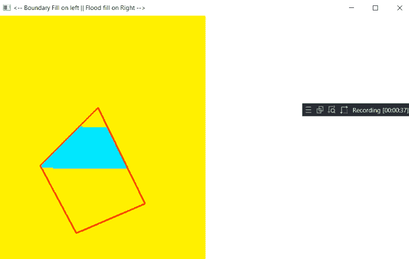
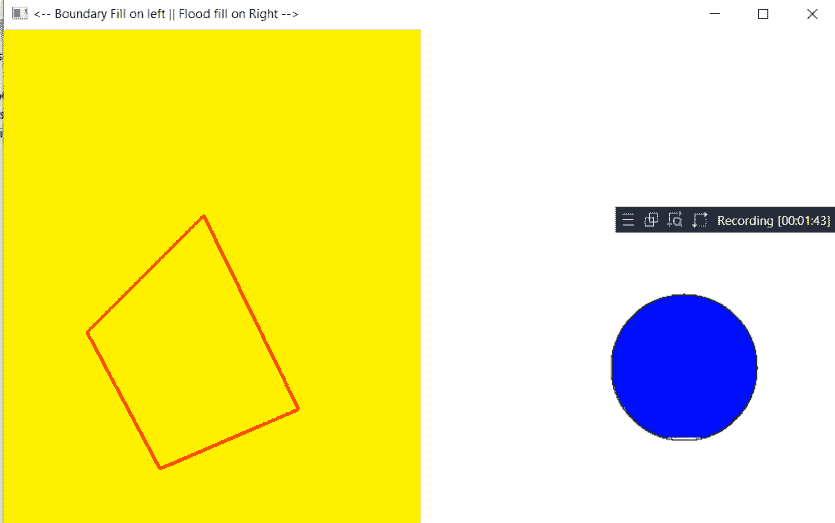

# 使用 OpenGL 对控制台上绘制的不同图形进行着色的 C 程序

> 原文:[https://www . geeksforgeeks . org/c-program-to-color-the-differential-graph-on-console-use-OpenGL/](https://www.geeksforgeeks.org/c-program-to-color-the-different-figures-drawn-on-the-console-using-opengl/)

在本文中，任务是使用 [OpenGL](https://www.geeksforgeeks.org/getting-started-with-opengl/) 在电脑屏幕上创建不同的图形。

**进场:**

*   在本文中，为了用颜色填充图形，使用了不同的算法，因此填充可以在优化的图案中进行。
*   这里，将使用在具有子窗口概念的 [C++程序](https://www.geeksforgeeks.org/c-plus-plus/)中实现的洪水填充和边界填充算法。
*   程序中使用了[鼠标()](https://www.geeksforgeeks.org/mouse-programming-in-c-c/)功能。运行程序后，用左键画出图像，然后**右键**填充图像。

下面是说明 OpenGL 使用的 C++程序:

## C++

```cpp
// C++ program to illustrate the use
// of OpenGL

#include <GL/glut.h>
#include <iostream>
#include <math.h>
#include <stdlib.h>
#include <time.h>
#define xpix 500
#include <cstring>
using namespace std;

// Global variable declaration
float r, g, b, x, y;
bool flag = true;
int x2, y2, x3, y3, x4, y4, x5, y5;
int a1, b1;
int a2, b2;
int a3, b3;
int a4, b4;
int counter = 1;
char buffer[20];

// Function to draw text
void drawBitmapText(
    char* string, float x,
    float y, float z)
{
    char* c;
    glRasterPos2f(x, y);

    // Traverse the given string
    for (c = string; *c != '\0'; c++) {

        // Initialize gluBitmap
        glutBitmapCharacter(
            GLUT_BITMAP_TIMES_ROMAN_24, *c);
    }
}

// Function for performing the delay
void delay(float ms)
{

    clock_t goal = ms + clock();

    // Iterate until goal is greater
    // than the clock
    while (goal > clock())
        ;
}

// Function to initialize the figure
void init()
{
    glClearColor(1.0, 1.0, 1.0, 0.0);
    glColor3f(0.0, 0.0, 0.0);
    glPointSize(1.0);
    glMatrixMode(GL_PROJECTION);
    glLoadIdentity();
    gluOrtho2D(0, 800, 0, 600);
}

// Function to fill the color in the
// figure
void bound_it(int x, int y,
              float* fillColor,
              float* bc)
{
    float color[3];

    // Initialize to read the pixels
    glReadPixels(x, y, 1.0, 1.0,
                 GL_RGB, GL_FLOAT, color);

    if ((color[0] != bc[0]
         || color[1] != bc[1]
         || color[2] != bc[2])
        && (color[0] != fillColor[0]
            || color[1] != fillColor[1]
            || color[2] != fillColor[2])) {

        // Fill the Color
        glColor3f(fillColor[0],
                  fillColor[1],
                  fillColor[2]);

        // Begin the GL Points
        glBegin(GL_POINTS);

        // Initialize the vertex
        glVertex2i(x, y);
        glEnd();
        glFlush();

        // Fill the color
        bound_it(x + 1, y, fillColor, bc);
        bound_it(x - 2, y, fillColor, bc);
        bound_it(x, y + 2, fillColor, bc);
        bound_it(x, y - 2, fillColor, bc);
    }
}

// Function to fill the figure using
// the mouse click operation
void mouseboundaryfill(int btn, int state,
                       int x, int y)
{
    // Boundary fill algorithm
    y = 600 - y;

    // If the right button is clicked
    if (btn == GLUT_RIGHT_BUTTON) {
        if (state == GLUT_DOWN) {

            float bCol[] = { 1, 0, 0 };
            float color[] = { 0, 1, 1 };
            bound_it(x, y, color, bCol);
        }
    }

    // If the left button is clicked
    if (btn == GLUT_LEFT_BUTTON) {

        if (state == GLUT_DOWN) {
            if (counter == 1) {
                a1 = x;
                b1 = y;
                counter++;
            }
            else if (counter == 2) {

                a2 = x;
                b2 = y;
                counter++;
            }
            else if (counter == 3) {
                a3 = x;
                b3 = y;
                counter++;
            }
            else if (counter == 4) {
                a4 = x;
                b4 = y;
                counter = 0;
            }
        }
    }
}

// Function to implement the world()
void world()
{
    glLineWidth(3);
    glPointSize(2);
    glClear(GL_COLOR_BUFFER_BIT);
    glColor3f(1, 0, 0);
    glBegin(GL_LINE_LOOP);

    // Initialize a vertices
    glVertex2f(a1, b1);
    glVertex2f(a2, b2);
    glVertex2f(a3, b3);
    glVertex2f(a4, b4);
    glEnd();

    // Fill the color
    glColor3f(0, 0, 0);
    glFlush();
}

// Function to initialize the figure
void init2()
{
    glClearColor(1.0, 1.0, 0.0, 0.0);
    glMatrixMode(GL_PROJECTION);
    gluOrtho2D(0, 400, 0, 600);
}

// Structure for Points
struct Point {
    GLint x;
    GLint y;
};

// Structure for Colors
struct Color {
    GLfloat r;
    GLfloat g;
    GLfloat b;
};

// Structure for getting the Pixels
Color getPixelColor(GLint x, GLint y)
{
    Color color;
    glReadPixels(x, y, 1, 1,
                 GL_RGB,
                 GL_FLOAT,
                 &color);
    return color;
}

// Function for setting the pixel color
void setPixelColor(GLint x, GLint y,
                   Color color)
{
    // Fill the Color
    glColor3f(color.r, color.g, color.b);

    // Begin the GL Points
    glBegin(GL_POINTS);

    // Initialize the vertex
    glVertex2i(x, y);
    glEnd();
    glFlush();
}

// Function to fill the figure using
// floodfill function
void floodFill(GLint x, GLint y,
               Color oldColor,
               Color newColor)
{
    // Flood fill algorithm
    Color color;
    color = getPixelColor(x, y);

    if (color.r == oldColor.r
        && color.g == oldColor.g
        && color.b == oldColor.b) {
        setPixelColor(x, y, newColor);

        // Fill the color
        floodFill(x + 1, y, oldColor,
                  newColor);
        floodFill(x, y + 1, oldColor,
                  newColor);
        floodFill(x - 1, y, oldColor,
                  newColor);
        floodFill(x, y - 1, oldColor,
                  newColor);
    }
    return;
}

// Function to fill the color using
// mouse click operation
void mousefloodfill(int button, int state,
                    int x, int y)
{
    // Left Click
    if (button == GLUT_LEFT_BUTTON
        && state == GLUT_DOWN) {
        flag = true;
        x2 = x;
        y2 = 600 - y;
    }

    // Right Click
    else if (button == GLUT_RIGHT_BUTTON
             && state == GLUT_DOWN) {

        Color newColor = { 0.0f, 0.0f, 1.0f };
        Color oldColor = { 1.0f, 1.0f, 1.0f };

        // Fill the color
        floodFill(x2, y2, oldColor, newColor);
    }
    glutPostRedisplay();
}

// Function to draw the circle on
// the plane
void draw_circle(Point pC,
                 GLfloat radius)
{
    if (flag) {
        GLfloat step = 1 / radius;
        GLfloat x, y;

        for (GLfloat theta = 0; theta <= 360;
             theta += step) {
            x = pC.x + (radius * cos(theta));
            y = pC.y + (radius * sin(theta));
            glVertex2i(x, y);
        }
    }
}

// Function to display the figure
void display(void)
{
    Point pt = { x2, y2 };
    GLfloat radius = 70;

    glClear(GL_COLOR_BUFFER_BIT);
    glBegin(GL_POINTS);
    draw_circle(pt, radius);
    glEnd();

    glFlush();
}

// Driver Code
int main(int argc, char** argv)
{
    glutInit(&argc, argv);

    // Function calls
    glutInitDisplayMode(
        GLUT_SINGLE | GLUT_RGB);
    glutInitWindowSize(800, 600);
    glutInitWindowPosition(100, 100);

    int mainWindow
        = glutCreateWindow(
            "<-- Boundary Fill on left || "
            "Flood fill on Right -->");

    init();
    glutDisplayFunc(display);
    glutMouseFunc(mousefloodfill);

    int subWindow1
        = glutCreateSubWindow(
            mainWindow, 0, 0, 400, 600);

    glutInitWindowPosition(100, 100);
    glutDisplayFunc(world);
    glutMouseFunc(mouseboundaryfill);
    init2();

    glutMainLoop();

    return 0;
}
```

**输出**

[ ](https://media.geeksforgeeks.org/wp-content/uploads/20210227124438/opengl.png) [ ](https://media.geeksforgeeks.org/wp-content/uploads/20210227125124/opengl.png)