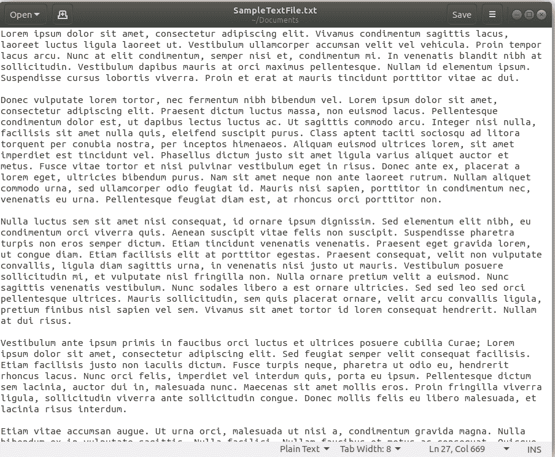

# 计算文件中字符数的 C 程序

> 原文:[https://www . geesforgeks . org/c-程序对文件中字符数的计数/](https://www.geeksforgeeks.org/c-program-to-count-the-number-of-characters-in-a-file/)

计算字符数很重要，因为几乎所有依赖用户输入的文本框都对可以插入的字符数有一定的限制。例如，脸书帖子的字符限制为 63，206 个字符。然而，对于推特上的一条推文，字符限制是 140 个字符，对于 Snapchat，每个帖子的字符限制是 80 个。

当推文和脸书邮报的更新通过应用编程接口完成时，确定字符限制变得至关重要。

**注意:**这个程序不会在在线编译器上运行。请做一篇**的课文(。txt)文件**并给出它在你的系统上运行这个程序的路径。

**方法:**通过使用 [getc()](https://www.geeksforgeeks.org/eof-and-feof-in-c/) 方法读取文件中的字符，可以很容易地对字符进行计数。对于从文件中读取的每个字符，将计数器递增 1。

下面是上述方法的实现:

**程序:**

```
// C Program to count
// the Number of Characters in a Text File

#include <stdio.h>
#define MAX_FILE_NAME 100

int main()
{
    FILE* fp;

    // Character counter (result)
    int count = 0;

    char filename[MAX_FILE_NAME];

    // To store a character read from file
    char c;

    // Get file name from user.
    // The file should be either in current folder
    // or complete path should be provided
    printf("Enter file name: ");
    scanf("%s", filename);

    // Open the file
    fp = fopen(filename, "r");

    // Check if file exists
    if (fp == NULL) {
        printf("Could not open file %s",
               filename);
        return 0;
    }

    // Extract characters from file
    // and store in character c
    for (c = getc(fp); c != EOF; c = getc(fp))

        // Increment count for this character
        count = count + 1;

    // Close the file
    fclose(fp);

    // Print the count of characters
    printf("The file %s has %d characters\n ",
           filename, count);

    return 0;
}
```

**Output:**[](https://media.geeksforgeeks.org/wp-content/uploads/20190528110912/Screenshot-from-2019-05-28-11-06-03.png)

**注意:**用来运行该代码的文本文件可以从这里下载

[](https://sample-videos.com/text/Sample-text-file-10kb.txt)