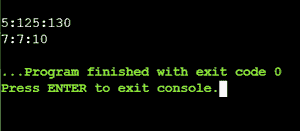

# 将给定时间转换/归一化为标准形式的 C++程序

> 原文:[https://www . geeksforgeeks . org/c-程序到隐蔽-正常化-给定时间到标准形式/](https://www.geeksforgeeks.org/c-program-to-covert-normalize-the-given-time-into-standard-form/)

给定三个代表小时、分钟和秒的变量，任务是编写一个 [C++程序](https://www.geeksforgeeks.org/c-plus-plus/)将给定时间归一化/转换成标准形式，即 **HR: MIN: SEC** 格式。

**示例:**

> **输入:** HR = 5，MIN = 125，SEC = 130
> T3】输出: 7:7:10

**方法:**为了标准化给定的时间，下面是使用类的函数/步骤:

*   定义了 3 个变量来分别存储小时、分钟和秒的值。

```
int HR, MIN, SEC;
where HR represents hours,
      MIN represents minutes and
      SEC represents seconds
```

*   **设置时间()功能**设置小时、分钟和秒的值:

```
void setTime(int x, int y, int z)
{
    x = HR;
    y = MIN;
    z = SEC;
}
```

*   **显示时间()**显示时间:

```
void showTime()
{
    cout << HR << ":" << MIN << ":" << SEC;
}
```

*   **归一化()函数**将合成时间转换为标准形式。通过根据标准时间格式将其转换为以下格式来标准化时间:

```
void normalize()
{
    MIN = MIN + SEC/60;
    SEC = SEC%60;
    HR  = HR + MIN/60;
    MIN = MIN%60;
}
```

**图示:**例如时间:5: 125: 130

*   要使时间正常化:
    *   首先，将 SEC 除以 60，找出分钟数，并将其加入 MIN，
    *   所以，125+(130/60) =125+2 = 127。
*   然后取 SEC 的模求秒 130 % 60 = 10。
*   现在，将 MIN 除以 60，求出小时数，并将其加到 HR 中，5+(127/60) = 5+2= 7。
*   最后取最小模数求分钟，127 % 60 = 7，所以，小时= 7，最小= 7，秒= 10。
*   因此，结果是 7: 7: 10

下面是上述方法的实现:

## C++

```
// C++ program to normalize the given
// time into standard form
#include <conio.h>
#include <iostream>
using namespace std;

// Time class
class Time {
private:
    // Instance variables
    int HR, MIN, SEC;

public:
    void setTime(int, int, int);
    void showTime();
    void normalize();
};

// Function that sets the given time
void Time::setTime(int h, int m, int s)
{
    HR = h;
    MIN = m;
    SEC = s;
}

// Function to show the given time
void Time::showTime()
{
    cout << endl
         << HR << ":"
         << MIN << ":" << SEC;
}

// Function to normalize the given
// time into standard form
void Time::normalize()
{
    // Convert the time into the
    // specific format
    MIN = MIN + SEC / 60;
    SEC = SEC % 60;
    HR = HR + MIN / 60;
    MIN = MIN % 60;
}

// Driver Code
int main()
{
    // Object of class Time
    Time t1;

    t1.setTime(5, 125, 130);
    t1.showTime();

    // Normalize the time
    t1.normalize();
    t1.showTime();

    return 0;
}
```

**输出:**

