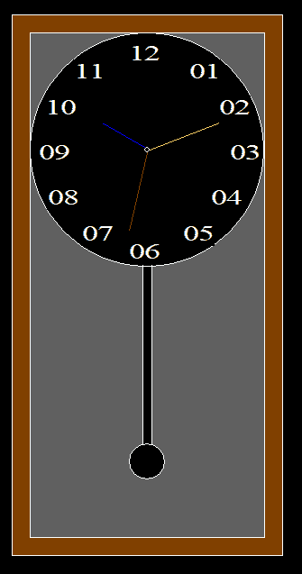

# C 程序使用图形创建摆钟

> 原文:[https://www . geesforgeks . org/c-program-to-create-a-钟摆-使用图形/](https://www.geeksforgeeks.org/c-program-to-create-a-pendulum-clock-using-graphics/)

本文讨论了如何使用[图形](https://www.geeksforgeeks.org/basic-graphic-programming-in-c/)在 [C 编程语言](https://www.geeksforgeeks.org/c/)中设计摆钟。

**进场:**

*   创建两个矩形，一个在另一个内部，使用[矩形()](https://www.geeksforgeeks.org/draw-rectangle-c-graphics/)功能作为时钟的外部轮廓&另一个是时钟的内部轮廓。
*   使用 [setfillstyle()和 floodfill()](https://www.geeksforgeeks.org/setfillstyle-floodfill-c/) 函数将两个矩形之间的空间涂成棕色
*   使用 circle()函数在内部矩形内实现一个圆
*   使用 **setfillstyle()** 和 **floodfill()** 功能将所有其他离开圆圈的部分涂成深灰色。
*   在圆圈中，使用[setextstyle()](https://www.geeksforgeeks.org/settextstyle-function-c/)和[outextxy()](https://www.geeksforgeeks.org/outtextxy-function-c/)功能插入所有数字。
*   计算数字的坐标。
*   使用 line()函数实现双线钟摆，使用**圆()函数**实现另一个圆，它将充当摆锤。
*   再次使用 **setfillstyle()** 和 **floodfill()** 功能将它们全部涂黑。
*   使用 line()函数实现时针、分针和秒针。
*   使用 [setcolor()](https://www.geeksforgeeks.org/setcolor-function-c/) 功能为对象单独上色。

下面是上述方法的实现:

## C

```
// C program toc draw the pendulum clock
#include <conio.h>
#include <graphics.h>
#include <stdio.h>

// Driver Code
void main()
{
    int gd = DETECT, gm;

    // Initialize of gdriver
    initgraph(&gd, &gm, "C:\\"
                        "turboc3\\bgi");

    // Clock Outer Outline
    rectangle(500, 50, 800, 650);

    // Clock Inner Outline
    rectangle(520, 70, 780, 630);

    // Coloring Middle Part Of
    // Rectangle With Brown
    setfillstyle(SOLID_FILL, BROWN);
    floodfill(505, 55, 15);

    // Clock Outline
    circle(650, 200, 130);
    circle(650, 200, 3);

    // Coloring all the parts Of the
    // clock except the circle with
    // Darkgray
    setfillstyle(SOLID_FILL, DARKGRAY);
    floodfill(525, 355, 15);
    floodfill(522, 72, 15);
    floodfill(768, 72, 15);

    // Inserting Digits
    settextstyle(6, 0, 3);
    outtextxy(697, 100, "01");
    outtextxy(730, 140, "02");
    outtextxy(742, 190, "03");
    outtextxy(721, 240, "04");
    outtextxy(690, 280, "05");
    outtextxy(630, 300, "06");
    outtextxy(578, 280, "07");
    outtextxy(540, 240, "08");
    outtextxy(530, 190, "09");
    outtextxy(537, 140, "10");
    outtextxy(569, 100, "11");
    outtextxy(630, 80, "12");

    // Left Line Of Pendulum
    line(645, 328, 645, 528);

    // Right Line Of Pendulum
    line(655, 328, 655, 528);

    // Pendulum Bob
    circle(650, 546, 20);

    // Coloring Line & Bob With Black
    setfillstyle(SOLID_FILL, BLACK);
    floodfill(652, 544, 15);
    floodfill(647, 330, 15);

    // Creating the Hour Hand
    // & Color Blue
    setcolor(BLUE);
    line(647, 197, 600, 170);

    // Creating Minute Hand
    // & Color Yellow
    setcolor(YELLOW);
    line(653, 200, 730, 170);

    // Creating Second Hand and the
    // Color Red
    setcolor(RED);
    line(650, 203, 630, 290);

    // Hold the screen for a while
    getch();

    // Close the initialized gdriver
    closegraph();
}
```

**输出:**

