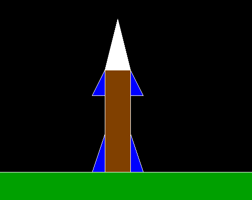

# 使用图形

创建火箭的 C 程序

> 原文:[https://www . geesforgeks . org/c-program-to-create-a-rocket-using-graphics/](https://www.geeksforgeeks.org/c-program-to-create-a-rocket-using-graphics/)

在本文中，我们将讨论如何使用[图形](https://www.geeksforgeeks.org/basic-graphic-programming-in-c/)绘制**火箭**。

**进场:**

*   使用[线()](https://www.geeksforgeeks.org/draw-line-c-graphics/)功能画一条直线，该直线将作为地面轮廓。
*   在上面绘制的线下面，使用两个函数 [**setfillstyle()** 和**flood fill()**T5 将其填充为绿色。](https://www.geeksforgeeks.org/setfillstyle-floodfill-c/)
*   使用[矩形()](https://www.geeksforgeeks.org/draw-rectangle-c-graphics/)功能创建一个矩形，并将其涂成棕色，作为火箭体。
*   使用**线()**函数创建总共四个三角形，该函数将充当火箭的机翼，使其看起来更有吸引力。
    *   其中，两个将位于火箭上部的两侧&火箭的下部。
    *   用蓝色给所有的翅膀上色。
*   [使用线()](https://www.geeksforgeeks.org/draw-a-triangle-in-c-graphics/)创建一个三角形，它将充当火箭的头部。把它涂成白色。

下面是上述方法的实现:

## C

```
// C program for the above approach

#include <conio.h>
#include <graphics.h>
#include <stdio.h>

// Driver Code
void main()
{
    // Initialize of gdriver with
    // DETECT macros
    initgraph(&gd, &gm, "C:\\turboc3\\bgi");

    setfillstyle(SOLID_FILL, BROWN);
    rectangle(650, 450, 700, 650);

    // Rocket body
    floodfill(652, 648, 15);
    line(0, 650, 1500, 650);

    // Land outline
    setfillstyle(SOLID_FILL, WHITE);
    line(650, 450, 700, 450);
    line(650, 450, 675, 350);
    line(675, 350, 700, 450);

    // Rocket head
    floodfill(652, 448, 15);
    setfillstyle(SOLID_FILL, BLUE);
    line(650, 500, 650, 450);
    line(625, 500, 650, 500);
    line(625, 500, 650, 450);

    // Rocket left up wing
    floodfill(648, 498, 15);
    setfillstyle(SOLID_FILL, BLUE);
    line(700, 450, 700, 500);
    line(725, 500, 700, 500);
    line(700, 450, 725, 500);

    // Rocket right up wing
    floodfill(702, 498, 15);
    setfillstyle(SOLID_FILL, BLUE);
    line(625, 650, 650, 650);
    line(650, 575, 650, 650);
    line(625, 650, 650, 575);

    // Rocket left down wing
    floodfill(627, 648, 15);
    setfillstyle(SOLID_FILL, GREEN);
    floodfill(627, 698, 15);

    setfillstyle(SOLID_FILL, BLUE);
    line(725, 650, 700, 650);
    line(700, 575, 700, 650);
    line(725, 650, 700, 575);

    // Rocket right down wing
    floodfill(702, 648, 15);
    line(0, 650, 1500, 650);

    // Draw the land with green color
    setfillstyle(SOLID_FILL, GREEN);
    floodfill(627, 698, 15);
    getch();

    // Close the initialized gdriver
    closegraph();
}
```

**输出:**

[](https://media.geeksforgeeks.org/wp-content/uploads/20210327183817/OUTPUTnew.png)