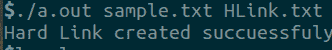
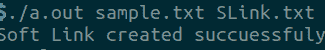

# C 程序创建硬链接和软链接

> 原文:[https://www . geesforgeks . org/c-程序-创建-硬链接-软链接/](https://www.geeksforgeeks.org/c-program-to-create-hard-link-and-soft-link/)

有两种类型的链接，即文件的软链接和硬链接。 [C 库](https://www.geeksforgeeks.org/tag/c-library/)有一个功能**链接()**创建一个到现有文件的新硬链接。[功能](https://www.geeksforgeeks.org/functions-in-c/) **符号链接()**创建软链接。如果链接文件/路径已经存在，它将不会被覆盖。两个功能**链接()**和**符号链接()**成功返回 **0** 。如果出现错误，则返回 **-1** 。否则，适当设置**“错误号”**(错误号)。

**软链接:**软链接(也称为符号链接)充当文件名的指针或引用。它不会访问原始文件中的可用数据。如果先前的文件被删除，软链接将指向一个不再存在的文件。

**硬链接:**硬链接充当所选文件的副本(镜像)。它访问原始文件中可用的数据。
如果先前选择的文件被删除，该文件的硬链接仍将包含该文件的数据。

**创建硬链接的功能:**

> L = link(FILE1，FILE2)，创建一个名为 FILE2 的硬链接到现有的 FILE1。
> 
> 其中，L 是 link()函数返回的值。

**创建软链接的功能:**

> sL = symlink(FILE1，FILE2)，创建一个名为 FILE2 的到现有 FILE1 的软链接。
> 
> 其中，sL 是 symlink()函数返回的值

**程序 1:** 下面是 [C 程序](https://www.geeksforgeeks.org/c/)创建到现有文件的硬链接:

## C

```cpp
// C program to create an Hard Link
// to the existing file
#include <stdio.h>
#include <stdlib.h>
#include <unistd.h>

// Driver Code
int main(int argc, char* argv[])
{
    // Link function
    int l = link(argv[1], argv[2]);

    // argv[1] is existing file name
    // argv[2] is link file name
    if (l == 0) {
        printf("Hard Link created"
               " succuessfuly");
    }

    return 0;
}
```

**输出:**



**程序 2:** 下面是 [C 程序](https://www.geeksforgeeks.org/c/)创建到现有文件的软链接:

## C

```cpp
// C program to create an Soft Link
// to the existing file
#include <stdio.h>
#include <stdlib.h>
#include <unistd.h>

// Driver Code
int main(int argc, char* argv[])
{
    // Symlink function
    int sl = symlink(argv[1], argv[2]);

    // argv[1] is existing file name
    // argv[2] is soft link file name
    if (sl == 0) {
        printf("Soft Link created"
               " succuessfuly");
    }

    return 0;
}
```

**输出:**

