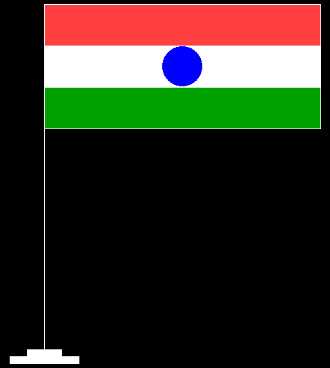

# C 程序使用图形

创建印度国旗

> 原文:[https://www . geesforgeks . org/c-program-to-create-Indian-national-flag-use-graphics/](https://www.geeksforgeeks.org/c-program-to-create-indian-national-flag-using-graphics/)

在本文中，我们将讨论如何使用[图形](https://www.geeksforgeeks.org/basic-graphic-programming-in-c/)绘制**印度国旗**。

**进场:**

*   使用 [<u>矩形()</u>](https://www.geeksforgeeks.org/draw-rectangle-c-graphics/) 功能绘制一个矩形。
*   同样，使用函数 [line()](https://www.geeksforgeeks.org/draw-line-c-graphics/) 创建直线，将上述矩形分成三部分。
*   互相画双线，即画 4 条线，其中 2 条线将作为**红色**之间的分割线(浅红色，因为图形库中没有直接的藏红花颜色)& **白色**另外 2 条线将分割**白色**和**绿色**颜色。
*   阿育王脉轮将使用功能[圆()](https://www.geeksforgeeks.org/draw-circle-c-graphics/)制成。
*   最后，将使用功能 [<u>setfillstyle()</u> 和 <u>floodfill()</u>](https://www.geeksforgeeks.org/setfillstyle-floodfill-c/) 填充所有空间。

下面是上述方法的实现:

## C

```cpp
// C program for the above approach

#include <conio.h>
#include <graphics.h>
#include <stdio.h>

// Driver Code
void main()
{
    // Initialize of gdriver with
    // DETECT macros
    initgraph(&gd, &gm, "C:\\turboc3\\bgi");

    // Creating the base rectangle
    line(250, 100, 250, 600);
    line(250, 100, 250, 600);

    // Fil the White Color
    setfillstyle(SOLID_FILL, WHITE);

    // Create and fill the top strip
    rectangle(225, 600, 275, 610);
    rectangle(200, 610, 300, 620);

    floodfill(227, 608, 15);
    floodfill(202, 618, 15);

    // Fill the Light Red Color
    setfillstyle(SOLID_FILL, LIGHTRED);

    // Create and fill the ashoka
    // chakra with Blue
    rectangle(250, 100, 650, 280);
    line(250, 160, 650, 160);
    floodfill(252, 158, 15);

    // Fill the Blue Color
    setfillstyle(SOLID_FILL, BLUE);

    // Create and fill the left
    // part of the middle strip

    // Create a Circle
    circle(450, 190, 30);
    floodfill(452, 188, 15);

    // Fill the White Color
    setfillstyle(SOLID_FILL, WHITE);

    // Create and fill the right
    // part of the middle strip
    line(250, 160, 480, 160);
    line(250, 220, 480, 220);
    floodfill(252, 162, 15);

    // Fill the White Color
    setfillstyle(SOLID_FILL, WHITE);

    // Create and fill the bottom
    // strip
    line(480, 160, 650, 160);
    line(480, 220, 650, 220);
    floodfill(482, 162, 15);

    // Fill the Green Color
    setfillstyle(SOLID_FILL, GREEN);

    line(250, 220, 650, 220);
    floodfill(252, 278, 15);

    // Close the initialized gdriver
    closegraph();
}
```

**输出:**

[](https://media.geeksforgeeks.org/wp-content/uploads/20210313103039/A.png)