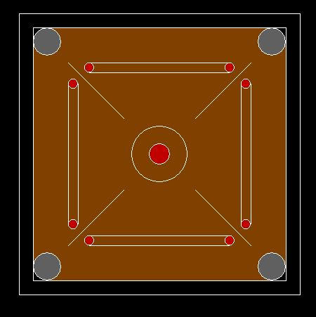

# 使用图形设计电路板的 C 程序

> 原文:[https://www . geesforgeks . org/c-程序到设计-a-carrom-board-use-graphics/](https://www.geeksforgeeks.org/c-program-to-design-a-carrom-board-using-graphics/)

在本文中，我们将讨论如何使用[图形](https://www.geeksforgeeks.org/basic-graphic-programming-in-c/)绘制**卡罗姆板**。

**进场:**

*   使用[矩形()](https://www.geeksforgeeks.org/draw-rectangle-c-graphics/)功能创建板的轮廓。
*   使用**矩形()**功能在大矩形内创建另一个小矩形。
*   使用 [circle()](https://www.geeksforgeeks.org/draw-circle-c-graphics/) 功能，在每个角上总共创建四个圆，它们将成为 carrom 板的口袋。
*   使用两个函数 [setfillstyle()和 floodfill()](https://www.geeksforgeeks.org/setfillstyle-floodfill-c/) 将上一步创建的圆涂上深灰色。
*   使用相同的功能，板的所有其他部分将被染成棕色。
*   使用**圆()**功能创建另一个圆，表示板的中心圆。
*   使用相同的两个函数 **setfillstyle()** 和 **floodfill()** 将所有剩余的圆涂成红色。

下面是上述方法的实现:

## C

```cpp
// C program to draw the Carrom Board
// using graphics

#include <conio.h>
#include <graphics.h>
#include <stdio.h>

// Driver Code
void main()
{
    // Initialize of gdriver with
    // DETECT macros
    int gd = DETECT, gm;
    initgraph(&gd, &gm, "C:\\"
                        "turboc3\\bgi");
    rectangle(200, 100, 600, 500);

    // Draw the outer Rectangle
    rectangle(220, 120, 580, 480);

    // Draw the inner Rectangle
    circle(240, 140, 20);

    // Upper Left Hole
    circle(560, 140, 20);

    // Upper Right Hole
    circle(240, 460, 20);

    // Lower Left Hole
    circle(560, 460, 20);

    // Lower Right Hole
    setfillstyle(SOLID_FILL, BROWN);
    floodfill(300, 170, 15);
    line(300, 170, 500, 170);

    // Upper Striker Range Line(Upper)
    line(300, 184, 500, 184);

    // Upper Striker Range Line(Lower)
    circle(300, 177, 7);

    // Circle Upper Stricker(Left)
    circle(500, 177, 7);

    // Circle Upper Stricker(Right)
    line(300, 430, 500, 430);

    // Lower Striker Range Line(Upper)
    line(300, 416, 500, 416);

    // Lower Striker Range Line(Lower)
    circle(300, 423, 7);

    // Circle Lower Stricker(Left)
    circle(500, 423, 7);

    // Circle Lower Stricker(Right)
    line(270, 200, 270, 400);

    // Left Striker Range Line(Left)
    line(284, 200, 284, 400);

    // Left Striker Range Line(Right)
    circle(277, 200, 7);

    // Circle Left Stricker(Upper)
    circle(277, 400, 7);

    // Circle Left Stricker(Down)
    line(530, 200, 530, 400);

    // Right Striker Range Line(Left)
    line(516, 200, 516, 400);

    // Right Striker Range Line(Right)
    circle(523, 200, 7);

    // Circle Right Stricker(Upper)
    circle(523, 400, 7);

    // Circle Right Stricker(Lower)
    line(270, 170, 350, 250);

    // Upper Left Tangent Line
    line(530, 170, 450, 250);

    // Upper Right Tangent Line
    line(270, 430, 350, 350);

    // Lower Left Tangent Line
    line(530, 430, 450, 350);

    // Lower Right Tangent Line
    circle(400, 300, 40);

    // Central Circle
    circle(400, 300, 15);

    // Mini Central Circle
    setfillstyle(SOLID_FILL, RED);

    // All Circle Red Coloring
    floodfill(303, 180, 15);
    floodfill(497, 180, 15);
    floodfill(303, 420, 15);
    floodfill(497, 420, 15);
    floodfill(280, 203, 15);
    floodfill(280, 403, 15);
    floodfill(520, 203, 15);
    floodfill(520, 403, 15);
    floodfill(405, 305, 15);

    setfillstyle(SOLID_FILL, DARKGRAY);
    floodfill(243, 143, 15);
    floodfill(563, 143, 15);
    floodfill(243, 463, 15);
    floodfill(563, 463, 15);

    // Collectively coloring all
    // the shapes created above
    getch();

    // Close the initialized gdriver
    closegraph();
}
```

**输出:**

[](https://media.geeksforgeeks.org/wp-content/uploads/20210328170227/OUTPUT.png)