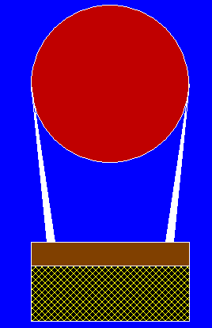

# 用图形设计热气球的 C 程序

> 原文:[https://www . geesforgeks . org/c-程序到设计-热气球-使用图形/](https://www.geeksforgeeks.org/c-program-to-design-a-hot-air-balloon-using-graphics/)

在本文中，我们将讨论如何使用[图形](https://www.geeksforgeeks.org/basic-graphic-programming-in-c/)在 [C](https://www.geeksforgeeks.org/c/) 中设计热气球。

**进场:**

*   使用[圆()](https://www.geeksforgeeks.org/draw-circle-c-graphics/)功能画一个圆。
*   使用[线()](https://www.geeksforgeeks.org/draw-line-c-graphics/)功能绘制总共四条线，该功能将充当固定容器的绳索。
*   使用[矩形()](https://www.geeksforgeeks.org/draw-rectangle-c-graphics/)功能实现容器。
*   使用[setfillstyle()&flood fill()](https://www.geeksforgeeks.org/setfillstyle-floodfill-c/)功能将充当气球的圆圈涂成红色。
*   使用**setfillstyle()&flood fill()**功能将容器涂成黄色和棕色。
*   使用**setfillstyle()&flood fill()**功能将所有绳索涂成白色。
*   使用 setfillstyle() & floodfill()函数将背景颜色设置为蓝色。

下面是上述方法的实现:

## C

```cpp
// C program to design a Hot Air Balloon
// using graphics
#include <conio.h>
#include <graphics.h>
#include <stdio.h>

// Driver Code
void main()
{
    int gd = DETECT, gm;

    // Initialize of gdriver with
    // DETECT macros
    initgraph(&gd, &gm, "C:\\"
                        "turboc3\\bgi");

    // Set the Background Color to blue
    setfillstyle(SOLID_FILL, BLUE);
    floodfill(100, 100, 15);

    // Set Circle Balloon Color
    // With Red
    setfillstyle(SOLID_FILL, RED);

    // Creating Balloon
    circle(550, 200, 100);
    floodfill(552, 202, 15);

    // Set The Rope Color
    // With White
    setfillstyle(SOLID_FILL, WHITE);

    // Right Side Right Rope
    line(650, 200, 630, 400);

    // Right Side Left Rope
    line(650, 200, 620, 400);

    // Connect the two right side ropes
    // for coloring purpose
    line(620, 400, 630, 400);
    floodfill(625, 398, 15);

    // Left side left rope
    line(450, 200, 470, 400);

    // Left side right rope

    line(450, 200, 480, 400);

    // Connect the two left side ropes
    // for coloring purpose
    line(470, 400, 480, 400);
    floodfill(475, 398, 15);

    // Set Container One Part
    // With Brown
    setfillstyle(SOLID_FILL, BROWN);
    rectangle(450, 400, 650, 500);
    floodfill(452, 402, 15);

    // Set Container Another
    // Part With Yellow
    setfillstyle(XHATCH_FILL, YELLOW);

    // Dividing Container For
    // Decorating Purpose
    line(450, 430, 650, 430);
    floodfill(452, 498, 15);

    // Hold the screen
    getch();

    // Close the initialized gdriver
    closegraph();
}
```

**输出:**

