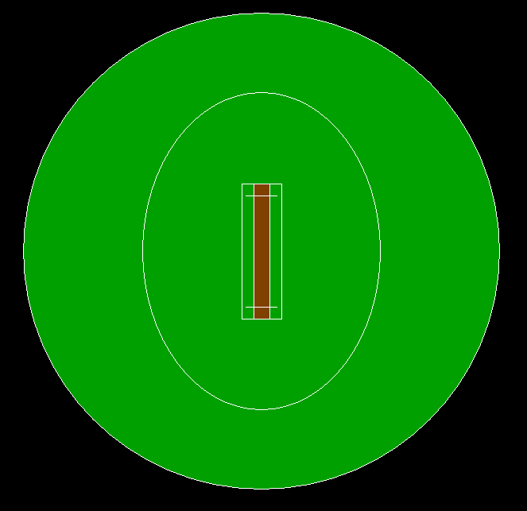

# 用计算机绘图绘制板球场地的 C 程序

> 原文:[https://www . geesforgeks . org/c-program-to-draw-a-cricket-ground-use-computer-graphics/](https://www.geeksforgeeks.org/c-program-to-draw-a-cricket-ground-using-computer-graphics/)

在本文中，我们将讨论如何使用[计算机图形](https://www.geeksforgeeks.org/introduction-to-computer-graphics/)绘制正在设计的 2D 板球场。

**进场:**

*   使用[圆()功能](https://www.geeksforgeeks.org/draw-circle-c-graphics/)画一个圆。这将作为地面轮廓。
*   使用[设置填充样式()和填充()功能](https://www.geeksforgeeks.org/setfillstyle-floodfill-c/)将上面的圆圈涂成**绿色**。
*   然后使用[椭圆()功能](https://www.geeksforgeeks.org/fillellipse-function-c/)实现 30 码轮廓。
*   然后使用[矩形()功能](https://www.geeksforgeeks.org/draw-rectangle-c-graphics/)实现两个矩形。在它们之间，一个是外矩形，另一个是内矩形。
*   使用 [setfillstyle()和 floodfill()功能](https://www.geeksforgeeks.org/setfillstyle-floodfill-c/)将内部矩形涂成棕色。
*   使用两个**矩形()函数**划分内矩形。在它们之间，一个是上树桩线，另一个是下树桩线。
*   使用[线 <u>(</u> )功能](https://www.geeksforgeeks.org/draw-line-c-graphics/)用两条线增加残端线。

以下是上述方法的程序:

## C

```
// C program for the above approach

#include <conio.h>
#include <graphics.h>
#include <stdio.h>

// Driver Code
void main()
{
    int gd = DETECT, gm;

    // Initialize of gdriver with
    // DETECT macros
    initgraph(&gd, &gm, "C:\\turboc3\\bgi");

    // Ground Outline
    circle(700, 350, 300);

    // Coloring Green
    setfillstyle(SOLID_FILL, GREEN);
    floodfill(402, 350, 15);

    // 30 Yards Outline
    ellipse(700, 350, 0, 360, 150, 200);

    // Pitch Outer Line
    rectangle(675, 265, 725, 435);

    // Pitch Inner Line
    rectangle(690, 265, 710, 435);

    // Coloring Pitch Brown
    setfillstyle(SOLID_FILL, BROWN);
    floodfill(695, 300, 15);

    // Upper Stump Line
    rectangle(690, 265, 710, 280);
    line(680, 280, 720, 280);

    // Lower Stump Line
    rectangle(690, 435, 710, 420);
    line(680, 420, 720, 420);

    // Hold Screen For A While
    getch();

    // Close the initialized gdriver
    closegraph();
}
```

**输出:**

[](https://media.geeksforgeeks.org/wp-content/uploads/20210423171813/OUTPUT2.png)